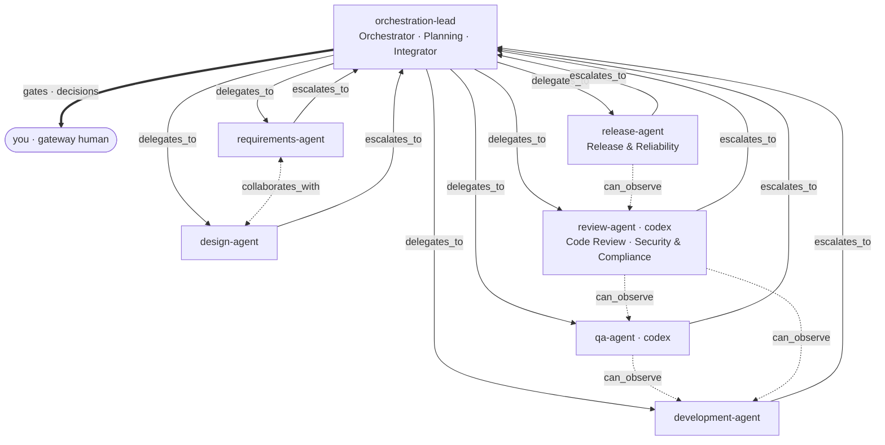
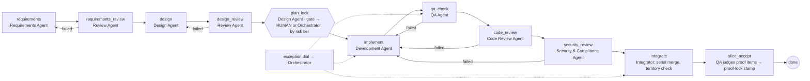

# PLAN — Agentic SDLC on OpenRig: URL Shortener

Status: **v2 — decisions D1–D5 recorded (§10); awaiting go for Day 0** · Date: 2026-10-02 · Owner: Andrzej Urbanowicz · Drafted with Claude Code

## 0. TL;DR

- **What we deliver:** a URL-shortener service built by a governed multi-agent team running on **OpenRig 0.6.3** (already installed; daemon up on :7433). OpenRig is the *substrate* (seats, queues, workflow engine, proofs, Mission Control). **Our deliverable is the orchestration layer designed on top of it:** a purpose-built rig topology, custom agent specs for ten roles, a three-level graph (rig topology → mission `depends_on` DAG → per-slice `next_hop` workflow) with risk-tiered human gates and bounded remediation loops, governance policy, an evidence exporter and a reliability-metrics tool — plus the product itself.
- **Three scenarios = three OpenRig missions:** greenfield (core shortener), brownfield (enhancement + bug fix + fault-injection drills), ambiguous (vague analytics ask → ambiguity log → human decision → dynamic re-plan).
- **The evaluator almost certainly cannot run OpenRig** (tmux + daemon + two logged-in AI harnesses). The submission therefore stands on two legs: (1) the app runs standalone — `./gradlew build && java -jar build/libs/urlshort.jar` (or `docker compose up`); (2) the orchestration is proven by **committed evidence** (workflow traces, queue transition logs, compiled dependency graphs, proof dirs, Mission Control screenshots, metrics) and a `rig bundle` for anyone who does have OpenRig.
- **Timeline:** Day 0 setup + spikes + hello-slice dry run → Day 1 greenfield → Day 2 brownfield + ambiguous → Day 3 hardening, metrics, final summary, submission (zip).
- **Decisions taken (§10):** Java 21 + Spring Boot 4.1.1 (Gradle wrapper, Kotlin DSL); `standard` permissions + project allow-list; `product-team` rig snapshotted down (done); zip-only submission.

## 1. Assignment decoded → how we satisfy it → artifact

Sources: PDF §4 core requirements (R1–R8), PDF §5 deliverables (D1–D5), and the pasted "AI SDLC artifacts" agent list (A-*).

| # | Requirement | How we satisfy it | Artifact path (repo) |
|---|---|---|---|
| R1 | Requirement understanding — interpret intent, identify ambiguity, normalize | Requirements agent (PM seat, `requirements-writer` skill) turns each intent into `SPEC.md`: Intent / Mini-requirements (personas, user stories, GIVEN-WHEN-THEN acceptance criteria, business rules, scope, **ambiguity log** with resolutions) / Proof contract | `missions/<m>/slices/<s>/SPEC.md` |
| R2 | Task decomposition with dependencies & sequencing | Missions → slices with `depends_on` (SPEC frontmatter + `slice.yaml execution.depends_on`); `rig workflow compile` renders the inspectable graph; wave map for parallel slices | `missions/<m>/mission.yaml`, `slices/*/slice.yaml`, `docs/evidence/<m>/compiled-graph.json`, `docs/architecture/dependency-graphs.md` |
| R3 | Codebase reasoning (brownfield) | Design agent writes an impact analysis per brownfield slice: impacted modules / endpoints / schema / data flows, blast radius, migration + rollback plan | `missions/02-brownfield/slices/*/impact-analysis.md` |
| R4 | Workflow orchestration (**critical differentiator**) | §3 governance matrix: our workflow spec + lifecycle profile on the OpenRig Workflow runtime, queues, gates, proofs | `rig/rig.yaml`, `rig/workflows/urlshort-slice.workflow.yaml`, `project.yaml#lifecycle`, `docs/GOVERNANCE.md` |
| R5 | Production-quality code, API/schema, unit/integration tests, docs | Spring Boot service, OpenAPI 3 (springdoc, committed snapshot), Flyway migrations, JUnit 5 unit + Spring `@WebMvcTest`/`@SpringBootTest` functional suites; `./gradlew check` is the single quality gate (both test suites + JaCoCo verification) | `src/main/java`, `src/main/resources/db/migration`, `src/test/java` (unit), `src/functionalTest/java` (functional), `docs/api/openapi.json` |
| R6 | Validation & risk control | Risk register, failure-scenario catalogue, guardrails; fault-injection drills with evidence | `docs/RISKS.md`, `docs/scenarios/drills.md` |
| R7 | Controlled autonomy | Two human gates per slice (plan-lock, ship sign-off) + decision gate for ambiguity; `rig mode` posture; permission policy; "publish is a human act" | `docs/GOVERNANCE.md`, `rig/CULTURE.md`, `rig/rig.yaml` |
| R8 | Final engineering summary | Plan/rationale, artifacts, risks/trade-offs/validation, assumptions, limitations | `docs/FINAL-SUMMARY.md` |
| D1 | Working prototype, runnable end-to-end | Standalone app (`./gradlew check bootJar`, `java -jar`), Dockerfile (eclipse-temurin 21) + `docker compose up`; OpenRig bundle for the factory | `README.md`, `Dockerfile`, `compose.yaml`, `dist/urlshort-factory.rigbundle` |
| D2 | Architecture overview (components, orchestration model, control flow, key decisions) | Plain-English doc (OpenRig concepts explained for a reader who has never seen it) with Mermaid diagrams for both layers; ADRs | `docs/ARCHITECTURE.md`, `docs/adr/` |
| D3 | Three scenarios (decomposition, orchestration, validation) | One mission each + per-scenario narrative linking to evidence | `docs/scenarios/{greenfield,brownfield,ambiguous}.md` |
| D4 | Setup instructions | App (no OpenRig) and factory (with OpenRig) | `README.md`, `docs/SETUP-FACTORY.md` |
| D5 | Testing approach, limitations, trade-offs | | `docs/TESTING.md`, `docs/FINAL-SUMMARY.md` |
| A-Req | Requirements Agent: user stories + acceptance criteria | = R1 | as R1 |
| A-Des | Design Agent: design document + architecture/design diagrams | Design agent: system `DESIGN.md`, per-slice `design.md` (incl. threat-model section), Mermaid (context/container, sequence, ERD), ADRs | `docs/DESIGN.md`, `docs/diagrams/*.mmd`, `slices/*/design.md`, `docs/adr/` |
| A-Dev | Development Agent: error handling, logging, auditing, meaningful git commits | Implementer: RFC 9457 `ProblemDetail` via `@RestControllerAdvice`, Spring Boot structured JSON logging with request-id (MDC filter), `audit_log` table + admin read endpoint, conventional commits per slice with Co-Authored-By | `src/main/java/.../web/ApiExceptionHandler.java`, `.../logging/`, `.../audit/`, `git log` |
| A-Rev | Code Review Agent: proof all code reviewed, issues, resolutions | Code review agent (Codex) per slice: findings with severity + `file:line` + resolution + re-review verdict; a ledger proving every changed file was covered; followed by the Security & Compliance review step on the same seat | `docs/review/<slice>/01-review.md`, `docs/review/<slice>/02-security-review.md`, `docs/review/REVIEW-LEDGER.md` |
| A-QA | QA Agent: unit tests, unit coverage, functional coverage, 100% target, gaps | QA (Codex): Gradle `jacoco` plugin with one report per JVM test suite (`test` = unit, `functionalTest` = functional) and `jacocoTestCoverageVerification` rules at 100% line + branch; HTML/XML/CSV reports committed; functional coverage = acceptance-criteria ↔ test traceability matrix; honest gap list for anything excluded (e.g. the `main` bootstrap) | `docs/qa/coverage/unit/`, `docs/qa/coverage/functional/`, `docs/qa/TRACEABILITY.md`, `docs/qa/GAPS.md` |

## 2. Solution architecture — two layers

### Layer A — the orchestration layer (what we design and implement)

| Component | Ours / built-in | Purpose |
|---|---|---|
| `rig/rig.yaml` (RigSpec) | **ours** | Topology: 7 pods / 7 seats; 10 workflow roles resolved onto them (§7) |
| `rig/agents/<role>/` × 7 | **ours** (custom AgentSpecs) | One spec per seat, named after the brief's agents; each role's deliverables are its exit criteria. Thin wrappers: they import OpenRig's shared skill pool (queue-handoff, mission-slice-sop, TDD, verification-before-completion, review-team, …) and add our role contract + Java 21 / Spring Boot 4 / Gradle context |
| OpenRig builtin agent specs | OpenRig | kept as reference only; not launched (their guidance is generic and OpenRig-product-flavoured) |
| `rig/CULTURE.md` + `rig/startup/*.md` | **ours** | Team constitution: honesty rails, hot-potato handoff, independence rules, what needs a human, commit conventions |
| `rig/workflows/urlshort-slice.workflow.yaml` | **ours** | Per-slice graph (§5.3): 9 steps, risk-tiered `plan_lock` gate, bounded remediation loops (`max_hops`), orchestrator-first exception routing, ends at `slice_accept` |
| `project.yaml#lifecycle.profiles.urlshort-mission-v1` | **ours** | Mission DAG (§5.2): decompose → mission plan-lock (human) → waves (fan-out / fan-in of slice instances) → wave review → release prep → ship sign-off (human) → evidence export → close |
| `missions/**/{mission,slice}.yaml` + SPEC/PROGRESS/PROOF | **ours** | Decomposition as data: slices, dependencies, actor roles, gates, acceptance |
| `tools/evidence-export.sh` | **ours** | Dumps `workflow validate/compile/trace`, `queue transitions`, `scope audit`, `proof show` → `docs/evidence/` |
| `tools/sdlc-metrics.ts` | **ours** | Derives success rate, retry/rollback frequency, MTTR, end-to-end latency per slice/mission from exported traces → `docs/metrics/` |
| `docs/GOVERNANCE.md` | **ours** | Living version of §3: every clause of R4 → mechanism → evidence |
| `docs/guidance/` | **ours** | Engineering practice library — requirements capture, architecture, Java + Spring Boot 4, databases, QA — each role's required reading and the standard reviews judge against |
| Workflow runtime, queue, scope/proof, watchdog, Mission Control UI, snapshots, transcripts | OpenRig daemon | Substrate — explained in plain English in `docs/ARCHITECTURE.md` |

### Layer B — the product (URL shortener)

| Area | Decision (ADR where marked) | Notes |
|---|---|---|
| Stack (D1) | **Java 21 (Homebrew `openjdk@21`, present) + Spring Boot 4.1.1 (current GA; 3.5 left OSS support June 2026) + Gradle wrapper, Kotlin DSL** (ADR-001). Starters: `spring-boot-starter-webmvc`, `-data-jdbc`, `-flyway`, `-validation`, `-actuator` + their `-test` counterparts; H2 file DB (ADR-003: embedded, zero ops; swap to Postgres later is a brownfield candidate) | Boot 4 renamed starters → **skeleton is generated from start.spring.io, never from agent memory**; the design agent reads the Boot 4 release notes first |
| Core API | `POST /api/links` (url, optional alias, optional expiresAt) → 201; `GET /{code}` → 302 (ADR-002: 302, not 301, so clicks stay observable); `GET /api/links/{code}`; `DELETE /api/links/{code}` (soft delete) | Bean Validation on request DTOs; RFC 9457 `ProblemDetail` responses (`spring.mvc.problemdetails.enabled=true` + `@RestControllerAdvice`) |
| Analytics | click events (ts, referrer, UA class, salted-hash IP) → `GET /api/links/{code}/stats` (total, by day, top referrers) | exact shape is decided inside the **ambiguous** scenario |
| Reliability | rate limiting (small servlet filter token bucket — fully unit-testable; Bucket4j only if the filter outgrows ~50 lines), idempotent create (`Idempotency-Key`), Actuator health/readiness probes, graceful shutdown (`server.shutdown=graceful`), Flyway versioned migrations, request-id propagation (MDC) | |
| Security / compliance | http(s)-only URL allow-list, alias charset + reserved words, body-size limits, no secrets in repo, audit log of all mutations (actor, action, before/after, request-id), PII minimisation (IP hashed with a daily salt) | |
| Observability | Spring Boot structured JSON logging (`logging.structured.format.console=ecs`), Micrometer via Actuator `/actuator/metrics` + `/actuator/prometheus` | |
| Testing | unit (domain, codec, validators, filter) + functional (`@SpringBootTest` + `MockMvc`/`RestTestClient` against a temp H2 file, Flyway applied) + smoke script against the running jar; `jacocoTestCoverageVerification` at 100% line/branch wired into `./gradlew check` | unit and functional coverage reported separately (one JaCoCo report per JVM test suite) |
| Packaging | `./gradlew check` (single quality gate — no remote CI since the submission is a zip), `./gradlew bootJar` + `java -jar build/libs/urlshort.jar`, multi-stage `Dockerfile` (eclipse-temurin:21), `compose.yaml` | |
| Toolchain note | Gradle 9 needs JDK ≥ 17 just to start, so `JAVA_HOME` must point at `/opt/homebrew/opt/openjdk@21` for every seat (RigSpec members carry no `env`): set in the project `CLAUDE.md`/`AGENTS.md` managed block and `scripts/env.sh`, which also pins `GRADLE_USER_HOME` to a repo-local gitignored dir so sandboxed Codex seats can build `--offline` from a pre-warmed cache; the build declares a Java 21 toolchain so a wrong JDK fails fast; Gradle itself comes from the committed wrapper | Day-0 spikes 7–8 |

## 3. Governance matrix — requirement 4, clause by clause

| Clause (PDF §4.4) | Mechanism (where configured) | Evidence produced |
|---|---|---|
| Explicit dependency graph with entry/exit gates | Two graph styles, never mixed in one spec: the **per-slice** workflow is a pure `next_hop` routing graph (branch edges + enforced `max_hops`); the **mission** lifecycle profile is a pure `depends_on` prerequisite graph (boundary steps may not carry `next_hop.on`). Both declare `entry.role`, `allowed_exits`, `invariants.allowed_exits`; checked by `rig workflow validate`; mission DAG compiled by `rig workflow compile` | `docs/evidence/**/validate.json`, `compiled-graph.json`, Mermaid render |
| Sequential and parallel paths with synchronization | **Honest scope:** the shipped Workflow runtime v1 keeps **one active packet per instance**. Parallelism = a mission wave step (§5.2) launches one slice workflow instance per slice; they run concurrently in disjoint git worktrees/territories with a serial integrator; synchronization = the wave step exits `waiting --blocked-on <qitem> --wait-for-proof <slice>` until every slice's judgments land, plus queue dependency wakes (`rig queue block --on`). Intra-instance fan-out is a Day-0 spike and is claimed only if observed | wave-map qitem, traces of concurrent instances, integrator step trail |
| Cross-stage context & decision lineage | Transactional `rig queue handoff` (lineage kept by the daemon's chain of record), context packs riding handoffs (`--body-context`), SPEC → design → PROOF chain files, `rig workflow trace` append-only trail, decisions in SPEC ambiguity log + ADRs | `queue transitions --json`, `workflow trace --json`, ADRs |
| Human approval checkpoints for high-impact actions | Risk-tiered gate policy (§5.4): mission plan-lock and ship sign-off are always human; slice plan-lock is human for high-tier slices and delegated (`--on-behalf-of`, recorded) for low-tier; ambiguity decisions parked on the human seat with evidence. Gates are steps with `gate: {target: <human seat>, summary, evidence_ref}` resolved in Mission Control or `rig queue resolve --decision`; stamps via `rig scope mission\|slice approve --scope spec\|delivery` | approval stamps + append-only audit rows, resolve transitions, UI screenshots |
| Bounded retries | `loop_guards.max_hops` (enforced by the validator/runtime); `next_hop.on.failed → implement` from `qa_check` and `review`; `rig workflow resume --decision` grants exactly one more bounded window | trace showing failed→implement hops, resume receipts |
| Fallback | `rig workflow route --to` (same step, new owner) and `rig queue fallback` when a seat is dead/unresponsive; roles with ≥2 `preferred_targets` where capacity exists | drill evidence: seat stopped → packet re-routed |
| Rollback | Git: slice branches/worktrees, integrator-only merges, `git revert` after a failed installed-smoke; OpenRig: `rig workflow abort`, `rig snapshot` / `restore`; DB: reversible migrations | drill evidence, commit history |
| Safe-stop | `rig workflow abort --reason`, `rig queue block` (HELD with continuation + wake), `rig mode set human-led` (pre-approved-only autonomy), `rig down --snapshot` | mode citations, abort receipt |
| Policy guardrails (security, compliance, change control) | `permission_policy: builtin:standard` in RigSpec + project `.claude/settings.json` allow-list (`rig *`, `git *`, `./gradlew *`, `java *`) **plus an explicit `deny: ["Bash(git push *)"]` — deny wins**; Codex `workspace-write` sandbox + project `.codex/rules` with `git push` as `forbidden`; CULTURE rules (no secrets, authors never review their own work, cross-runtime reviewer, publish is a human act); `./gradlew check` JaCoCo gate; PII rules in SPEC | `rig policy current` output, settings diff, `build.gradle.kts` verification rules |
| Audit-grade observability & traceability | daemon-persisted queue transitions, workflow trails, transcripts (`rig transcript`, `rig ask`), `rig health`, `rig heartbeat`, proof receipts (`rig proof judge`), `rig bundle history` | `docs/evidence/` exports + `docs/AUDIT-INDEX.md` |
| Reliability metrics: success rate, retry/rollback frequency, MTTR, end-to-end latency | **Gap in OpenRig → our `tools/sdlc-metrics.ts`** over exported traces/transitions (per-transition timestamps); `rig usage top` for token burn | `docs/metrics/metrics.json`, `docs/metrics/README.md` |
| Dynamic re-plan when upstream outputs change | `rig workflow revise` (diff authored vs running graph; adopt compatible changes without replaying completed steps); re-opened plan-lock when a SPEC changes; demonstrated in the ambiguous scenario | revise receipts, before/after graphs |
| Governance + controlled agent autonomy | `rig mode` posture per scope, proportionality (idle seats add no gates), orchestrator-first exception dial, human owns publish | mode bindings, culture, gate records |

## 4. Repository layout

```
url-shortener/
├── README.md                  # run the app in 3 commands (no OpenRig needed)
├── PLAN.md                    # this document
├── project.yaml               # OpenRig work-tree root + lifecycle profile (mission DAG)
├── missions/
│   ├── 01-greenfield-core/    # mission.yaml, SPEC.md, NOTES.md, slices/NN-*/{SPEC,PROGRESS,PROOF}.md + slice.yaml + proof/
│   ├── 02-brownfield/
│   └── 03-ambiguous-analytics/
├── rig/                       # the orchestration layer (ours)
│   ├── rig.yaml, CULTURE.md
│   ├── agents/<role>/{agent.yaml,guidance/role.md,startup/context.md}   # 7 roles: orchestration, requirements, design, development, qa, review, release
│   ├── startup/*.md           # per-seat project context
│   └── workflows/urlshort-slice.workflow.yaml
├── tools/                     # evidence-export.sh, sdlc-metrics.mjs, graph-to-mermaid.mjs (node scripts: no build step)
├── build.gradle.kts  settings.gradle.kts  gradlew  gradle/  src/main/java  src/main/resources/db/migration  src/test/java  src/functionalTest/java  Dockerfile  compose.yaml  scripts/env.sh
└── docs/
    ├── ARCHITECTURE.md DESIGN.md GOVERNANCE.md TESTING.md RISKS.md FINAL-SUMMARY.md SETUP-FACTORY.md AUDIT-INDEX.md
    └── adr/  diagrams/  guidance/  scenarios/  review/  qa/  metrics/  evidence/
```

The assignment PDF is **not** committed (it is marked Schwab Internal).

## 5. Graph topology — three levels

Roles live at different altitudes, so one flat pipeline is the wrong shape. Three graphs, each a separate authored artifact:

| Level | Artifact | Graph style | Instances |
|---|---|---|---|
| 5.1 Rig topology | `rig/rig.yaml` pods + edges | coordination shape: who delegates / observes / escalates | 1 rig, 7 seats |
| 5.2 Mission lifecycle | `project.yaml#lifecycle.profiles.urlshort-mission-v1` + `missions/*/mission.yaml` | `depends_on` DAG, one instance per mission | 3 (one per scenario) + hello |
| 5.3 Slice workflow | `rig/workflows/urlshort-slice.workflow.yaml` | `next_hop` routing graph with bounded loops, one instance per slice | 6 (+ hello) |

### 5.1 Rig topology (seats and edges)



Edges are coordination shape, not hierarchy: `delegates_to` orders launch, `can_observe` lets evaluators read the builder's pane and transcript, `escalates_to` is the exception dial, and the lead is the only path to the human. Seven single-member pods keep session names 1:1 with roles (`<pod>-<member>@urlshort-factory`, e.g. `requirements-agent@urlshort-factory`); cross-seat context travels through queue handoffs and chain files, never shared panes.

### 5.2 Mission lifecycle DAG (`depends_on`; one instance per mission)

```mermaid
flowchart LR
  DEC[decompose<br/>Planning: slices, depends_on, wave map, gate tiers] --> DR[decomposition_review<br/>Review Agent]
  DR --> MPL{{mission_plan_lock<br/>Orchestrator · gate → HUMAN}}
  MPL --> W1[wave_1<br/>Integrator: run slice 01, wait-for-proof]
  W1 --> W2[wave_2<br/>Integrator: run slices 02 ∥ 03, wait-for-proof ×2]
  W2 --> WR[wave_review<br/>Code Review Agent + Design Agent<br/>two vantages, authors excluded]
  WR --> RP[release_prep<br/>Release Agent: installed smoke, docs, evidence, metrics]
  RP --> RR[release_review<br/>Review Agent]
  RR --> SS{{ship_signoff<br/>Release Agent · gate → HUMAN}}
  SS --> EX[evidence_export<br/>Release Agent] --> MC[mission_close<br/>Orchestrator]
```



- **Parallel paths with synchronization live here.** A wave step launches one slice workflow instance per slice (02 and 03 run concurrently in separate git worktrees with declared file territories) and exits `waiting --blocked-on <qitem> --wait-for-proof <slice>` until every slice's judgments land; the Integrator merges candidates serially as they freeze. The fan-in is the wave step's own closure. Wave composition is the care dial: a risky slice gets a wave of its own.
- **Re-plan.** When a SPEC or the decomposition changes (the ambiguous scenario), Planning edits `mission.yaml` / `slice.yaml` and runs `rig workflow revise --apply`; completed steps are preserved, unstarted successors adopt the change.
- Missions 02 and 03 depend on 01; the project-level order is recorded in `project.yaml`.
- `decomposition_review` and `release_review` (Review Agent) precede the two human gates: the human is never the first reviewer. The lifecycle DAG has no back-edges, so mission-level rework travels to the producer as a queue item while the review step waits.

### 5.3 Slice workflow (`next_hop`; one instance per slice)

> Superseded on 2026-10-03 by D7 (§10): the slice graph now has **nine** steps — `security_review` runs inside the `code_review` packet, QA records the proof judgments at `qa_check`, and `integrate` is terminal (`max_hops: 30`). The diagram below is the Day-0 design kept for the record; the live spec is `rig/workflows/urlshort-slice.workflow.yaml` (+ `-delegated`, `-delegated-b`).



- 11 steps; **every producing step is followed by an independent review** (requirements_review, design_review, code_review + security_review) whose `failed` verdict routes back to the producer. `loop_guards.max_hops` is sized from the graph, not guessed: 11 + 2×2 + 2×2 + 3×4 = 31 → **36**, arithmetic kept in the spec comment. A trip becomes an exception; `rig workflow resume --decision "<why>"` grants one more window.
- Release work is deliberately **not** per slice: shipping is a mission-level act (§5.2). A slice ends at `slice_accept`: QA records attributed judgments (`rig proof judge`; policy `proofPolicy.judges: [qa-agent@urlshort-factory]`), the proof-lock stamp is written (`rig scope slice approve --scope delivery`, by you or by the orchestrator `--on-behalf-of`, recorded), and the conveyor auto-continues — no manufactured human gate on a clean closeout.
- Gates are ordinary steps with an owner whose `gate:` routes to the human (`plan_lock` → Design Agent; `mission_plan_lock` → Orchestrator; `ship_signoff` → Release Agent, routed from `release_prep` by explicit step id because they share the actor, as in the shipped `factory-rsi` spec). Each carries `summary` + `evidence_ref` (SPEC.md / mission SPEC.md + wave map / PROOF.md).
- Every packet ends with an authored exit (`handoff | waiting | failed | done`) — the hot-potato rule: no seat idles while holding work.
- Proportionality: on a tiny slice a step whose contract is unaffected exits in one short turn (e.g. `security_review`: "threat model unchanged; checklist re-run; CLEAR") — roles never manufacture work.

### 5.4 Gate policy (controlled autonomy by risk tier)

| Gate | Who approves | When |
|---|---|---|
| `mission_plan_lock` | **human** | every mission: decomposition, wave map, gate tier of each slice |
| `plan_lock` (slice) | **human** for tier `high` (foundations, schema migrations, ambiguous scope, security-relevant surface); Orchestrator `--on-behalf-of` for tier `low`, recorded in the audit row | per slice; tier set at `decompose`, visible in `slice.yaml` |
| ambiguity decision | **human** | whenever Requirements parks an open question with options + a recommended default |
| `slice_accept` (proof-lock) | QA judgments + stamp (human or delegated) | per slice; auto-continue when clean |
| `ship_signoff` | **human** | every mission; no agent publishes anything |
| safe-stop (`workflow abort`, `queue block`, `mode set human-led`) | human or Orchestrator | any time |

The human action is two-part: `rig queue resolve --decision "<text>"` (or Mission Control) unparks the gate; `rig scope mission|slice approve --scope spec|delivery` writes the stamp + audit row. The hello slice settles who runs the second.

Expected touchpoints: 3 mission plan-locks, 3 ship sign-offs, high-tier slice plan-locks for 01, 04, 06 (+ hello), 1 ambiguity decision ≈ 11 over three days.

## 6. The three scenarios

| Mission | Slices (→ = depends_on) | Demonstrates | Planned governance events |
|---|---|---|---|
| **01 Greenfield — core shortener** | 01 create + redirect (skeleton, schema, errors, logging, audit) → { 02 analytics/stats ∥ 03 reliability: rate limit, idempotency, health, graceful shutdown } | decomposition; sequential then parallel paths with synchronization; wave review; plan-lock and ship gates | mission plan-lock (H); slice 01 plan-lock (H, foundation tier); 02/03 plan-locks delegated; wave-2 fan-out / fan-in; one ship sign-off (H); natural QA fail→remediate loops (coverage < 100% fails QA) |
| **02 Brownfield — enhance + fix** | 04 link expiry + custom alias (impact analysis: migration, API, redirect path, stats) → 05 bug fix from the dogfood report (regression test first) + **fault-injection drills** | codebase reasoning; migration/rollback plan; retry, rollback, fallback, safe-stop with non-zero metrics | mission plan-lock (H); slice 04 plan-lock (H, schema migration); 05 delegated; drills (labelled as drills): QA rejects a candidate; integrator `git revert` after a failed installed-smoke; `rig seat stop` → `workflow route`; `workflow abort` + `resume`; ship sign-off (H) |
| **03 Ambiguous — "marketing wants better analytics"** | 06 analytics v2: ambiguity log (event vs aggregate storage, retention, PII, dashboard vs API, uniqueness) → options with trade-offs → **human decision gate** → re-plan via `rig workflow revise` → build | requirement understanding under ambiguity; durable human decision record; dynamic re-planning when an upstream output (the SPEC) changes | mission plan-lock (H); decision qitem parked on the human seat with evidence; slice 06 plan-lock (H); `workflow revise` receipt with before/after graph; ship sign-off (H) |

Bug source for slice 05: the dogfood pass at the end of mission 01 (QA + release seat exercising the public journey). If nothing real surfaces, a seeded defect is used and **disclosed as seeded** in `docs/scenarios/brownfield.md`.

## 7. Role catalog and seat map (rig `urlshort-factory`)

Roles are designed from the brief: each required agent is a role whose listed deliverables are its step exit criteria, so requirement → role → artifact is a 1:1 audit trail. The PDF's broader requirements justify five more roles. OpenRig resolves workflow roles onto seats via `preferred_targets`, and adjacent roles may share a seat unless independence matters — **10 roles on 7 seats** (topology graph in §5.1).

| Role (custom AgentSpec) | Required by | Deliverables (= step exit criteria) | Seat · runtime |
|---|---|---|---|
| **Requirements Agent** | brief | user stories, GIVEN/WHEN/THEN acceptance criteria, business rules, scope, ambiguity log (decisions parked on the human), proof contract → `SPEC.md` | `requirements-agent@urlshort-factory` · Claude |
| **Design Agent** | brief | design document, Mermaid diagrams (context/container, sequence, ERD), ADRs, threat-model section, brownfield impact analysis | `design-agent@…` · Claude |
| **Development Agent** | brief | TDD code under the **ponytail** discipline (YAGNI → reuse → JDK/Spring → one line → minimum code; `// ponytail:` comments name deliberate ceilings) with RFC 9457 error handling, structured logging + request-id, audit log, Flyway migrations, conventional commits with Co-Authored-By, builder evidence in `PROOF.md` | `development-agent@…` · Claude |
| **Code Review Agent** (reviewer of every chunk) | brief | per slice: `requirements_review`, `design_review`, `code_review` (findings with severity, `file:line`, evidence; a **ponytail-review** over-engineering section; resolutions + re-review verdict; ledger proving every changed file was reviewed) and `security_review`; per mission: `decomposition_review`, `wave_review`, `release_review` — always before a human gate | `review-agent@…` · **Codex** |
| **QA Agent** | brief | unit tests + JaCoCo unit report, functional tests + JaCoCo functional report, 100% line/branch check, criteria ↔ test traceability, `GAPS.md`, `rig proof add` drops | `qa-agent@…` · **Codex** |
| Orchestrator | PDF §4.4, §4.7 | dispatch with context packs, gate routing, exception dial, safe-stop / abort / resume, status to the human | `orchestration-lead@…` · Claude |
| Planning Agent | PDF §4.2 task decomposition; §4.4 dependency graph + re-plan | mission/slice decomposition (`mission.yaml`, `slice.yaml` with `depends_on`), wave map, compiled-graph export, `rig workflow revise` when upstream outputs change | hosted on `orchestration-lead` |
| Integrator | PDF §4.4 rollback; wave model | serial merges from worktrees, territory check, `git revert` rollback, candidate tags | hosted on `orchestration-lead` |
| Security & Compliance Agent | PDF §4.4 policy guardrails; §4.6 risk control | `security_review` step: shortener-specific checklist (open redirect, scheme allow-list, injection, rate-limit bypass, PII/log hygiene), dependency vulnerability scan, verdict on the design's threat model | hosted on `review-agent` (Codex — independent of the builder) |
| Release & Reliability Agent | PDF §4.4 release readiness + reliability metrics; deliverables D1/D4/D5/R8 | README/setup, installed smoke (`docker compose up` + journey), evidence export, `sdlc-metrics` refresh, fault-injection drills + runbook, final-summary draft, holds the ship gate (never publishes) | `release-agent@…` · Claude |
| you | `rig gateway human` registry | plan-locks, ship sign-offs, ambiguity decisions | Mission Control / `rig queue resolve` |

Not added as seats, deliberately: a second orchestrator (unnecessary at 7 seats), a dogfood seat (QA + release run the public-journey pass), a tech writer (release agent), any "human proxy" (PDF §4.7: humans own approvals). If Planning or Security becomes a bottleneck, `rig grow` splits it into its own seat without touching the rest.

## 8. Day-0 spikes, then the timeline

Spikes (facts that must be verified by running, ~1 h, in a scratch directory):

1. **Human gate address** — validate a 3-step spec with `gate.target: human@kernel`; register you via `rig gateway human add` and confirm the minted address; one scratch instantiate → resolve → observe the handoff.
2. **Fan-out mechanics** — (a) two ready `depends_on` steps in one instance: one live packet or two? decides whether intra-instance parallelism is ever claimed; (b) a wave step waiting on two slice proofs: `--wait-for-proof` per slice or a mission scope — verify the fan-in closes only when both land.
3. **`rig workflow revise --apply`** after editing a slice on a running scratch instance.
4. **Timestamps** in `workflow trace --json` / `queue transitions --json` — enough for latency and MTTR?
5. **`rig proof show/judge`** against this repo registered as a second project in `~/.openrig/workspace/workspace.yaml` (vs changing `workspace.root`), with `proofPolicy.judges: [qa-agent@urlshort-factory]` set and one judgment recorded end to end.
6. **Permission floor** — do Claude seats stall on `./gradlew check` / `git commit` / `rig queue` under `standard` + a project allow-list? (The `product-team` seats sat on `selection_prompt` before teardown — exactly this failure mode.)
7. **Java toolchain** — generate the Boot 4.1.1 Gradle (Kotlin DSL) skeleton from start.spring.io, `./gradlew check` under `JAVA_HOME=openjdk@21`: measure cold and warm build time (bounds the QA loop), confirm JaCoCo + JVM test suites work on Java 21 and that 100% line/branch is reachable on the skeleton (decide now what, if anything, must be excluded and documented in `GAPS.md`).
8. **Codex sandbox vs Gradle** — the QA and review seats run Codex `workspace-write`: no network, writes only under cwd/tmp, while Gradle wants network for the wrapper + dependencies and writes to `~/.gradle`. Plan: `GRADLE_USER_HOME` pinned to a repo-local, gitignored dir in `scripts/env.sh`; pre-warm it from a Claude seat; Codex seats build `--offline`; decide main-checkout vs worktree builds for Codex (a worktree cwd excludes the main repo's Gradle home — Codex `writable_roots` may be needed). Verify `scripts/gw --offline check` succeeds from `qa-agent`; do not assume.
9. **Same-seat handoff** — `code_review → security_review` closes one packet and opens the next on the same seat (`review-agent`); confirm on the hello slice that the projector nudges a seat that is its own successor.

| Day | Work | Your touchpoints |
|---|---|---|
| **0 (today)** | `git init` → Java toolchain (JDK 21 env, start.spring.io Gradle skeleton, `./gradlew check` green with JaCoCo) → scaffold (project.yaml, rig, agents, workflow, culture, tools skeleton, permission allow-lists) → spikes → `rig up` → **hello-slice dry run** through the whole pipeline (both gates) → evidence export works → fix what broke | go for Day 0; resolve the hello mission's three decisions: mission plan-lock, slice plan-lock (tier high), ship sign-off |
| **1** | Mission 01 greenfield: slice 01, then wave { 02 ∥ 03 }; wave review; dogfood pass | mission plan-lock, slice 01 plan-lock, ship sign-off |
| **2** | Mission 02 brownfield (04, 05 + drills); Mission 03 ambiguous (decision gate, revise, build) | 2 mission plan-locks, slice 04 + 06 plan-locks, 1 ambiguity decision, 2 ship sign-offs |
| **3** | Hardening: 100% coverage or honest gap list, traceability matrix, metrics, ARCHITECTURE / GOVERNANCE / TESTING / RISKS / FINAL-SUMMARY, README / SETUP, bundle, final independent review of the docs, private repo push, tag `v1.0.0` | final sign-off |

## 9. Risks & fallbacks

| Risk | Mitigation / fallback |
|---|---|
| Seats stall on permission prompts → no progress while unattended | spike 6; project-scoped allow-list; Mission Control "needs you" view; watchdog `periodic-reminder` to the orchestrator; never `yolo` on a seat that could push |
| Spring Boot 4 is new (renamed starters, Framework 7); agents' training data is mostly Boot 3 | skeleton from start.spring.io; the design agent reads the Boot 4 release notes and records conventions in `docs/DESIGN.md`; reviewer checks for Boot-3-isms; fallback: pin 4.0.8 (same starter names) |
| Full `./gradlew check` (~1 min cold) lengthens every QA/review loop | Gradle daemon + incremental compilation keep the inner-loop `test` task fast; `functionalTest` runs at QA; configuration cache enabled |
| `JAVA_HOME` points at JDK 11 on this machine | `scripts/env.sh` + managed `CLAUDE.md`/`AGENTS.md` block export JDK 21; Gradle 9 refuses to start on JDK 11 and the declared Java 21 toolchain fails fast with a clear message |
| Workflow runtime edge cases (single frontier, revise semantics) | spikes 2–3 decide what is claimed; **fallback: queue-only orchestration** (`rig queue create/handoff/block`) producing the same artifacts, documented as the degraded path |
| Token / cost burn across 7 seats × 3 days | `rig usage top` daily; idle seats cost ~0; ≤ 2 builders concurrent; snapshot-down `product-team` |
| Compaction loses context mid-slice | OpenRig compaction-restore skill + NOTES.md discipline; everything durable lives on disk or in the queue |
| Metrics trivially all-green | drills in mission 02 + natural QA loops recorded honestly |
| Evaluator cannot run OpenRig | two-leg runnability (§0), committed evidence, bundle, screenshots |
| Confidentiality (PDF is Schwab Internal) | private repo only; no artifact publishing; PDF excluded from the repo |
| Scope creep / "moon base" | smallest working outcome first (OpenRig's doghouse rule); docs explain, never pad |

## 10. Decisions (recorded 2026-10-02)

| # | Decision | Chosen | Consequences |
|---|---|---|---|
| D1 | Product stack | **Java + Spring Boot, Gradle** (your follow-up: Gradle over Maven) → Java 21 + Spring Boot **4.1.1** + Gradle wrapper, Kotlin DSL (Boot line is my recommendation; say so if you prefer 4.0.x) | JaCoCo via the Gradle `jacoco` plugin + JVM test suites; H2 file DB + Flyway; springdoc OpenAPI; longer build loop than Node (see §9) |
| D2 | Seat permission posture | **`standard` + project allow-list** | `.claude/settings.json`: allow `Bash(rig *)`, `Bash(git *)`, `Bash(./gradlew *)`, `Bash(java *)` + **deny `Bash(git push *)`** (deny wins); `.codex/rules`: `prefix_rule` allow for the same families + `["git","push"]` → `forbidden`; push/publish/zip remain human acts |
| D3 | Human gate identity | register you via `rig gateway human add` (default, not objected) | gates route to your seat; approve in Mission Control (`rig ui open`) or `rig queue resolve` |
| D4 | Existing `product-team` rig | **snapshotted and torn down** (snapshot `01M3Z4M6A30X2HX9SJ7J1VB537`; restore with `rig up product-team`) | only `kernel` + the new `urlshort-factory` run |
| D5 | Submission target | **zip only** | local git history kept; deliverable = `url-shortener-agentic-sdlc.zip` = repo incl. `.git` + `docs/evidence` + `dist/*.rigbundle`; no GitHub Actions (the `./gradlew check` gate is the CI); PDF excluded |
| D6 | Seat models | **Development Agent → Opus 5.5, QA Agent → GPT-6.1-Sol, both at xhigh effort** (your decision, 2026-10-02); the other seats stay on the runtime defaults (Fable 5.1 / GPT-6-Astra, xhigh) | pinned in the two agent specs (`defaults.model`) and in the live rig (`rig seat set-model`, audited); effort stays a runtime setting documented in `docs/SETUP-FACTORY.md`; the builder seat was relaunched fresh mid-mission (continuity from files, recorded as a seat-handover drill) |
| D7 | Speed ("fast plan") | **Chosen 2026-10-03 ~05:30Z**: slice plan-locks delegated to the lead for every slice after `01-create-redirect` (mission plan-locks and ship sign-offs stay human); slice workflow cut to nine steps (security review inside the code-review packet, proof judgments at `qa_check`, `integrate` terminal); Claude author seats at `high` effort, Codex judges at `xhigh`; second QA and review seats (`qa2-agent`, `review2-agent`) + workflow variant `urlshort-slice-delegated-b`; mission 01 wave 2 = `02-analytics ∥ 03-operate`; `04-audit-read` moves to mission 02 as the brownfield enhancement; custom alias/expiry (FR-11/12) dropped; mission 03 decomposed in parallel with mission 01's wave 2 | target: deliverable complete Saturday evening instead of Sunday night; recorded with the lead as `qitem-20261003052736-7830d02a`; `docs/REQUIREMENTS.md` marks FR-11/12 dropped and FR-17 moved |
| D8 | Claude seat model | **All Claude seats on Opus 5.5** (user decision 2026-10-03 ~05:50Z), effort `high` per D7; Codex judges unchanged | pinned via `defaults.model` in every Claude agent spec and `rig seat set-model`; seats relaunched at their next idle point; the operator session itself stays on Fable 5.1 until restarted |
| D9 | Effort per Opus seat | **xhigh for the orchestration lead and the design agent; high for requirements, development, release** (user asked which Opus seats deserve xhigh, 2026-10-03) | per-seat effort is not an OpenRig field; the two seats send `/effort xhigh` to themselves at launch (agent spec `startup.actions`, `send_text`, `after_ready`); project settings keep `high` as the default; Codex judges stay `xhigh` |

## 11. First actions once you say go

`git init` → `scripts/env.sh` (JDK 21) + Gradle skeleton from start.spring.io → `./gradlew check` green → `project.yaml` + register repo in `~/.openrig/workspace/workspace.yaml` → `rig/` (rig.yaml, CULTURE.md, agents, workflow) → `rig spec validate` / `rig agent validate` / `rig workflow validate` → permission allow-lists → spikes 1–7 → `rig gateway human add` → `rig up rig/rig.yaml --cwd .` → hello slice end to end → evidence export → first commit "Bootstrap orchestration layer".

## 12. Day-0 log (2026-10-02)

**Built and committed:** rig spec (7 seats), 7 role specs + vendored shared skill pool, two slice workflow specs, mission lifecycle profile, culture + factory protocol, Spring Boot 4.1.1 / Java 21 / Gradle 9.7.1 skeleton with unit + functional suites and the JaCoCo 100 % gate (18 s warm), `scripts/gw` wrapper, container packaging (image builds, smoke passes), evidence exporter, metrics tool, ARCHITECTURE / GOVERNANCE / TESTING / RISKS / SETUP docs, ledgers.

**Decisions taken today (user):** Java + Spring Boot on Gradle; `standard` permissions + allow-lists; zip-only submission; `product-team` rig snapshotted down; **an independent reviewer for every chunk** (requirements, design, decomposition, release — not only code) plus a recorded self-check inside every producing step; review loops bounded by severity gate, re-review discipline, deadlock escalation and `max_hops`.

**Dry run (`00-hello` / `01-ping`) so far:** mission plan-lock approved by the human (`human@kernel`, 21:59Z); requirements SPEC (8 AC, 9-row ambiguity log) ; design + 4 ADRs; **first real review loop** — the Codex reviewer failed the design with an empirically proven HIGH finding (bootstrap test properties shadowing the production config), the design agent replaced the mechanism with a profile overlay, the reviewer re-ran the probe and passed it; slice plan-lock approved by the human (23:27Z); implementation in progress.

**Incidents and fixes (all recorded in `docs/scenarios/drills.md` / `docs/SETUP-FACTORY.md`):** guidance-merged role files collided across seats → roles by `send_text`; Claude Code stops on `source`, `$VAR`, `find -exec`, out-of-tree reads, new domains → command hygiene rule + allow-lists; Codex sandbox blocks Gradle's lock socket and treats any shell plumbing as an opaque script → execpolicy allow for `scripts/gw` and a `--log` flag on the wrapper; `rig down`→`rig up` race left seats without a harness → documented relaunch order; daemon-side scope/proof verbs resolve from `workspace.root` → repo made the work root, daemon restarted; accidental Codex upgrade 0.159.3 → 0.160.0 via a prompt-driving keystroke (disclosed); `git add -A` committed managed blocks → clean blob restored, pathspec-only rule.

**Engine facts learned:** gate steps are engine-parked packets resolved by the human; standalone spec edits apply to in-flight instances at their next hop, lifecycle profile edits need `rig workflow revise` (refused when a completed step would be rewritten); the stuck-sweep routes stalled packets to the orchestration lead, who diagnosed correctly.

**Dry run completed (2026-10-03 UTC):** QA-01 fixed (`f286a10`, one property line), QA PASS, code review PASS (9/9 files, Ponytail lens: lean), security review PASS (live probes: canary headers, 405, actuator, env, H2 console), `--no-ff` merge `42a25db4`, slice accepted (tag `slice/01-ping/accepted`, 13 hops), wave review PASS from both vantages (two LOW follow-ups), release package with installed smoke of jar and container on loopback and an OSV advisory check (10 advisories, reachability argued, remediation filed as `qitem-20261003021640-bc2477ef`), **ship sign-off approved by the human 02:44:55Z** (`qitem-20261003023502-f807af1f`), delivery stamp on the human's behalf, evidence exported, mission closed 03:07Z. Final metrics (`docs/metrics/`): 2 instances completed, 35 step closures (2 failed), 6 retries, 0 rollbacks, MTTR 21 min, slice E2E 3.8 h, 46 min parked on the human.

**Also today:** seat models decided (D6: builder Opus 5.5, QA GPT-6.1-Sol, both xhigh; pinned in the agent specs, applied by mid-mission seat replacement — recorded as drills); `docs/REQUIREMENTS.md` product baseline (44 FR/NFR rows tagged stated/derived/assumed; 8 assumed rows for the mission-01 plan-lock); guidance library extended to every assignment area (decomposition, brownfield, orchestration, review, release + the assignment coverage map); evidence export now tabulates packets and trails (`tools/evidence-index.mjs`) after three permission-prompt stalls on hand-rolled shell loops; seats cycled at close (`rig down` → record deleted → `rig up rig/rig.yaml`), all seven ready with the pinned models and the new install context.

**Next (Day 1):** mission 01 — `rig workflow instantiate-lifecycle missions/01-greenfield-core`; decomposition from `docs/REQUIREMENTS.md` with the lead's ordered backlog (1. dependency overrides for Tomcat/Jackson, 2. OpenAPI export ownership, 3. real-server journey for log-privacy ACs, 4. unit-suite properties overlay); human gates: mission plan-lock (confirms the 8 assumed rows), foundation-slice plan-lock, ship sign-off.
