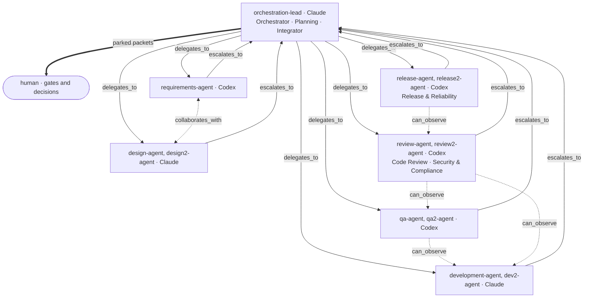
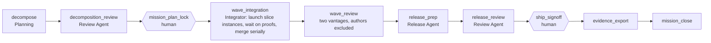
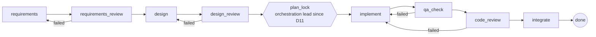
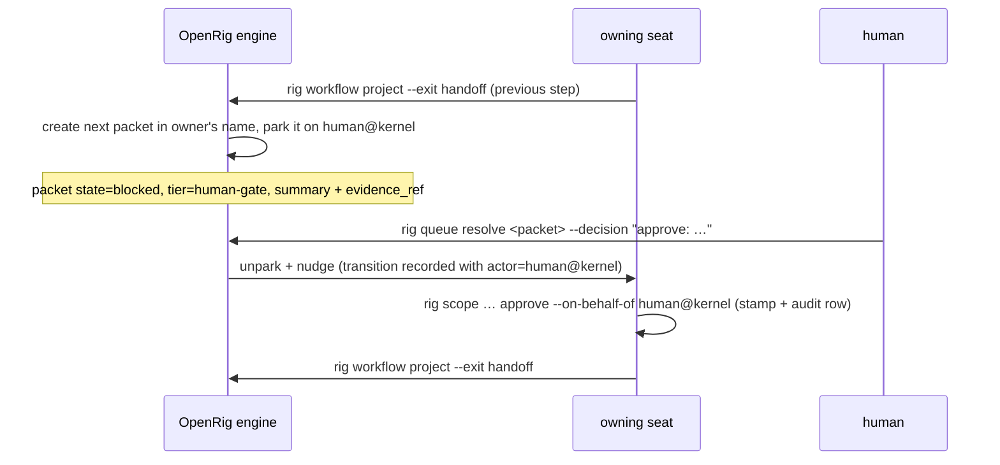

# Architecture overview

Two systems live in this repository: the **product** (a URL-shortener service)
and the **factory** that builds it (an agentic SDLC running on OpenRig). This
document explains both, how control flows between them, and the decisions
behind the shape. It is written for a reader who has never used OpenRig and
will not run it; every claim points at a committed artifact.

## 1. OpenRig in plain English (the substrate)

[OpenRig](https://openrig.dev) is a local control plane for teams of coding
agents. The vocabulary used throughout this repo:

| Term | Meaning here |
|---|---|
| **Rig** | a team of agents declared in YAML (`rig/rig.yaml`) and launched as one unit |
| **Seat** | one agent session (a Claude Code or Codex process in a tmux pane) with a stable address such as `qa-agent@urlshort-factory` |
| **Queue / packet** | the daemon-persisted work ledger; every unit of work is a *qitem* with an owner, a state machine and an append-only transition log |
| **Workflow instance** | a run of a declared step graph; the engine keeps exactly one live packet per instance (the *frontier*) and records every closure in an append-only trail |
| **Gate** | a step whose packet the engine parks on a human seat until a decision is recorded |
| **Mission / slice** | the on-disk work tree: a mission is an outcome, a slice is one buildable user outcome inside it (`missions/<m>/slices/<s>/`) |
| **Proof** | attributed judgments on a slice's promised outcomes (`rig proof judge`), separate from "the queue says done" |

OpenRig supplies the mechanics (persistence, routing, parking, trails, snapshots,
Mission Control UI). Everything about *this* factory — roles, graphs, gates,
policy, evidence, metrics — is authored in this repository.

## 2. The factory (Layer A)

### 2.1 Components we designed

| Component | Path | Purpose |
|---|---|---|
| Rig topology | `rig/rig.yaml` | 12 seats — one per SDLC role from the brief plus second QA and review seats (D7), second development (D15) and design (D16) seats for concurrent slices, and a second release seat (D18) for concurrent missions; coordination edges; `builtin:standard` permission posture |
| Role specs | `rig/agents/<role>/` | one AgentSpec per seat: `guidance/role.md` is the contract (deliverables = step exit criteria, "never" list), `startup/context.md` the first-minute checklist |
| Factory protocol | `rig/startup/project.md` | delivered to every seat before boot: how packets are worked and closed, gate mechanics, evidence paths, command hygiene |
| Culture | `rig/CULTURE.md` | the constitution: truth over appearance, hot-potato closure, independence where it matters, humans own approvals and publishing |
| Slice workflow | `rig/workflows/urlshort-slice*.workflow.yaml` | the per-slice SDLC graph in three variants (`urlshort-slice`, `urlshort-slice-delegated`, and `urlshort-slice-delegated-b`, which resolves to the second seats); since D11 every variant sends the plan-lock to the orchestration lead. `urlshort-drill` is a two-step workflow for the labelled mission 02 drills |
| Mission lifecycle | `project.yaml#lifecycle` | the mission-level dependency graph |
| Work tree | `missions/`, `project.yaml`, `workspace.yaml` | missions, slices, proof policy (`qa-agent` judges) |
| Guardrails | `.claude/settings.json`, `.codex/rules/urlshort.rules` | allow-lists for build/inspection commands; `git push`, history rewrites and publishing denied/forbidden |
| Evidence & metrics | `tools/evidence-export.sh`, `tools/sdlc-metrics.mjs` | raw audit exports per mission; success rate, retries, rollbacks, MTTR, latency derived from them |
| Guidance library | `docs/guidance/` | practice guides for requirements capture, architecture, Java + Spring Boot 4, databases and QA; each role's contract names its required reading; reviews judge against them |
| Shared skills | `rig/agents/shared/` (vendored from OpenRig, Apache-2.0); `ponytail` and `ponytail-review` (vendored, MIT) in the development and review specs | reusable craft the roles import: TDD, verification-before-completion, review protocol, queue handoff, compaction restore; lazy-senior minimalism for implementation and an over-engineering lens for code review |

### 2.2 Roles and seats

Ten workflow roles resolve onto twelve seats (design, development, QA, review and release have two each; a slice's workflow variant names which). QA, review, requirements and release run on **Codex**; orchestration, design and
development on **Claude Code**. Code is never judged by the model that wrote it.
Since D17 two artefacts are judged on the same runtime as their author: a `SPEC.md`
(written by GPT-6-Astra, reviewed by GPT-6-Astra, the same model) and a release
package (GPT-6.1-Sol author, GPT-6-Astra reviewer). This is a disclosed weakening of
review independence for those two steps, chosen by the human.

Seats that hold the same role share a box; `rig/rig.yaml` lists the edges seat by seat (for example, only `qa2-agent` and `review2-agent` observe `dev2-agent`).

| Seat | Roles | Deliverables that are its exit criteria |
|---|---|---|
| `orchestration-lead` | Orchestrator, Planning Agent, Integrator | decomposition + wave map + compiled graph; gate briefs; serial `--no-ff` merges; exception handling (`resume` / `route` / `abort`) |
| `requirements-agent` | Requirements Agent | `SPEC.md`: user stories, GIVEN/WHEN/THEN acceptance criteria, business rules, ambiguity log, proof contract |
| `design-agent`, `design2-agent` | Design Agent (two seats; `design-agent` is also the second vantage in wave review) | `design.md` with API contract, data model/migration, sequence, logging/audit events, threat model; ADRs; `docs/DESIGN.md`; brownfield impact analysis |
| `development-agent`, `dev2-agent` | Development Agent (two seats) | TDD implementation in the slice worktree: ProblemDetail errors, structured logs with request id, audit log, Flyway migrations, conventional commits |
| `qa-agent`, `qa2-agent` | QA Agent (two seats) | unit + functional coverage reports (JaCoCo), AC↔test traceability, gap list, proof drops and attributed judgments |
| `review-agent`, `review2-agent` | Code Review Agent + Security & Compliance Agent (one packet; two seats) | findings with severity + `file:line`, review ledger, shortener security checklist, verdict on the threat model |
| `release-agent`, `release2-agent` | Release & Reliability Agent (two seats) | installed smoke, README/TESTING, `RELEASE.md`, evidence export, metrics, drills; holds the ship gate |

**Runtimes, models and effort per seat** (decided 2026-10-02; a model is pinned in the agent spec where it differs from the runtime default and mirrored into the live rig with `rig seat set-model`, which is audited):

| Seat | Runtime | Model | Reasoning effort | Where it is set |
|---|---|---|---|---|
| `design-agent`, `design2-agent` | Claude Code | Claude Opus 5.5 (`claude-opus-5-5`) | **xhigh** (D9, D16) | `defaults.model` in its agent spec; effort set per session by the operator after each launch (`rig send --raw <seat> "/effort xhigh"`, verified with `/effort status`) |
| `orchestration-lead` | Claude Code | Claude Opus 5.5 (`claude-opus-5-5`) | high (D12, 2026-10-03: few short turns, backstopped by review-before-gate) | `defaults.model` in its agent spec; effort `high` is the project default in `.claude/settings.json`, applied live with `rig send --raw orchestration-lead@urlshort-factory "/effort high"` (D12) |
| `requirements-agent` | Codex | GPT-6-Astra (`gpt-6-astra`) | xhigh | `defaults.model` in its agent spec (D17, 2026-10-03); effort from `~/.codex/config.toml` |
| `release-agent`, `release2-agent` | Codex | GPT-6.1-Sol (`gpt-6.1-sol`) | xhigh | `defaults.model` in its agent spec (D17, 2026-10-03); effort from `~/.codex/config.toml` |
| `development-agent`, `dev2-agent` | Claude Code | Claude Opus 5.5 (`claude-opus-5-5`) | high (D7) | `rig/agents/development-agent/agent.yaml` → `defaults.model`; effort from `modelSettings.claude-opus-5-5` |
| `qa-agent`, `qa2-agent` | Codex | GPT-6.1-Sol (`gpt-6.1-sol`) | xhigh | `rig/agents/qa-agent/agent.yaml` → `defaults.model`; effort from `~/.codex/config.toml` `model_reasoning_effort` |
| `review-agent`, `review2-agent` | Codex | GPT-6-Astra (`gpt-6-astra`) | xhigh | runtime default (`~/.codex/config.toml`) |

Effort is a runtime setting, not an OpenRig field; the factory runs the design seats at `xhigh`, the other Claude author seats including the lead at `high` (D7/D9/D12), and the Codex judge seats at `xhigh` (`docs/SETUP-FACTORY.md`). Every review step runs on the other family from the author (Codex judges Claude), and every Claude seat runs Opus 5.5 (D8); independence comes from the Codex judges, not from model diversity inside the Claude family.

### 2.3 Control flow: three graphs

**Mission lifecycle** (`project.yaml`; a pure `depends_on` DAG, one instance per mission):

**Slice workflow** (`rig/workflows/urlshort-slice.workflow.yaml`; a `next_hop`
routing graph with bounded loops, one instance per slice). Every producing
step is followed by an independent review whose `failed` verdict routes back to
the producer; human gates come after a review, never before:

**What a gate looks like at runtime** (observed on the hello mission):

Parallelism lives at the mission level: `wave_integration` launches one slice
instance per slice in a wave (fan-out), parks with `--wait-for-proof` until every
slice's judgments land (fan-in), and merges serially. The engine's single live
packet per instance is respected; concurrency is across instances and seats.

### 2.4 Governance in one table

The clause-by-clause mapping (dependency graph, parallel paths, lineage, human
checkpoints, bounded retries, fallback, rollback, safe-stop, policy guardrails,
observability, metrics, re-planning) with configuration paths and evidence
artifacts is maintained in [`GOVERNANCE.md`](GOVERNANCE.md). The gate policy by
risk tier is there too.

### 2.5 Key decisions (and why)

| Decision | Why |
|---|---|
| Self-check inside every step, independent review between steps | the author records a definition-of-done checklist in its artifact; a different seat on a different model reviews next. Review inside a step by its own author would not be independent, and a second reviewer seat per step would add hops without a new vantage |
| A reviewer for every chunk, not only for code | requirements, design, decomposition and release packages are reviewed by an independent seat before they are consumed or put in front of the human; the human is never the first reviewer |
| Own role specs instead of OpenRig's builtin agents | the brief names the agents; contracts had to be specific (Java/Spring/Gradle, exact artifacts, exit semantics). The builtins' generic guidance stays vendored for reference |
| Release steps live at mission level, not per slice | shipping is a high-impact act; clean slice closeouts auto-continue instead of manufacturing a human gate each time |
| Risk-tiered plan-lock (superseded by D11) | human attention goes to foundations, migrations, security-relevant and ambiguous slices; low-tier plan-locks are delegated and recorded. Since D11 every slice plan-lock is delegated to the orchestration lead and recorded; mission plan-locks and ship sign-offs stay human |
| Cross-runtime review (Codex judges Claude's work) | independence that does not rely on prompting alone |
| Slice code in git worktrees, documents in the main checkout | isolation for concurrent slices without breaking OpenRig's scope/proof verbs, which read the main work tree |
| Metrics derived from engine records, not agent reports | the trails and transition logs are append-only and attributed; self-reported status is not evidence |
| Evidence exported into the repo | the evaluator can audit every step without installing OpenRig |

## 3. The product (Layer B)

Spring Boot 4.1 on Java 21, built with Gradle (`build.gradle.kts`). Structure
grows slice by slice under `src/main/java/dev/urlshort/`; the design agent keeps
the system view in [`DESIGN.md`](DESIGN.md) and the decisions in
[`adr/`](adr/). Baseline properties fixed before the first slice:

- RFC 9457 `ProblemDetail` for every error; graceful shutdown; structured JSON logs.
- Embedded H2 file database under `data/`, schema owned by Flyway migrations.
- Actuator health/metrics; OpenAPI 3 document via springdoc.
- Two JVM test suites (`test`, `functionalTest`) and a JaCoCo gate at 100 % line
  and branch coverage over both (`scripts/gw check`).
- Container: multi-stage `Dockerfile`, `compose.yaml` with a health probe;
  `scripts/smoke.sh` exercises the public journey of a running instance.

## 4. How to read the evidence

| Question | Where |
|---|---|
| What was asked? | `missions/<m>/slices/<s>/SPEC.md` (intent, stories, AC, ambiguity log, proof contract) |
| What was decided and why? | `design.md`, `docs/adr/`, mission `SPEC.md` decision briefs, `NOTES.md` |
| Who approved what, when? | SPEC frontmatter stamps (`approved-spec-by/at`), `docs/evidence/<m>/packets/*.transitions.json` (resolve rows carry `actorSession: human@kernel` and the decision text) |
| Was it reviewed? | `docs/review/<s>/01-code-review.md`, `02-security-review.md`, `docs/review/REVIEW-LEDGER.md` |
| Was it proven? | `PROOF.md`, `proof/`, `docs/qa/coverage/<s>/`, `docs/qa/TRACEABILITY.md`, `docs/qa/GAPS.md`, `docs/evidence/<m>/proof-readiness.json` |
| How did the orchestration behave? | `docs/evidence/<m>/instances/*.trace.json`, `compiled-graph.json`, `docs/metrics/` |

## 5. Known limits

**Scalability (assignment §6).** The service keeps no sessions and no caches that matter, and idempotency keys live in the database. Rate-limit state does not: the GCRA buckets are in memory, per instance, and reset on restart (ADR-0014). Scaling out therefore needs a shared rate-limiter store and PostgreSQL instead of the embedded H2 file (`docs/guidance/databases.md` §5), with N instances behind a load balancer; neither is built. The prototype deliberately runs single-node on H2 (NFR-R4 states the ceiling; `docs/RISKS.md` records it).

- OpenRig 0.6.3 keeps one live packet per workflow instance; intra-instance
  fan-out is not claimed.
- The human is reached through parked packets and Mission Control; the human
  registry in this version supports Slack bindings only.
- Claude Code stops for approval on commands it cannot pre-check; the protocol's
  command-hygiene rule keeps that rare, and every operator approval is audited
  (`rig send --dangerously-interact --reason …`).
- Codex seats run sandboxed without network; the Gradle wrapper is allow-listed
  to run outside the sandbox, and advisory-database dependency checks run at
  release prep on the release seat (Codex since D17), with the network call
  approved by the operator.
