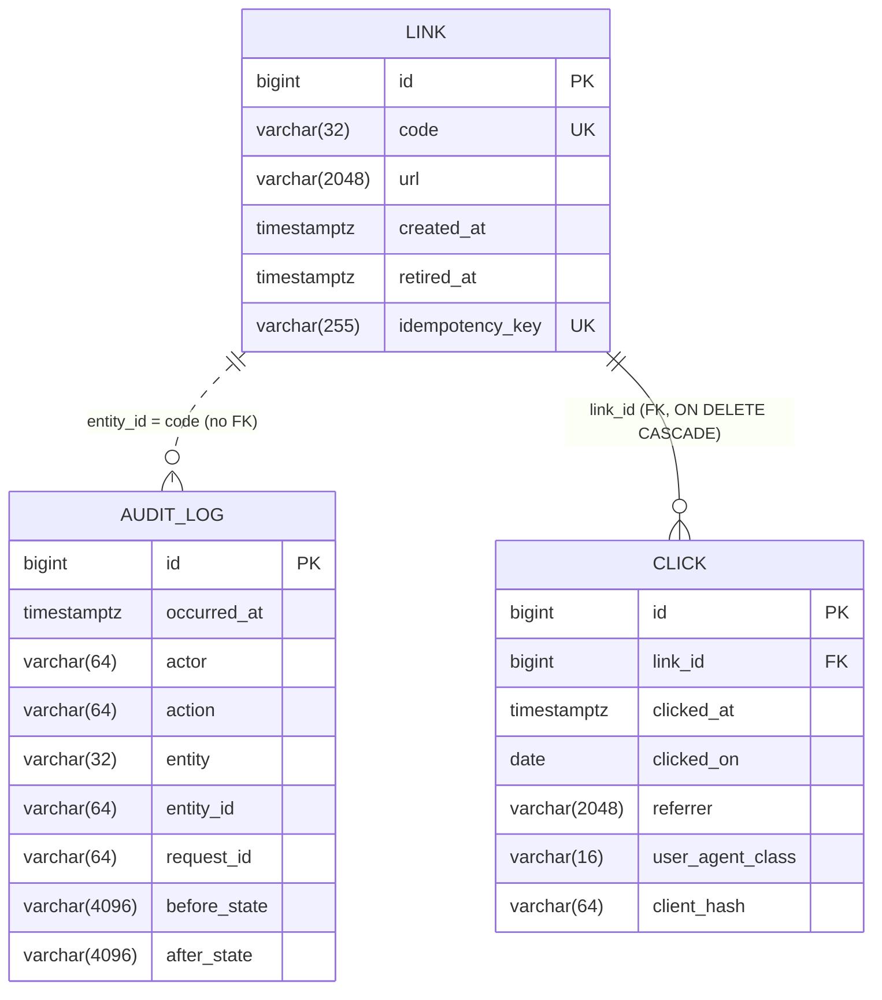

# urlshort — system design

The current shape of the product, kept current by the Design Agent after every
slice. Slice-level detail lives in `missions/<m>/slices/<s>/design.md`;
decisions live in [`adr/`](adr/). Diagrams in [`diagrams/`](diagrams/) are the
single source for the pictures below.

Last updated: 2026-10-03, slice `02-analytics` (design; not yet merged).
`main` carries `01-ping` and `01-create-redirect` (merged as `16c355f`);
everything marked *02-analytics* below describes the design under review, so
that the builder, the reviewers and `03-operate` read one picture.

## 1. System view

```mermaid
flowchart LR
    C[Creator / Visitor / Analyst / Operator]
    subgraph urlshort [urlshort · Spring Boot 4.1 · Java 21]
        F1[RequestIdFilter<br/>web · highest precedence<br/>X-Request-Id · MDC · request event]
        F2[RequestBodyLimitFilter<br/>web · 16 KiB counting stream]
        D[DispatcherServlet]
        LC[LinkController<br/>link · /api/links]
        RC[RedirectController<br/>link · /{code} · click hook]
        V[LinkValidation · ShortCodes]
        S[LinkService<br/>@Transactional]
        R[LinkRepository<br/>Spring Data JDBC]
        AU[AuditLog<br/>audit · insert-only JdbcClient]
        CR[ClickRecorder<br/>click · reduce on request thread<br/>queue 10 000 · one click-writer]
        DS[DailySalt<br/>click · HMAC · salt per UTC day, in memory]
        CS[ClickStore<br/>click · JdbcClient]
        SC[StatsController<br/>click · /api/links/{code}/stats]
        P[PingController<br/>ping]
        E[ProblemDetailsAdvice<br/>web · extends ResponseEntityExceptionHandler]
        A[Actuator<br/>health · info · metrics]
        O[springdoc OpenAPI<br/>OpenApiConfig: servers /]
        K[(Clock · tickMillis UTC)]
    end
    L[(stdout · ECS JSON lines)]
    H[(H2 file DB · data/<br/>Flyway V1: link, audit_log<br/>V2: click)]
    C -->|HTTP| F1 --> F2 --> D
    D --> LC
    D --> RC
    D --> SC
    D --> P
    D -.->|every error| E
    LC --> V
    LC --> S
    RC --> S
    RC -->|302 only, not HEAD| CR
    CR --> DS
    CR -.->|async, fail open| CS
    SC --> CS
    S --> R --> H
    S --> AU --> H
    CS --> H
    S --- K
    AU --- K
    CR --- K
    C -->|/actuator/*| A
    C -->|/v3/api-docs| O
    F1 -->|INFO request completed · MDC requestId| L
    E -->|ERROR request failed · 500 only| L
    CR -->|WARN click lost · requestId restored| L
    P -->|INFO ping| L
```

Source: `diagrams/container.mmd`.

## 2. Components by package

| Package | Class | Since | Role |
|---|---|---|---|
| `dev.urlshort` | `UrlshortApplication` | bootstrap | Spring Boot entry point (Javadoc added by 01-create-redirect; no beans) |
| `dev.urlshort.web` | `RequestIdFilter` | 01-ping; event added 01-create-redirect | one id per request; `X-Request-Id` header; MDC `requestId`; one INFO `request completed` event (`status` only; the method token is client input) per request |
| `dev.urlshort.web` | `RequestBodyLimitFilter` | 01-create-redirect | counting request stream; `413` on the 16 385th body byte, declared or chunked |
| `dev.urlshort.web` | `ProblemDetailsAdvice` | 01-create-redirect | the one advice: extends `ResponseEntityExceptionHandler` (Boot's handler backs off); catch-all `500` whose ERROR event carries class chain + one code frame, never the throwable; unwraps a limit raised inside Jackson; `createResponseEntity` override clears `detail` and sets `instance` = `urn:uuid:<request id>` on every problem |
| `dev.urlshort.web` | `Problems` | 01-create-redirect | factories for `ErrorResponseException`s: `validation` (`400` + `errors[]`), `notFound`, `gone`, `idempotencyMismatch` (`422` + `errors[]`) |
| `dev.urlshort.web` | `OpenApiConfig` | 01-create-redirect | `OpenAPI` bean: info, fixed `servers: [/]` |
| `dev.urlshort.link` | `LinkController`, `RedirectController` | 01-create-redirect; click hook 02-analytics | `POST /api/links`, `GET`/`DELETE /api/links/{code}`; `GET /{code}` → `302`, calling `ClickRecorder.record(link.id, request)` after `resolve` |
| `dev.urlshort.link` | `LinkService` | 01-create-redirect | use cases and transaction boundary: create (with idempotency), read, resolve, retire; writes the audit row |
| `dev.urlshort.link` | `LinkRepository` | 01-create-redirect | `Repository<Link, Long>` exposing `save`, `findByCode`, `findByIdempotencyKey`, conditional `retire`, `releaseIdempotencyKey` |
| `dev.urlshort.link` | `Link`, `LinkSnapshot`, `CreateLinkRequest`, `LinkResponse` | 01-create-redirect | aggregate record; audit payload; request and response records |
| `dev.urlshort.link` | `LinkValidation`, `ShortCodes` | 01-create-redirect | ordered target/key validation; 8-char `SecureRandom` codes with the reserved set |
| `dev.urlshort.link` | `LinkProperties`, `LinkConfig` | 01-create-redirect | `urlshort.public-base-url`; the `Clock` and `SecureRandom` beans |
| `dev.urlshort.audit` | `AuditLog` | 01-create-redirect | insert-only writer for `audit_log` (`JdbcClient`); actor `anonymous`, `request_id` from the MDC |
| `dev.urlshort.click` | `ClickRecorder` (public) | 02-analytics | the hook's target: skips `HEAD`; reduces the request to a `Click` on the request thread; one bounded writer thread (queue 10 000, abort on full); fail open with one `WARN click lost` per lost click; restores `requestId` on the writer thread; drains on close |
| `dev.urlshort.click` | `Click`, `DailySalt` | 02-analytics | the stored facts and the referrer-origin and user-agent-class reductions; HMAC-SHA256 under a random salt per UTC day, in memory, dropped at the day's end |
| `dev.urlshort.click` | `ClickStore`, `StatsController`, `LinkStats` | 02-analytics | one insert, code → link id, one grouped query; `GET /api/links/{code}/stats`; the fold into total, per day and top 10 referrers |
| `dev.urlshort.ping` | `PingController`, `PingResponse` | 01-ping | `GET /api/ping` → `{"status":"ok","time":"<ISO-8601 UTC>"}` |
| platform | Actuator, springdoc, Flyway, H2, Spring Data JDBC | bootstrap | operations surface, API document, schema ownership, storage, mapping |

Layering rule: controller → service → repository (Spring Data JDBC) inside a
feature package; `web/` holds only cross-cutting HTTP concerns; `audit/` is
shared infrastructure with one public method. No `common/` or `util/` package
exists. Between features: `link/` calls `click.ClickRecorder` (one hook);
`click/` reads the `link` table only to turn a code into the id its foreign
key points at, and has no Java dependency on `link/` (whose types are
package-private).

## 3. Cross-cutting contracts

| Concern | Contract | Decided in |
|---|---|---|
| Request correlation | Response header `X-Request-Id`, server-issued per request, inbound ignored; MDC key `requestId`; one INFO event per request from the filter | ADR-0003; 01-create-redirect design §5 |
| Errors | Every non-2xx/3xx is an RFC 9457 `ProblemDetail`, `application/problem+json`, regardless of `Accept`, built from server-owned values only: `type` `about:blank`, `title` = reason phrase, `instance` = `urn:uuid:<X-Request-Id>`, **no `detail`** (framework wording quotes paths, methods and header values); validation and `422` add `errors: [{field, rule, message}]` with static messages; the `500` body is bare; framework headers (`Allow`, `Accept`) kept; one advice extending `ResponseEntityExceptionHandler` | ADR-0002 (amended 2026-10-03) |
| Domain failures | `ErrorResponseException` built by `web.Problems`; no project exception hierarchy | ADR-0002 amendment |
| Request limits | JSON bodies ≤ 16 384 bytes (`RequestBodyLimitFilter`, `413`); no multipart (`spring.servlet.multipart.enabled=false`, `415`); headers at Tomcat defaults | 01-create-redirect design §1, §2 (NFR-S3) |
| Logging | ECS JSON, one object per line, MDC and SLF4J key-value pairs as top-level members; never client IP, `User-Agent`, target URL, idempotency key, method token or any copied inbound header value; `process.thread.name` excluded; **no throwable is ever passed to a logger on a request path** (the `500` event carries `errorChain` + `errorOrigin`); `PageNotFound` category at ERROR; DispatcherServlet initialised at startup (`spring.mvc.servlet.load-on-startup=1`) so the first request writes no uncorrelated line; work done for a request on another thread (click writes, *02-analytics*) restores `requestId` in the MDC for its duration and logs exceptions by class name only | ADR-0004 (amended 2026-10-03; second amendment proposed by 02-analytics) |
| Privacy of Visitor data *(02-analytics)* | A click stores four reduced facts only: referrer origin (lowercase scheme and host, non-default port) or none; user-agent class `browser`/`bot`/`other`/`unknown`; HMAC-SHA256 of the peer address under a random salt per UTC day, held in memory and dropped at the day's end; the instant (and its UTC day). Never stored or logged: raw address, `User-Agent`, referrer path/query/fragment/userinfo, forwarding headers, request id. Statistics expose aggregates only | ADR-0012, ADR-0013; 02-analytics SPEC rules 2–4, 9 |
| Asynchronous work *(02-analytics)* | Only click writes, on one bounded writer thread owned by `ClickRecorder` (no `@Async`, no scheduler framework); the request thread never waits on it; fail open; a salt's expiry uses `CompletableFuture.delayedExecutor` | ADR-0011, ADR-0012 |
| Persistence | H2 file DB under `data/` in PostgreSQL mode; Flyway-owned schema `V<n>__<verb>_<noun>.sql`; Spring Data JDBC records + targeted `@Modifying` updates; `JdbcClient` for single-statement writers; portable SQL; reserved-word-safe names | ADR-0005 |
| Time | Every stored or returned instant comes from the `Clock` bean `Clock.tickMillis(UTC)` (`link.LinkConfig`); tests replace the bean; no database-side business time | ADR-0005 |
| Audit | One `audit_log` row per mutation in the same transaction; insert-only writer; actor `anonymous`; `before_state`/`after_state` JSON text | ADR-0008 |
| Idempotency | `Idempotency-Key` on `POST /api/links`; bound on the `link` row by its `201`; 24 h from `created_at`; replay `201` current representation; mismatch `422`; failures never bind; race decided by `UNIQUE` | ADR-0009 |
| Redirect | `302`, `Cache-Control: no-store`, `Location` = stored URL byte for byte | ADR-0006 |
| Short codes | 8 × `[A-Za-z0-9]` from `SecureRandom`; reserved first segments refused; `UNIQUE (code)` | ADR-0007 |
| Configuration | `@ConfigurationProperties` records with defaults; first operator setting `urlshort.public-base-url` (default `http://localhost:8080`, env `URLSHORT_PUBLIC_BASE_URL`); `Host`/forwarding headers never used | 01-create-redirect design §2.7 |
| API document | `docs/api/openapi.json` generated by the functional suite, key-sorted, fixed `servers`; the suite fails on drift; `springdoc.override-with-generic-response=false` (no untyped generic error entries from the advice) and `springdoc.writer-with-order-by-keys=true` shipped; `/v3/api-docs` and `/swagger-ui.html` on in every profile until `03-operate` decides the production profile | ADR-0010 |
| Documentation | Javadoc on every public type and public/protected method, `package-info.java` per feature package, `javadoc -Xdoclint:all -Werror` in `check` | `docs/guidance/java-spring.md` §8 (human decision 2026-10-03) |
| Tests | unit suite `test` (plain-text logs), functional suite `functionalTest` (`@SpringBootTest` + `MockMvc`, shipped `application.properties` plus the `functional` profile overlay, real Flyway on in-memory H2, suite-controlled `Clock`; one `RANDOM_PORT` class guards the first real request's log correlation, which MockMvc cannot see; *02-analytics* adds one `RANDOM_PORT` class with a `ClickStore` spy for the slow, failing and concurrent store and request recycling, kept off the cold-start context), 100 % line + branch gate on merged data | ADR-0001, ADR-0004, `TESTING.md` |

## 4. Stack conventions (Spring Boot 4.1.1)

Read before writing code or tests. Each line says how it was established:
**[jar]** = verified against the 4.1.1 / 7.0.9 artifacts in the repo-local
Gradle cache; **[notes]** = from the Spring Boot 4.0 migration guide / 4.1
release notes; **[docs]** = Spring Boot 4.1.1 reference; **[probe]** = run by
a design probe against a real Tomcat (`missions/…/design-probe/output.txt`).

Build and modules

- Starters are `spring-boot-starter-webmvc`, `-data-jdbc`, `-flyway`,
  `-validation`, `-actuator`, each with a `-test` twin; `spring-boot-starter-web`
  no longer exists. **[jar, build.gradle.kts]**
- Resolved versions: Spring Framework 7.0.9, Jackson 3.1.5 (3.1.7 after the
  01-create-redirect override commit), Boot modules `spring-boot-webmvc`,
  `spring-boot-webmvc-test`, `spring-boot-test`, `spring-boot-resttestclient`,
  `spring-boot-data-jdbc(-test)`, `spring-boot-flyway`, `spring-boot-jackson`,
  Spring Data JDBC 4.1.1, springdoc 3.1.1. **[jar]**
- Java baseline for this project is 21 via toolchain. **[build.gradle.kts]**
- springdoc 3.1.1 serialises the API document with **Jackson 2**
  (`com.fasterxml`), which is why a Jackson 2 version constraint is part of the
  dependency overrides; application code uses Jackson 3 only. **[jar]**

Web MVC and errors

- `org.springframework.boot.webmvc.autoconfigure.ProblemDetailsExceptionHandler`
  is registered when `spring.mvc.problemdetails.enabled=true` and is
  `@ConditionalOnMissingBean(ResponseEntityExceptionHandler.class)`: a project
  advice that extends `ResponseEntityExceptionHandler` replaces it and inherits
  every framework mapping. **[jar]**
- `org.springframework.web.ErrorResponseException` carries a `ProblemDetail`
  and is handled by `ResponseEntityExceptionHandler`; a `ProblemDetail` is
  written as `application/problem+json` even when the `Accept` header admits
  nothing compatible (`text/html` alone). **[jar, probe]**
- Boot registers `org.springframework.http.converter.json.ProblemDetailJacksonMixin`
  on the auto-configured `JsonMapper`, so `ProblemDetail.setProperty(...)`
  values render as top-level members and `type` is omitted when
  `about:blank`. **[jar, probe]**
- `HttpEntityMethodProcessor` fills a `ProblemDetail`'s `instance` with the
  request URI **only when it is null**; a value set earlier survives.
  `ResponseEntityExceptionHandler.handleExceptionInternal` ends in the
  protected `createResponseEntity(body, headers, status, request)` for every
  exception it renders, so overriding that one method sees every problem
  body (domain, framework, `500`). **[jar, probe]**
- `ResponseEntityExceptionHandler` logs in two places: the `405` handler WARNs
  `ex.getMessage()` (`Request method '<token>' is not supported`) on category
  `org.springframework.web.servlet.PageNotFound`, and `handleExceptionInternal`
  WARNs `"Response already committed. Ignoring: " + ex` on the subclass's own
  category. With status `500` and a **null** body it also sets
  `jakarta.servlet.error.exception` on the request. **[jar]**
- The DispatcherServlet initialises lazily on the first request (Boot
  default `spring.mvc.servlet.load-on-startup=-1`); its three INFO lines are
  then written inside that request before any filter runs. `1` moves them
  before `Tomcat started`. MockMvc never shows the lazy path. **[jar, probe]**
- Spring 7 resolves `@PathVariable`/`@RequestParam` names only from
  `-parameters` (no bytecode fallback). The Boot Gradle plugin adds the flag
  to compilation; Java source-file mode (the design probes) does not.
  **[probe; docs]**
- `HttpStatus.CONTENT_TOO_LARGE` (413) and `UNPROCESSABLE_CONTENT` (422) are
  the current names; `PAYLOAD_TOO_LARGE` and `UNPROCESSABLE_ENTITY` remain as
  deprecated twins. **[jar]**
- Jackson 3 wraps a `RuntimeException` thrown by the request `InputStream`
  while a value is being deserialised into `tools.jackson.databind.DatabindException`,
  which Spring turns into `HttpMessageNotReadableException` (`400`); between
  tokens it propagates unchanged. A limit raised from the stream therefore
  needs an unwrap in `handleHttpMessageNotReadable`. **[probe]**
- No Boot or Tomcat property bounds a JSON request body (`maxPostSize` applies
  to form parameters only); the request body limit is a servlet filter. The
  multipart property is still named `spring.servlet.multipart.enabled`. **[jar]**
- A `@GetMapping` handler also serves `HEAD` (it runs, the body is dropped):
  code that must act only on a real `GET` checks `request.getMethod()`.
  springdoc ignores an `HttpServletRequest` handler parameter, so adding one
  does not change the API document. **[probe: `02-analytics/design-probe` C2,
  C9]**
- A path that matches no handler reaches the static-resource handler and
  raises `NoResourceFoundException`, rendered as a `404` problem detail whose
  `detail` is `No static resource <path>.` **[probe]**
- Servlet API is Jakarta 6.1: `jakarta.servlet.*`. `OncePerRequestFilter` stays
  in `org.springframework.web.filter`. **[notes]**
- `@EntityScan` moved to `org.springframework.boot.persistence.autoconfigure`;
  `spring.dao.exceptiontranslation.enabled` became
  `spring.persistence.exceptiontranslation.enabled`. **[notes]**

Testing

- `org.springframework.boot.test.context.SpringBootTest` (unchanged). **[jar]**
- `@SpringBootTest` alone gives no `MockMvc`; add
  `org.springframework.boot.webmvc.test.autoconfigure.AutoConfigureMockMvc`.
  `@WebMvcTest` is in the same package. **[jar]**
- `org.springframework.boot.test.system.OutputCaptureExtension` and
  `CapturedOutput` capture `System.out`/`System.err`, including Logback's
  console appender. **[jar]**
- `TestRestTemplate` is `org.springframework.boot.resttestclient.TestRestTemplate`
  and needs `@AutoConfigureTestRestTemplate`; `RestTestClient` (Framework 7)
  is supported for both MockMvc-bound and live-server tests. **[notes]**
- `@MockBean`/`@SpyBean` are replaced by `@MockitoBean`/`@MockitoSpyBean` in
  `org.springframework.test.context.bean.override.mockito` (spring-test). A
  spied bean changes the context cache key. **[jar]**
- A top-level `@Configuration` class in a test source set under `dev.urlshort`
  **is** picked up by the application's component scan (only
  `@TestConfiguration` is excluded); the functional suite uses this on purpose
  for its controllable `Clock`. **[docs; design choice, 01-create-redirect]**
- Bean-definition overriding is off: a test `@Bean` with the same name as a
  production bean fails the context with `BeanDefinitionOverrideException`
  before `@Primary` is considered. Give the replacement a distinct name
  (`functionalClock`) and `@Primary`. **[probe: `docs/review/01-create-redirect/proof/design-boundary-probe.txt:59–66`]**
- Gradle JVM test suites: `functionalTest` runs after `test`; both write
  `build/jacoco/*.exec`; the gate verifies the merged data. **[build.gradle.kts]**
- A test suite's `application.properties` **shadows** the shipped one: Boot
  loads `classpath:/application.properties` as a single resource and the test
  resources come first, so shipped values are absent in that suite, not
  overridden. Suite overrides therefore go in a profile-specific file
  (`application-<suite>.properties`) and the suite's Gradle task activates the
  profile (`systemProperty("spring.profiles.active", "<suite>")`). **[probe:
  `docs/review/01-ping/proof/config-probe.txt` shows the shadowing,
  `missions/00-hello/slices/01-ping/design-probe/output.txt` shows the overlay
  working]**
- The in-memory H2 of the functional suite (`DB_CLOSE_DELAY=-1`) outlives a
  Spring context and is shared by every context started in the JVM; tests
  count deltas, never absolute rows. **[design choice, 01-create-redirect]**

JSON

- Jackson 3: `tools.jackson.databind.*` (`tools.jackson.databind.json.JsonMapper`
  is the auto-configured mapper), annotations remain
  `com.fasterxml.jackson.annotation.*`. `Jackson2ObjectMapperBuilderCustomizer`
  → `JsonMapperBuilderCustomizer`, `@JsonComponent` → `@JacksonComponent`,
  `@JsonMixin` → `@JacksonMixin`. JSON-specific properties moved under
  `spring.jackson.json.read.*` / `spring.jackson.json.write.*`. **[notes]**
- `LocalDate` renders as `"YYYY-MM-DD"` under Boot 4.1's Jackson 3 defaults.
  **[probe: `02-analytics/design-probe` C5]**
- Records serialise as plain objects in declaration order; `Instant` renders
  as an ISO-8601 UTC string with `Z`. **[docs; 01-create-redirect relies on it]**
- `SerializationFeature.ORDER_MAP_ENTRIES_BY_KEYS` + `INDENT_OUTPUT` on a
  `JsonMapper` give the deterministic rendering the committed API document
  uses. **[docs]**

Logging

- `logging.structured.format.console` / `.file` accept `ecs`, `gelf`,
  `logstash`. ECS output is one JSON object per line with `@timestamp`,
  `log.level`, `log.logger`, `process.pid`, `service.name` (defaults to
  `spring.application.name`), `message`, `ecs.version`; **every MDC key-value
  pair and every SLF4J fluent key-value pair (`log.atInfo().addKeyValue(...)`)
  is added as a top-level member**; a logged throwable renders as `error.type`,
  `error.message` and a single-line `error.stack_trace`. Customise with
  `logging.structured.json.{include,exclude,rename,add}`. **[jar, probe]**
  Because a throwable's message is printed verbatim and driver messages
  quote bound values, this service never passes a throwable to a logger on a
  request path (ADR-0004 amendment).
- H2 writes its own trace file next to a file database (`data/*.trace.db`)
  at level ERROR by default; it traces `23xxx` integrity violations at INFO
  (so they are not written) and other SQL errors at ERROR.
  **[jar: `org.h2.message.TraceObject.logAndConvert`]**
- This service **excludes `process.thread.name`**
  (`logging.structured.json.exclude=process.thread.name`, shipped
  `application.properties`): Tomcat puts the bound address into worker-thread
  names, so a loopback-bound instance would print its own address on every
  event. The `process` member renders as `{"pid":<n>,"thread":{}}`. Decided
  on `01-ping` finding QA-01; recorded in ADR-0004. **[by effect]**
- Logging is initialised before the `ApplicationContext` is created, so only
  Environment-level properties influence it, and the Logback configuration
  is applied once per JVM. Suite-wide logging therefore comes from the
  shipped file plus the suite's profile overlay, never from a per-test-class
  override. **[docs]**

Persistence

- `spring-boot-starter-flyway` with Flyway 12.x; migrations under
  `src/main/resources/db/migration/V<n>__<verb>_<noun>.sql`; H2 in PostgreSQL
  mode, file DB in production, in-memory in both test suites. **[build,
  properties, notes]**
- Spring Data JDBC 4.1.1: records as aggregates (`@Id` null → insert without
  the identity column; non-null → update of every column), camelCase →
  snake_case, derived finders, `@Modifying @Query` for targeted updates with
  named parameters, selective CRUD exposure on a `Repository<T, ID>`
  sub-interface by declaring the method signature. Never `save()` a re-read
  aggregate to change one column. **[docs; design rule, ADR-0005]**
- `JdbcClient` (auto-configured) for single-statement writers with named
  parameters. **[docs]**
- H2 returns `TIMESTAMP WITH TIME ZONE` values in the JVM's session zone
  (`…-07:00` on the reference machine), so a SQL `CAST(… AS DATE)` would
  give the local day: compute UTC days in Java and store them when grouping
  by day. **[probe: `02-analytics/design-probe` C3]**
- H2 reserved words that bite: `KEY`, `VALUE`; keywords to avoid as column
  names on either engine: `AT`, `BEFORE`, `AFTER`. **[H2 grammar]**

Time

- `Clock.systemUTC()` has microsecond precision on the reference machine;
  `Clock.tickMillis(ZoneOffset.UTC)` yields millisecond instants that survive
  a round trip through `TIMESTAMP WITH TIME ZONE` unchanged. **[probe]**

## 5. Data model

Flyway `V1__create_link_and_audit_log.sql` (01-create-redirect) and
`V2__create_click.sql` (*02-analytics*). ERD source: `diagrams/erd.mmd`.



- `link`: the Creator's resource. `retired_at IS NULL` means `active`;
  `idempotency_key` is the binding of ADR-0009 (nullable, unique);
  `created_at` is also the idempotency binding time. Constraints:
  `uq_link_code`, `uq_link_idempotency_key`, `LENGTH(code) >= 6`, `url <> ''`.
- `audit_log`: the write side of the audit trail (ADR-0008); no foreign key
  by design; no secondary index until the read slice (mission 02,
  `01-audit-read`) needs one.
- `click` *(02-analytics)*: one row per `302` redirect, reduced before it is
  written (no raw address, user agent, referrer path or request id);
  `clicked_on` is the UTC day of `clicked_at`, computed in Java because H2
  returns timestamps in the session zone; `CHECK`s on the user-agent class
  and the 64-character hash; index `ix_click_link_day (link_id, clicked_on)`
  for the statistics query; statistics are computed per request from one
  grouped query (ADR-0013). NFR-P2's purge (mission 02) is a `DELETE` by
  `clicked_on`, no schema change.
- Queries and their indexes are listed per slice in its `design.md` §3.
- Rollback of V1: `DROP TABLE audit_log; DROP TABLE link;`. Rollback of V2:
  `DROP TABLE click;` (click history only).

The audit-read slice (mission 02) adds no table.

## 6. Key sequences

- Create with the idempotency branches: `diagrams/create-link-sequence.mmd`
  (inline in `missions/01-greenfield-core/slices/01-create-redirect/design.md` §4).
- Redirect and retire: `diagrams/redirect-sequence.mmd` (same place).
- Ping with request id and wrong-method path: `diagrams/ping-sequence.mmd`
  (inline in `missions/00-hello/slices/01-ping/design.md` §4).
- Redirect with click recording (fail open, async write) and the statistics
  read: `diagrams/click-sequence.mmd` (inline in
  `missions/01-greenfield-core/slices/02-analytics/design.md` §4).

## 7. ADR index

| ADR | Title | Introduced by | Status |
|---|---|---|---|
| [0001](adr/0001-spring-boot-4-java-21-gradle.md) | Spring Boot 4.1 on Java 21, built with Gradle | bootstrap, recorded by 01-ping | accepted |
| [0002](adr/0002-problem-details-via-platform-handler.md) | Errors are RFC 9457 problem details, produced by the platform handler; amended: one project advice, `ErrorResponseException` domain failures, `errors[]`, no `detail` and request-id `instance` on every problem, catch-all `500` that never logs the throwable | 01-ping; amended by 01-create-redirect | accepted, amended 2026-10-03 |
| [0003](adr/0003-request-id-server-issued.md) | Request id: server-issued `X-Request-Id`, MDC `requestId`, inbound ignored | 01-ping | accepted |
| [0004](adr/0004-structured-ecs-logs-no-client-pii.md) | Structured ECS JSON logs with no client PII; amended: no throwable logged on a request path, `status`-only request event, `PageNotFound` at ERROR, servlet initialised at startup; second amendment: work on another thread restores `requestId` | 01-ping; amended by 01-create-redirect and 02-analytics | accepted, amended 2026-10-03; second amendment proposed |
| [0005](adr/0005-persistence-h2-flyway-spring-data-jdbc.md) | Persistence: H2 in PostgreSQL mode, Flyway-owned schema, Spring Data JDBC and `JdbcClient`; application `Clock` | 01-create-redirect | accepted at plan-lock 2026-10-03 |
| [0006](adr/0006-redirect-302-no-store.md) | Redirects are `302` with `Cache-Control: no-store` and a verbatim `Location` | 01-create-redirect | accepted at plan-lock 2026-10-03 |
| [0007](adr/0007-short-code-generation.md) | Short codes: 8 random `[A-Za-z0-9]`, unique by constraint, reserved segments refused | 01-create-redirect | accepted at plan-lock 2026-10-03 |
| [0008](adr/0008-audit-record-same-transaction.md) | Audit rows: one per mutation, same transaction, insert-only | 01-create-redirect | accepted at plan-lock 2026-10-03 |
| [0009](adr/0009-idempotency-key-binding.md) | `Idempotency-Key` bound on the link row, 24 h from creation | 01-create-redirect | accepted at plan-lock 2026-10-03 |
| [0010](adr/0010-committed-openapi-document.md) | The committed OpenAPI document is generated by the functional suite, key-sorted, verified against the live service | 01-create-redirect | accepted at plan-lock 2026-10-03 |
| [0011](adr/0011-click-handoff-bounded-single-writer.md) | Click recording: reduced on the request thread, written by one bounded writer, fail open | 02-analytics | proposed |
| [0012](adr/0012-client-hash-daily-salt.md) | Client hash: HMAC-SHA256 under a random salt per UTC day, in memory, dropped at the day's end | 02-analytics | proposed |
| [0013](adr/0013-click-events-and-request-time-statistics.md) | Clicks as reduced event rows; statistics per request from one grouped query | 02-analytics | proposed |

Pending, each lands with the slice that introduces the concern: rate
limiting, the trusted-proxy rule, the production profile and container
hardening (`03-operate`, from ADR-0014); click retention (NFR-P2, mission 02).

## 8. Change log

| Date | Slice | Change to the system |
|---|---|---|
| 2026-10-02 | 01-ping | Adds `web.RequestIdFilter` (cross-cutting) and `ping.PingController`/`PingResponse`; fixes the request-id, error and logging contracts; records ADR-0001..0004 |
| 2026-10-02 | 01-ping (design review DR-01) | Functional suite configuration becomes a profile overlay (`application-functional.properties` + `functional` profile from the Gradle task) so the shipped `application.properties` is the base in HTTP journeys |
| 2026-10-03 | 01-ping (QA finding QA-01) | Shipped configuration excludes `process.thread.name` from structured log events; the server bind address no longer appears in any log line |
| 2026-10-03 | 01-create-redirect (design) | First schema (`link`, `audit_log`, V1); `link/` feature (create, read, retire, redirect, idempotency); `audit/` insert-only writer; `web/` gains `Problems`, `ProblemDetailsAdvice` (replaces Boot's handler, catch-all `500`), `RequestBodyLimitFilter`, `OpenApiConfig`, and a per-request log event in `RequestIdFilter`; `Clock` bean; first operator setting; committed `docs/api/openapi.json`; Javadoc gate in `check`; ADR-0005..0010 and the ADR-0002 amendment |
| 2026-10-03 | 01-create-redirect (design review DR-01..DR-04) | Problem bodies lose `detail` and take `instance` = `urn:uuid:<request id>` (one `createResponseEntity` override); the `500` event logs class chain + one frame instead of the throwable; request event logs `status` only; shipped `spring.mvc.servlet.load-on-startup=1` and `PageNotFound` at ERROR; functional clock bean renamed `functionalClock`; ADR-0004 amended, ADR-0002 amendment revised |
| 2026-10-03 | 02-analytics (design) | `click/` feature: the redirect hook (`HEAD` skipped), request-thread reduction, `DailySalt` HMAC, one bounded writer thread with fail-open WARN, `GET /api/links/{code}/stats` from one grouped query; `click` table (V2) with FK to `link`; ADR-0011..0013 and a second ADR-0004 amendment; `docs/api/openapi.json` gains the statistics operation |
