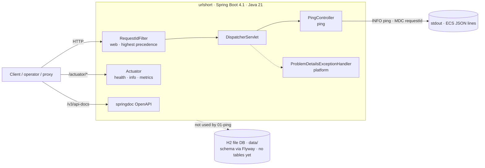

# urlshort — system design

The current shape of the product, kept current by the Design Agent after every
slice. Slice-level detail lives in `missions/<m>/slices/<s>/design.md`;
decisions live in [`adr/`](adr/). Diagrams in [`diagrams/`](diagrams/) are the
single source for the pictures below.

Last updated: 2026-10-02, slice `01-ping` (design; not yet merged).

## 1. System view

Source: `diagrams/container.mmd`.

## 2. Components by package

| Package | Class | Since | Role |
|---|---|---|---|
| `dev.urlshort` | `UrlshortApplication` | bootstrap | Spring Boot entry point |
| `dev.urlshort.web` | `RequestIdFilter` | 01-ping | one id per request; `X-Request-Id` header; MDC `requestId` |
| `dev.urlshort.ping` | `PingController`, `PingResponse` | 01-ping | `GET /api/ping` → `{"status":"ok","time":"<ISO-8601 UTC>"}` |
| platform | `ProblemDetailsExceptionHandler` | bootstrap property | RFC 9457 bodies for framework exceptions |
| platform | Actuator, springdoc, Flyway, H2 | bootstrap | operations surface, API document, schema ownership, storage |

Layering rule for later slices: controller → service → repository (Spring Data
JDBC). A layer is added only when a slice needs it; `01-ping` has a controller
only because it has no logic and no state.

## 3. Cross-cutting contracts

| Concern | Contract | Decided in |
|---|---|---|
| Request correlation | Response header `X-Request-Id`, server-issued per request, inbound ignored; MDC key `requestId` | ADR-0003 |
| Errors | Every non-2xx is an RFC 9457 `ProblemDetail`, `application/problem+json`, no stack trace or class name; platform handler until a domain exception exists | ADR-0002 |
| Logging | ECS JSON, one object per line, MDC as top-level members; never client IP, `User-Agent` or copied inbound header values | ADR-0004 |
| Persistence | H2 file DB under `data/`, schema owned by Flyway migrations `src/main/resources/db/migration/V<n>__<name>.sql` | baseline; ADR with the first persisting slice |
| Tests | unit suite `test` (plain-text logs), functional suite `functionalTest` (`@SpringBootTest` + `MockMvc`, shipped logging format), 100 % line + branch gate on merged data | ADR-0001, `TESTING.md` |

## 4. Stack conventions (Spring Boot 4.1.1)

Read before writing code or tests. Each line says how it was established:
**[jar]** = verified against the 4.1.1 artifacts in the repo-local Gradle
cache; **[notes]** = from the Spring Boot 4.0 migration guide / 4.1 release
notes; **[docs]** = Spring Boot 4.1.1 reference, Logging chapter.

Build and modules

- Starters are `spring-boot-starter-webmvc`, `-data-jdbc`, `-flyway`,
  `-validation`, `-actuator`, each with a `-test` twin; `spring-boot-starter-web`
  no longer exists. **[jar, build.gradle.kts]**
- Resolved versions: Spring Framework 7.0.9, Jackson 3.1.5, Boot modules
  `spring-boot-webmvc`, `spring-boot-webmvc-test`, `spring-boot-test`,
  `spring-boot-resttestclient`, `spring-boot-data-jdbc(-test)`,
  `spring-boot-flyway`, `spring-boot-jackson`. **[jar]**
- Java baseline for this project is 21 via toolchain. **[build.gradle.kts]**

Web MVC and errors

- `org.springframework.boot.webmvc.autoconfigure.ProblemDetailsExceptionHandler`
  is registered when `spring.mvc.problemdetails.enabled=true` and backs off if
  the project defines a `ResponseEntityExceptionHandler` bean. **[jar]**
- Servlet API is Jakarta 6.1: `jakarta.servlet.*`. `OncePerRequestFilter` stays
  in `org.springframework.web.filter`. **[notes]**
- `@EntityScan` moved to `org.springframework.boot.persistence.autoconfigure`;
  `spring.dao.exceptiontranslation.enabled` became
  `spring.persistence.exceptiontranslation.enabled`. **[notes]**

Testing

- `org.springframework.boot.test.context.SpringBootTest` (unchanged). **[jar]**
- `@SpringBootTest` alone gives no `MockMvc`; add
  `org.springframework.boot.webmvc.test.autoconfigure.AutoConfigureMockMvc`.
  `@WebMvcTest` is in the same package. **[jar]**
- `org.springframework.boot.test.system.OutputCaptureExtension` and
  `CapturedOutput` capture `System.out`/`System.err`, including Logback's
  console appender. **[jar]**
- `TestRestTemplate` is `org.springframework.boot.resttestclient.TestRestTemplate`
  and needs `@AutoConfigureTestRestTemplate`; `RestTestClient` (Framework 7)
  is supported for both MockMvc-bound and live-server tests. **[notes]**
- `@MockBean`/`@SpyBean` are replaced by `@MockitoBean`/`@MockitoSpyBean`.
  **[notes]**
- Gradle JVM test suites: `functionalTest` runs after `test`; both write
  `build/jacoco/*.exec`; the gate verifies the merged data. **[build.gradle.kts]**

JSON

- Jackson 3: `tools.jackson.databind.*` (`tools.jackson.databind.json.JsonMapper`
  is the auto-configured mapper), annotations remain
  `com.fasterxml.jackson.annotation.*`. `Jackson2ObjectMapperBuilderCustomizer`
  → `JsonMapperBuilderCustomizer`, `@JsonComponent` → `@JacksonComponent`,
  `@JsonMixin` → `@JacksonMixin`. JSON-specific properties moved under
  `spring.jackson.json.read.*` / `spring.jackson.json.write.*`. **[notes]**
- Records serialise as plain objects; a `String` field is the safest way to
  pin a date/time rendering in a contract. **[design choice, 01-ping]**

Logging

- `logging.structured.format.console` / `.file` accept `ecs`, `gelf`,
  `logstash`. ECS output is one JSON object per line with `@timestamp`,
  `log.level`, `log.logger`, `process.pid`, `process.thread.name`,
  `service.name` (defaults to `spring.application.name`), `message`,
  `ecs.version`; **every MDC key-value pair is added as a top-level member**.
  Customise with `logging.structured.json.{include,exclude,rename,add}`.
  **[docs]**
- Logging is initialised before the `ApplicationContext` is created, so only
  Environment-level properties (property files, system properties, test
  property sources at bootstrap) influence it, and the Logback configuration
  is applied once per JVM. Set suite-wide logging in the suite's
  `application.properties`, not per test class. **[docs; per-JVM behaviour to
  be confirmed by the 01-ping builder, see the slice design §7]**

Persistence

- `spring-boot-starter-flyway` with Flyway 12.x; migrations under
  `src/main/resources/db/migration/V<n>__<name>.sql`; H2 in PostgreSQL mode,
  file DB in production, in-memory in both test suites. **[build, properties,
  notes]**

## 5. Data model

No tables yet. `01-ping` has no persistent state. The ERD appears with the
first persisting slice (`diagrams/erd.mmd`).

## 6. Key sequences

- Ping with request id and wrong-method path: `diagrams/ping-sequence.mmd`
  (also inline in `missions/00-hello/slices/01-ping/design.md` §4).

## 7. ADR index

| ADR | Title | Introduced by |
|---|---|---|
| [0001](adr/0001-spring-boot-4-java-21-gradle.md) | Spring Boot 4.1 on Java 21, built with Gradle | bootstrap, recorded by 01-ping |
| [0002](adr/0002-problem-details-via-platform-handler.md) | Errors are RFC 9457 problem details, produced by the platform handler | 01-ping |
| [0003](adr/0003-request-id-server-issued.md) | Request id: server-issued `X-Request-Id`, MDC `requestId`, inbound ignored | 01-ping |
| [0004](adr/0004-structured-ecs-logs-no-client-pii.md) | Structured ECS JSON logs with no client PII | 01-ping |

Pending, each lands with the slice that introduces the concern: H2 + Flyway
schema conventions; 301 vs 302 redirects; short-code generation strategy;
salted IP hashing for analytics; audit-record shape.

## 8. Change log

| Date | Slice | Change to the system |
|---|---|---|
| 2026-10-02 | 01-ping | Adds `web.RequestIdFilter` (cross-cutting) and `ping.PingController`/`PingResponse`; fixes the request-id, error and logging contracts; records ADR-0001..0004 |
