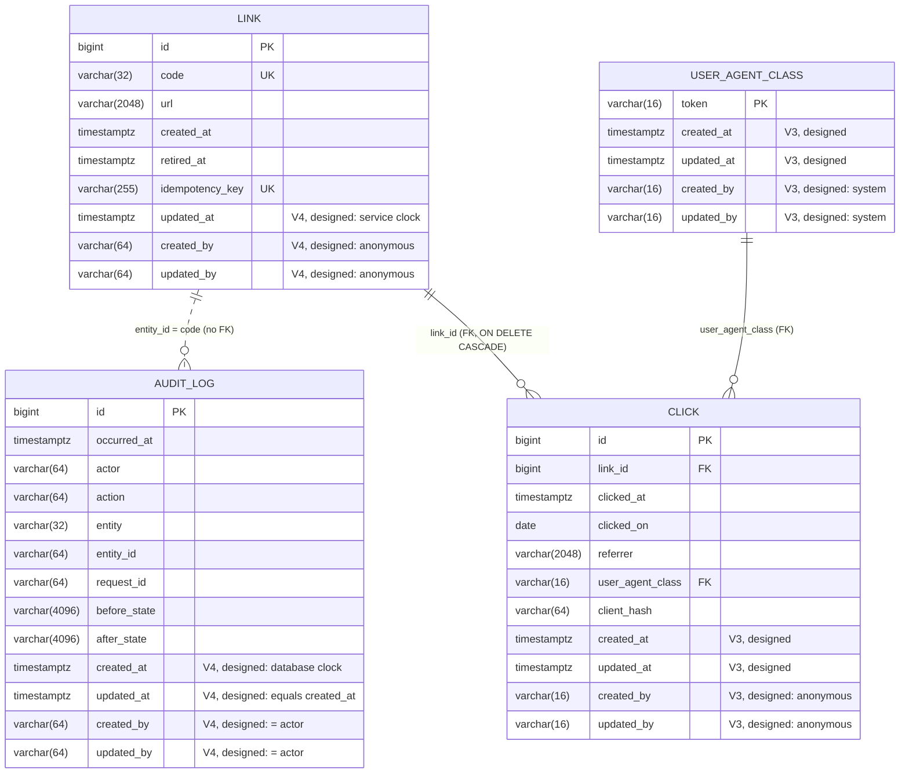

# urlshort — system design

The current shape of the product, kept current by the Design Agent after every
slice. Slice-level detail lives in `missions/<m>/slices/<s>/design.md`;
decisions live in [`adr/`](adr/). Diagrams in [`diagrams/`](diagrams/) are the
single source for the pictures below.

Last updated: 2026-10-03, mission 02 designs of `02-click-retention` and `01-audit-read`, and
mission 03's `01-analytics-v2` design.
`main` carries `01-ping`, `01-create-redirect` (`16c355f`), `02-analytics`
(`091ff46`) and `03-operate` (`8e9c065`). Everything below describes merged
code, except items marked ***02-click-retention (designed)***,
***01-audit-read (designed)*** or ***01-analytics-v2 (designed)***: those are
the locked or proposed design of a slice in flight and are not merged yet.
An italic slice name (*02-analytics*, *03-operate*) marks the slice that
introduced an item.

## 1. System view

```mermaid
flowchart LR
    C[Creator / Visitor / Analyst / Operator<br/>container: 127.0.0.1:8080 only]
    subgraph urlshort [urlshort · Spring Boot 4.1 · Java 21 · uid 10001 · read-only root + tmpfs /tmp]
        F1[RequestIdFilter<br/>web · highest precedence<br/>X-Request-Id · MDC · request event]
        OB[ServerHttpObservationFilter<br/>Boot · http.server.requests]
        RL[RateLimitFilter + RateLimiter<br/>web · +2 · per-client GCRA<br/>create 60/min · redirect 600/min · 429]
        F2[RequestBodyLimitFilter<br/>web · +3 · 16 KiB counting stream]
        D[DispatcherServlet]
        LC[LinkController<br/>link · /api/links]
        RC[RedirectController<br/>link · /{code} · click hook]
        V[LinkValidation · ShortCodes]
        S[LinkService<br/>@Transactional]
        R[LinkRepository<br/>Spring Data JDBC]
        AU[AuditLog<br/>audit · insert-only JdbcClient]
        AR[AuditController + AuditTrail · designed<br/>audit · /api/audit · loopback only<br/>keyset pages by id]
        CR[ClickRecorder<br/>click · reduce on request thread<br/>queue 10 000 · one click-writer]
        DS[DailySalt<br/>click · HMAC · salt per UTC day, in memory]
        CS[ClickStore<br/>click · JdbcClient]
        SC[StatsController<br/>click · /api/links/{code}/stats]
        CP[ClickPurge · designed<br/>click · one click-purge thread<br/>startup run before readiness · daily 00:10Z]
        P[PingController<br/>ping]
        E[ProblemDetailsAdvice<br/>web · extends ResponseEntityExceptionHandler]
        A[Actuator · not limited<br/>health liveness/readiness+db · info · metrics · prometheus]
        O[springdoc OpenAPI<br/>OpenApiConfig: servers /]
        K[(Clock · tickMillis UTC)]
    end
    L[(stdout · ECS JSON lines)]
    H[(H2 file DB · data/<br/>Flyway V1: link, audit_log<br/>V2: click)]
    C -->|HTTP| F1 --> OB --> RL --> F2 --> D
    RL -.->|429 problem+json, Retry-After| C
    D --> LC
    D --> RC
    D --> SC
    D --> P
    D -.->|every error| E
    LC --> V
    LC --> S
    RC --> S
    RC -->|302 only, not HEAD| CR
    CR --> DS
    CR -.->|async, fail open| CS
    SC --> CS
    CP -->|DELETE rows with clicked_on before today − P| CS
    S --> R --> H
    S --> AU --> H
    D --> AR
    AR -->|SELECT newest first| H
    CS --> H
    S --- K
    AU --- K
    DS --- K
    RL --- K
    CP --- K
    C -->|/actuator/*| A
    C -->|/v3/api-docs| O
    F1 -->|INFO request completed · MDC requestId| L
    E -->|ERROR request failed · 500 only| L
    CR -->|WARN click lost · requestId restored| L
    CP -->|INFO clicks purged · WARN click purge failed| L
    P -->|INFO ping| L
```

Source: `diagrams/container.mmd`.

## 2. Components by package

| Package | Class | Since | Role |
|---|---|---|---|
| `dev.urlshort` | `UrlshortApplication` | bootstrap | Spring Boot entry point (Javadoc added by 01-create-redirect; no beans) |
| `dev.urlshort.web` | `RequestIdFilter` | 01-ping; event added 01-create-redirect | one id per request; `X-Request-Id` header; MDC `requestId`; one INFO `request completed` event (`status` only; the method token is client input) per request |
| `dev.urlshort.web` | `RequestBodyLimitFilter` | 01-create-redirect; order `+3` from 03-operate | counting request stream; `413` on the 16 385th body byte, declared or chunked |
| `dev.urlshort.web` | `RateLimitFilter`, `RateLimiter`, `RateLimitProperties`, `RateLimitConfig` | *03-operate* | filter at `HIGHEST_PRECEDENCE + 2` (after request id and Boot's observation filter): operator paths exempt, `/api…` → create budget (60/min), the rest → redirect budget (600/min), client = peer or right-most untrusted `X-Forwarded-For` behind a listed proxy; GCRA bucket per client and budget (one `long`), released when full; writes the `429` problem itself; counter `urlshort.ratelimit.rejections{budget}` |
| `dev.urlshort.web` | `ProblemDetailsAdvice` | 01-create-redirect | the one advice: extends `ResponseEntityExceptionHandler` (Boot's handler backs off); catch-all `500` whose ERROR event carries class chain + one code frame, never the throwable; unwraps a limit raised inside Jackson; `createResponseEntity` override clears `detail` and sets `instance` = `urn:uuid:<request id>` on every problem |
| `dev.urlshort.web` | `Problems` | 01-create-redirect | factories for `ErrorResponseException`s: `validation` (`400` + `errors[]`), `notFound`, `gone`, `idempotencyMismatch` (`422` + `errors[]`) |
| `dev.urlshort.web` | `OpenApiConfig` | 01-create-redirect; customiser 03-operate | `OpenAPI` bean: info, fixed `servers: [/]`; *03-operate*: an `OpenApiCustomizer` adding the `429` (problem media type, integer `Retry-After`, an example) to every operation |
| `dev.urlshort.link` | `LinkController`, `RedirectController` | 01-create-redirect; click hook 02-analytics | `POST /api/links`, `GET`/`DELETE /api/links/{code}`; `GET /{code}` → `302`, calling `ClickRecorder.record(link.id, request)` after `resolve` |
| `dev.urlshort.link` | `LinkService` | 01-create-redirect | use cases and transaction boundary: create (with idempotency), read, resolve, retire; writes the audit row |
| `dev.urlshort.link` | `LinkRepository` | 01-create-redirect | `Repository<Link, Long>` exposing `save`, `findByCode`, `findByIdempotencyKey`, conditional `retire`, `releaseIdempotencyKey` |
| `dev.urlshort.link` | `Link`, `LinkSnapshot`, `CreateLinkRequest`, `LinkResponse` | 01-create-redirect | aggregate record; audit payload; request and response records |
| `dev.urlshort.link` | `LinkValidation`, `ShortCodes` | 01-create-redirect | ordered target/key validation; 8-char `SecureRandom` codes with the reserved set |
| `dev.urlshort.link` | `LinkProperties`, `LinkConfig` | 01-create-redirect | `urlshort.public-base-url`; the `Clock` and `SecureRandom` beans |
| `dev.urlshort.audit` | `AuditLog` | 01-create-redirect | insert-only writer for `audit_log` (`JdbcClient`); actor `anonymous`, `request_id` from the MDC |
| `dev.urlshort.audit` | `AuditController`, `AuditTrail`, `AuditEntry`, `AuditPage` | ***01-audit-read (designed)*** | `GET /api/audit`. It first refuses (`403`) any forwarding header or a peer that is not loopback. Then it validates `limit` (1–100, default 50) and `cursor` (base64url of an `id`), `400` per field. It reads `limit + 1` rows `WHERE id < :before ORDER BY id DESC` and returns `{"items": […], "next": …}`. `AuditTrail` holds the read's only statement, a `SELECT` (ADR-0019) |
| `dev.urlshort.click` | `ClickRecorder` (public) | 02-analytics | the hook's target: skips `HEAD`; reduces the request to a `Click` on the request thread; one bounded writer thread (queue 10 000, abort on full); fail open with one `WARN click lost` per lost click. The reasons: `rejected` (a full or closed queue); **`reduction failed`** (hashing or building the click threw before it was queued; *02-click-retention (designed)*, W2-05; until it merges this case reports `rejected`); `write failed`; `shutdown deadline`; `shutdown deadline, outcome unknown`; restores `requestId` on the writer thread; drains for at most 5 s on close, then claims every unfinished click (per-click atomic ownership), so all are reported before `close()` returns |
| `dev.urlshort.click` | `Click`, `DailySalt` | 02-analytics | the stored facts and the referrer-origin and user-agent-class reductions; `stamp(address)` chooses the click's instant and the day's key in one locked step, then HMAC-SHA256; a random salt per UTC day, in memory, dropped at the day's end |
| `dev.urlshort.click` | `ClickStore`, `StatsController`, `LinkStats` | 02-analytics | one insert, code → link id, one grouped query; `GET /api/links/{code}/stats`; the fold into total, per day and top 10 referrers; ***02-click-retention (designed)***: `ClickStore.deleteBefore(day)`; ***01-analytics-v2 (designed)***: one `UNION ALL` statement adds per-day `uniqueVisitors` (`COUNT(DISTINCT client_hash)` within the day) and `botClicks`, so each `clicksPerDay` element is `{date, clicks, uniqueVisitors, botClicks}` (ADR-0013 amendment). `ClickRecorder` hashes the rate limiter's client (`RateLimitFilter.CLIENT_ATTRIBUTE`, else the peer) and counts `urlshort.clicks.recorded` and `urlshort.clicks.lost{reason}` (ADR-0015, ADR-0016 amendments) |
| `dev.urlshort.click` | `ClickPurge`, `ClickRetentionProperties` | ***02-click-retention (designed)*** | the retention purge (ADR-0018). One daemon thread, `click-purge`. The startup run is awaited on `ApplicationReadyEvent`, so it ends before readiness. A 5 s tick on the application `Clock` then runs once at the first tick at or after 00:10Z of each later UTC day. A run is `DELETE FROM click WHERE clicked_on < today − P` and logs one INFO, or one WARN with the exception class. `close()` waits up to 3 s and never interrupts. `urlshort.click.retention-days` (default 90, positive) is validated at startup |
| `dev.urlshort.ping` | `PingController`, `PingResponse` | 01-ping | `GET /api/ping` → `{"status":"ok","time":"<ISO-8601 UTC>"}` |
| platform | Actuator, springdoc, Flyway, H2, Spring Data JDBC | bootstrap | operations surface, API document, schema ownership, storage, mapping |

Layering rule: controller → service → repository (Spring Data JDBC) inside a
feature package; `web/` holds only cross-cutting HTTP concerns; `audit/` is
shared infrastructure with one public method. No `common/` or `util/` package
exists. Between features: `link/` calls `click.ClickRecorder` (one hook);
`click/` reads the `link` table only to turn a code into the id its foreign
key points at, and has no Java dependency on `link/` (whose types are
package-private).

## 3. Cross-cutting contracts

| Concern | Contract | Decided in |
|---|---|---|
| Request correlation | Response header `X-Request-Id`, server-issued per request, inbound ignored; MDC key `requestId`; one INFO event per request from the filter | ADR-0003; 01-create-redirect design §5 |
| Errors | Every non-2xx/3xx is an RFC 9457 `ProblemDetail`, `application/problem+json`, regardless of `Accept`, built from server-owned values only: `type` `about:blank`, `title` = reason phrase, `instance` = `urn:uuid:<X-Request-Id>`, **no `detail`** (framework wording quotes paths, methods and header values); validation and `422` add `errors: [{field, rule, message}]` with static messages; the `500` body is bare; framework headers (`Allow`, `Accept`) kept; one advice extending `ResponseEntityExceptionHandler` | ADR-0002 (amended 2026-10-03) |
| Domain failures | `ErrorResponseException` built by `web.Problems`; no project exception hierarchy | ADR-0002 amendment |
| Request limits | JSON bodies ≤ 16 384 bytes (`RequestBodyLimitFilter`, `413`); no multipart (`spring.servlet.multipart.enabled=false`, `415`); headers at Tomcat defaults | 01-create-redirect design §1, §2 (NFR-S3) |
| Logging | ECS JSON, one object per line, MDC and SLF4J key-value pairs as top-level members; never client IP, `User-Agent`, target URL, idempotency key, method token or any copied inbound header value; `process.thread.name` excluded; **no throwable is ever passed to a logger on a request path** (the `500` event carries `errorChain` + `errorOrigin`); `PageNotFound` category at ERROR; DispatcherServlet initialised at startup (`spring.mvc.servlet.load-on-startup=1`) so the first request writes no uncorrelated line; work done for a request on another thread (click writes, *02-analytics*) restores `requestId` in the MDC for its duration and logs exceptions by class name only; *03-operate*: Tomcat's request-parse errors not logged (`Http11Processor=warn`, they carried client bytes), MVC's invalid-path WARN not logged (`ResourceHandlerUtils=error`, it carried the submitted path), and `DataSourceHealthIndicator`'s WARN is the one accepted framework throwable on a request path; ***02-click-retention (designed)***: work that is not a request (a purge run) carries no `requestId` and logs exceptions by class name only | ADR-0004 (amended 2026-10-03 three times; all three amendments accepted) |
| Privacy of Visitor data *(02-analytics)* | A click stores four reduced facts only: referrer origin (lowercase scheme and host, non-default port) or none; user-agent class `browser`/`bot`/`other`/`unknown`; HMAC-SHA256 of the peer address under a random salt per UTC day, held in memory and dropped at the day's end; the instant (and its UTC day). Never stored or logged: raw address, `User-Agent`, referrer path/query/fragment/userinfo, forwarding headers, request id. Statistics expose aggregates only. ***01-analytics-v2 (designed)***, the human's Q2 B:
- the hashed address is the rate limiter's client (the forwarded client behind a listed proxy, ADR-0015);
- the hash is used **only** to count distinct visitors within its own UTC day (`COUNT(DISTINCT client_hash) … GROUP BY clicked_on`), and the day is the salt's day;
- it is never exposed, exported, joined or compared across days. | ADR-0012, ADR-0013 (amended); 02-analytics SPEC rules 2–4, 9; 01-analytics-v2 rules 5, 6 |
| Asynchronous work *(02-analytics)* | Click writes, on one bounded writer thread owned by `ClickRecorder`; the request thread never waits on it; fail open; a salt's expiry uses `CompletableFuture.delayedExecutor`. ***02-click-retention (designed)***: the retention purge, on one daemon thread owned by `ClickPurge`. Each owner holds its executor as a field and controls its own shutdown, and neither interrupts a JDBC call. Still no `@Async` and no scheduler framework: Spring's cron trigger cannot follow the suite-controlled clock | ADR-0011 (amended by 02-click-retention), ADR-0012, ADR-0018 |
| Retention ***02-click-retention (designed)*** | Clicks are kept for `P` UTC days, then deleted; nothing is aggregated or kept in another form (NFR-P2, transition 831; mission 03 Q4 A). **`urlshort.click.retention-days`**, environment variable **`URLSHORT_CLICK_RETENTIONDAYS`**, a positive whole number, default **90**. An invalid value stops startup with an error naming the setting and the rejected value. On UTC day `T` a run deletes every click with `clicked_on < T − P`, so day `T − P` is kept and a click lives at least `P` full days (a calendar-day cutoff, not per-click expiry). **Runs:** once at startup, finished before readiness; then **daily at 00:10Z** (at the first 5 s tick at or after it, on the application clock); at most once per UTC day; a failed run is retried by the next day's run. **Records:** INFO `clicks purged` {`deleted`, `cutoff`, `retentionDays`} or WARN `click purge failed` {`cutoff`, `retentionDays`, `errorType`}, no audit row. **Hold:** `urlshort.click.purge-enabled=false` (environment variable `URLSHORT_CLICK_PURGEENABLED`, default `true`) pauses every deletion, at startup and daily, for example while an incident is investigated or under a legal hold. It logs WARN `click purge paused, no click is deleted` {`setting`, `retentionDays`} at every start, and clicks then grow beyond the period until the hold is lifted. The functional suite's shared contexts run with the hold on. **Before lowering the period**, copy `data/` while the service is stopped if an undo is wanted: deletion is irreversible. The next start's run deletes the difference at once, and readiness waits for it (8 to 32 s per million rows) | ADR-0018 |
| Persistence | H2 file DB under `data/` in PostgreSQL mode; Flyway-owned schema `V<n>__<verb>_<noun>.sql`; Spring Data JDBC records + targeted `@Modifying` updates; `JdbcClient` for single-statement writers; portable SQL; reserved-word-safe names | ADR-0005 |
| Time | Every stored or returned instant comes from the `Clock` bean `Clock.tickMillis(UTC)` (`link.LinkConfig`); tests replace the bean; no database-side business time | ADR-0005 |
| Audit | One `audit_log` row per mutation in the same transaction; insert-only writer; actor `anonymous`; `before_state`/`after_state` JSON text | ADR-0008 |
| Idempotency | `Idempotency-Key` on `POST /api/links`; bound on the `link` row by its `201`; 24 h from `created_at`; replay `201` current representation; mismatch `422`; failures never bind; race decided by `UNIQUE` | ADR-0009 |
| Redirect | `302`, `Cache-Control: no-store`, `Location` = stored URL byte for byte | ADR-0006 |
| Short codes | 8 × `[A-Za-z0-9]` from `SecureRandom`; reserved first segments refused; `UNIQUE (code)` | ADR-0007 |
| Configuration | `@ConfigurationProperties` records with defaults; first operator setting `urlshort.public-base-url` (default `http://localhost:8080`, env `URLSHORT_PUBLIC_BASE_URL`); `Host`/forwarding headers never used for it; *03-operate*: `urlshort.rate-limit.create-per-minute` (60, `URLSHORT_RATELIMIT_CREATEPERMINUTE`), `…redirect-per-minute` (600), `…trusted-proxies` (empty, comma-separated exact addresses); ***02-click-retention (designed)***: `urlshort.click.retention-days` (90, `URLSHORT_CLICK_RETENTIONDAYS`, Retention row); ***01-audit-read (designed)***: `server.forward-headers-strategy=none` pinned, as part of the audit read's loopback rule (Audit read row), not an operator knob | 01-create-redirect design §2.7; ADR-0014; ADR-0018; ADR-0019 |
| Rate limiting *(03-operate)* | Every request except `/actuator/**`, `/v3/api-docs/**`, `/swagger-ui.html`, `/swagger-ui/**` is charged before anything else (any outcome counts, a `429` takes nothing); `429` problem detail with `Retry-After` in whole seconds ≥ 1 and no client value; one log event per rejection (the filter's); state in memory per instance, released when full | ADR-0014 |
| Client identity *(03-operate)* | Peer address; `X-Forwarded-For` only when the peer is a listed trusted proxy, right-most untrusted entry; no other header; `getRemoteAddr()` itself is not rewritten (A-9 on the lead's backlog). ***01-audit-read (designed)***: `server.forward-headers-strategy=none` is pinned in the shipped file. Without it, Boot turns on Tomcat's `RemoteIpValve` on a detected cloud platform, which rewrites `getRemoteAddr()` and removes `X-Forwarded-For` (probe P4). ***01-analytics-v2 (designed)***: the rate limiter leaves its client on the request (`RateLimitFilter.CLIENT_ATTRIBUTE`). The click recorder hashes it, so one rule and one setting govern both. `getRemoteAddr()` is still never rewritten | ADR-0015 (amended), ADR-0019 |
| Audit read ***01-audit-read (designed)*** | **`GET /api/audit`**, anonymous and read-only. It is served **only to a loopback peer** (`127.0.0.0/8`, `::1`, IPv4-mapped `127.x`) **sending neither `X-Forwarded-For` nor `Forwarded`**; everything else is `403` with nothing about the trail. **No setting opens it beyond loopback.** **Trust boundary for the Operator:** the service sees only the connection address and the headers. Do not relay `/api/audit` through a local proxy, or have the proxy add a forwarding header, which then refuses. The read is served only while Boot's effective `server.forward-headers-strategy` is `none` (shipped). Setting it, or `SERVER_FORWARDHEADERSSTRATEGY`, to `native` or `framework` **closes** the read, with every request `403`. A successful read is `200 application/json` whatever the `Accept`; refusals and bad parameters are problems first. Pages are newest first by write sequence (`id`), which is not commit order: `limit` 1–100 (50), `cursor` = the previous page's `next`. A traversal returns every row committed before its first page exactly once and never repeats a row; a row written during it may be missing, and a fresh traversal has it. Under the `/api` rate budget. A failed read is a `500`, never an empty page | ADR-0019; SPEC `01-audit-read` rules 1–9 |
| Health *(03-operate)* | Liveness = `livenessState`; readiness = `readinessState` + `db` (`503 DOWN` while the database does not answer); bodies status only (`show-details=never`) | ADR-0016 |
| Metrics *(03-operate)* | Prometheus registry, `/actuator/prometheus`; `http.server.requests` with route-template tags (`UNKNOWN` for non-standard methods and filter `429`s); `urlshort.ratelimit.rejections{budget}`; pool gauges `hikaricp.connections.active` / `.idle`; no client, code, URL or header value in any tag. ***01-analytics-v2 (designed)***: `urlshort.clicks.recorded` (clicks written) and `urlshort.clicks.lost{reason}`, one increment per `click lost` event with its reason (`rejected`, `reduction failed`, `write failed`, `shutdown deadline`, `shutdown deadline, outcome unknown`), all registered at zero | ADR-0016 (amended) |
| Container and shutdown *(03-operate)* | uid 10001; read-only root + 64 MB tmpfs `/tmp`; named volume `/app/data`; `127.0.0.1:8080`; health check = readiness; `spring.lifecycle.timeout-per-shutdown-phase=10s` inside `stop_grace_period: 20s`; listening socket closed at the stop; every dispatched request completes; connections the kernel completed in the backlog but the server never accepted are boundary losses, counted and reported (SPEC `f24f373`), classified by request-id reconciliation | ADR-0017 |
| API document | `docs/api/openapi.json` generated by the functional suite, key-sorted, fixed `servers`; the suite fails on drift; `springdoc.override-with-generic-response=false` (no untyped generic error entries from the advice) and `springdoc.writer-with-order-by-keys=true` shipped; `/v3/api-docs` and `/swagger-ui.html` on in every profile until `03-operate` decides the production profile | ADR-0010 |
| Documentation | Javadoc on every public type and public/protected method, `package-info.java` per feature package, `javadoc -Xdoclint:all -Werror` in `check` | `docs/guidance/java-spring.md` §8 (human decision 2026-10-03) |
| Tests | unit suite `test` (plain-text logs), functional suite `functionalTest` (`@SpringBootTest` + `MockMvc`, shipped `application.properties` plus the `functional` profile overlay, real Flyway on in-memory H2, suite-controlled `Clock`; one `RANDOM_PORT` class guards the first real request's log correlation, which MockMvc cannot see; *02-analytics* adds one `RANDOM_PORT` class with a `ClickStore` spy for the slow, failing and concurrent store and request recycling, kept off the cold-start context; ***02-click-retention (designed)***: each purge journey runs on its own in-memory database and context, so its deletions and clock moves stay out of the shared ones, and records past-day clicks through real redirects from a dedicated peer; the suite triggers a run with the package-private `ClickPurge.runNow()`, except the startup and daily runs, which are observed without a trigger. The functional overlay sets `urlshort.click.purge-enabled=false`, so no shared context purges and no purge line enters a shipped journey's log window (design review DR-01)), 100 % line + branch gate on merged data | ADR-0001, ADR-0004, `TESTING.md` |

## 4. Stack conventions (Spring Boot 4.1.1)

Read before writing code or tests. Each line says how it was established:
**[jar]** = verified against the 4.1.1 / 7.0.9 artifacts in the repo-local
Gradle cache; **[notes]** = from the Spring Boot 4.0 migration guide / 4.1
release notes; **[docs]** = Spring Boot 4.1.1 reference; **[probe]** = run by
a design probe against a real Tomcat (`missions/…/design-probe/output.txt`).

Build and modules

- Starters are `spring-boot-starter-webmvc`, `-data-jdbc`, `-flyway`,
  `-validation`, `-actuator`, each with a `-test` twin; `spring-boot-starter-web`
  no longer exists. **[jar, build.gradle.kts]**
- Resolved versions: Spring Framework 7.0.9, Jackson 3.1.5 (3.1.7 after the
  01-create-redirect override commit), Boot modules `spring-boot-webmvc`,
  `spring-boot-webmvc-test`, `spring-boot-test`, `spring-boot-resttestclient`,
  `spring-boot-data-jdbc(-test)`, `spring-boot-flyway`, `spring-boot-jackson`,
  Spring Data JDBC 4.1.1, springdoc 3.1.1. **[jar]**
- Java baseline for this project is 21 via toolchain. **[build.gradle.kts]**
- The Prometheus scrape endpoint needs only `io.micrometer:micrometer-registry-prometheus`
  (Boot BOM: 1.17.1, with `io.prometheus:prometheus-metrics-*` 1.7.0); the
  auto-configuration is in `spring-boot-micrometer-metrics`, which the
  actuator starter already brings. The artifacts were resolved online into
  the shared `.gradle-home` on 2026-10-03, so offline seats can build.
  **[jar, probe: `03-operate` O0, O3]**
- `SpringApplicationBuilder.properties(...)` sets *default* properties, which
  the shipped `application.properties` outranks; probes and tests pass
  overrides as command-line arguments or inline test properties. **[probe:
  `03-operate`, first run]**
- springdoc 3.1.1 serialises the API document with **Jackson 2**
  (`com.fasterxml`), which is why a Jackson 2 version constraint is part of the
  dependency overrides; application code uses Jackson 3 only. **[jar]**

Web MVC and errors

- `org.springframework.boot.webmvc.autoconfigure.ProblemDetailsExceptionHandler`
  is registered when `spring.mvc.problemdetails.enabled=true` and is
  `@ConditionalOnMissingBean(ResponseEntityExceptionHandler.class)`: a project
  advice that extends `ResponseEntityExceptionHandler` replaces it and inherits
  every framework mapping. **[jar]**
- `org.springframework.web.ErrorResponseException` carries a `ProblemDetail`
  and is handled by `ResponseEntityExceptionHandler`; a `ProblemDetail` is
  written as `application/problem+json` even when the `Accept` header admits
  nothing compatible (`text/html` alone). **[jar, probe]**
- Boot registers `org.springframework.http.converter.json.ProblemDetailJacksonMixin`
  on the auto-configured `JsonMapper`, so `ProblemDetail.setProperty(...)`
  values render as top-level members and `type` is omitted when
  `about:blank`. **[jar, probe]**
- `HttpEntityMethodProcessor` fills a `ProblemDetail`'s `instance` with the
  request URI **only when it is null**; a value set earlier survives.
  `ResponseEntityExceptionHandler.handleExceptionInternal` ends in the
  protected `createResponseEntity(body, headers, status, request)` for every
  exception it renders, so overriding that one method sees every problem
  body (domain, framework, `500`). **[jar, probe]**
- `ResponseEntityExceptionHandler` logs in two places: the `405` handler WARNs
  `ex.getMessage()` (`Request method '<token>' is not supported`) on category
  `org.springframework.web.servlet.PageNotFound`, and `handleExceptionInternal`
  WARNs `"Response already committed. Ignoring: " + ex` on the subclass's own
  category. With status `500` and a **null** body it also sets
  `jakarta.servlet.error.exception` on the request. **[jar]**
- The DispatcherServlet initialises lazily on the first request (Boot
  default `spring.mvc.servlet.load-on-startup=-1`); its three INFO lines are
  then written inside that request before any filter runs. `1` moves them
  before `Tomcat started`. MockMvc never shows the lazy path. **[jar, probe]**
- Spring 7 resolves `@PathVariable`/`@RequestParam` names only from
  `-parameters` (no bytecode fallback). The Boot Gradle plugin adds the flag
  to compilation; Java source-file mode (the design probes) does not.
  **[probe; docs]**
- `HttpStatus.CONTENT_TOO_LARGE` (413) and `UNPROCESSABLE_CONTENT` (422) are
  the current names; `PAYLOAD_TOO_LARGE` and `UNPROCESSABLE_ENTITY` remain as
  deprecated twins. **[jar]**
- Jackson 3 wraps a `RuntimeException` thrown by the request `InputStream`
  while a value is being deserialised into `tools.jackson.databind.DatabindException`,
  which Spring turns into `HttpMessageNotReadableException` (`400`); between
  tokens it propagates unchanged. A limit raised from the stream therefore
  needs an unwrap in `handleHttpMessageNotReadable`. **[probe]**
- No Boot or Tomcat property bounds a JSON request body (`maxPostSize` applies
  to form parameters only); the request body limit is a servlet filter. The
  multipart property is still named `spring.servlet.multipart.enabled`. **[jar]**
- Filter order on this stack (outermost first): `RequestIdFilter`
  (`HIGHEST_PRECEDENCE`) → Boot's `CharacterEncodingFilter` →
  `ServerHttpObservationFilter` → filters at `+1` and above by their order;
  equal orders fall back to registration order, so give each project filter
  its own value. **[probe: `03-operate/design-probe` O1b]**
- `ServerHttpObservationFilter` tags `uri` with the route template (regex
  included: `/{code:[A-Za-z0-9]{6,32}}`), `/**` for a no-handler `404`,
  `UNKNOWN` for a response written by an earlier filter, and `method`
  `UNKNOWN` for a non-standard method token. **[probe: `03-operate` O2, O3]**
- A `ProblemDetail` serialised by the context's `JsonMapper` bean outside MVC
  has the same shape as the advice's (`type` omitted, mixin applied).
  **[probe: `03-operate` O1]**
- Tomcat logs its first request-parse error per connector at INFO
  (`org.apache.coyote.http11.Http11Processor`), including the offending
  request bytes, with no request id; later ones at DEBUG. **[probe:
  `03-operate` O6]**
- Graceful shutdown (Boot 4.1.1, Tomcat): `Connector.pause()` +
  `closeServerSocketGraceful()`, then a 50 ms poll until no request is active
  or the phase ends. New connections are refused after the stop; an accepted
  request whose body is still arriving completes. Under extreme connection
  rates a connection the kernel accepted just before the close is reset.
  **[jar; probe: `03-operate` D, P]**
- A `@GetMapping` handler also serves `HEAD` (it runs, the body is dropped):
  code that must act only on a real `GET` checks `request.getMethod()`.
  springdoc ignores an `HttpServletRequest` handler parameter, so adding one
  does not change the API document. **[probe: `02-analytics/design-probe` C2,
  C9]**
- A path that matches no handler reaches the static-resource handler and
  raises `NoResourceFoundException`, rendered as a `404` problem detail whose
  `detail` is `No static resource <path>.` **[probe]**
- Servlet API is Jakarta 6.1: `jakarta.servlet.*`. `OncePerRequestFilter` stays
  in `org.springframework.web.filter`. **[notes]**
- `@EntityScan` moved to `org.springframework.boot.persistence.autoconfigure`;
  `spring.dao.exceptiontranslation.enabled` became
  `spring.persistence.exceptiontranslation.enabled`. **[notes]**

Testing

- `org.springframework.boot.test.context.SpringBootTest` (unchanged). **[jar]**
- `@SpringBootTest` alone gives no `MockMvc`; add
  `org.springframework.boot.webmvc.test.autoconfigure.AutoConfigureMockMvc`.
  `@WebMvcTest` is in the same package. **[jar]**
- `org.springframework.boot.test.system.OutputCaptureExtension` and
  `CapturedOutput` capture `System.out`/`System.err`, including Logback's
  console appender. **[jar]**
- `TestRestTemplate` is `org.springframework.boot.resttestclient.TestRestTemplate`
  and needs `@AutoConfigureTestRestTemplate`; `RestTestClient` (Framework 7)
  is supported for both MockMvc-bound and live-server tests. **[notes]**
- `@MockBean`/`@SpyBean` are replaced by `@MockitoBean`/`@MockitoSpyBean` in
  `org.springframework.test.context.bean.override.mockito` (spring-test). A
  spied bean changes the context cache key. **[jar]**
- A top-level `@Configuration` class in a test source set under `dev.urlshort`
  **is** picked up by the application's component scan (only
  `@TestConfiguration` is excluded); the functional suite uses this on purpose
  for its controllable `Clock`. **[docs; design choice, 01-create-redirect]**
- Bean-definition overriding is off: a test `@Bean` with the same name as a
  production bean fails the context with `BeanDefinitionOverrideException`
  before `@Primary` is considered. Give the replacement a distinct name
  (`functionalClock`) and `@Primary`. **[probe: `docs/review/01-create-redirect/proof/design-boundary-probe.txt:59–66`]**
- Gradle JVM test suites: `functionalTest` runs after `test`; both write
  `build/jacoco/*.exec`; the gate verifies the merged data. **[build.gradle.kts]**
- A test suite's `application.properties` **shadows** the shipped one: Boot
  loads `classpath:/application.properties` as a single resource and the test
  resources come first, so shipped values are absent in that suite, not
  overridden. Suite overrides therefore go in a profile-specific file
  (`application-<suite>.properties`) and the suite's Gradle task activates the
  profile (`systemProperty("spring.profiles.active", "<suite>")`). **[probe:
  `docs/review/01-ping/proof/config-probe.txt` shows the shadowing,
  `missions/00-hello/slices/01-ping/design-probe/output.txt` shows the overlay
  working]**
- The in-memory H2 of the functional suite (`DB_CLOSE_DELAY=-1`) outlives a
  Spring context and is shared by every context started in the JVM; tests
  count deltas, never absolute rows. **[design choice, 01-create-redirect]**
- The rate limiter's per-peer state lives in the same context as the shared
  suite clock. A journey that moves the clock forward leaves its peer's
  bucket ahead of real time, and every later request from that peer would
  answer `429`. Such journeys send from a dedicated peer address
  (`.with(peer(...))`), never MockMvc's default `127.0.0.1`. **[03-operate
  code-review rework, lead decision 12:40Z; ADR-0014 clock-policy
  amendment]**

JSON

- Jackson 3: `tools.jackson.databind.*` (`tools.jackson.databind.json.JsonMapper`
  is the auto-configured mapper), annotations remain
  `com.fasterxml.jackson.annotation.*`. `Jackson2ObjectMapperBuilderCustomizer`
  → `JsonMapperBuilderCustomizer`, `@JsonComponent` → `@JacksonComponent`,
  `@JsonMixin` → `@JacksonMixin`. JSON-specific properties moved under
  `spring.jackson.json.read.*` / `spring.jackson.json.write.*`. **[notes]**
- `LocalDate` renders as `"YYYY-MM-DD"` under Boot 4.1's Jackson 3 defaults.
  **[probe: `02-analytics/design-probe` C5]**
- Records serialise as plain objects in declaration order; `Instant` renders
  as an ISO-8601 UTC string with `Z`. **[docs; 01-create-redirect relies on it]**
- `SerializationFeature.ORDER_MAP_ENTRIES_BY_KEYS` + `INDENT_OUTPUT` on a
  `JsonMapper` give the deterministic rendering the committed API document
  uses. **[docs]**

Logging

- `logging.structured.format.console` / `.file` accept `ecs`, `gelf`,
  `logstash`. ECS output is one JSON object per line with `@timestamp`,
  `log.level`, `log.logger`, `process.pid`, `service.name` (defaults to
  `spring.application.name`), `message`, `ecs.version`; **every MDC key-value
  pair and every SLF4J fluent key-value pair (`log.atInfo().addKeyValue(...)`)
  is added as a top-level member**; a logged throwable renders as `error.type`,
  `error.message` and a single-line `error.stack_trace`. Customise with
  `logging.structured.json.{include,exclude,rename,add}`. **[jar, probe]**
  Because a throwable's message is printed verbatim and driver messages
  quote bound values, this service never passes a throwable to a logger on a
  request path (ADR-0004 amendment).
- H2 writes its own trace file next to a file database (`data/*.trace.db`)
  at level ERROR by default; it traces `23xxx` integrity violations at INFO
  (so they are not written) and other SQL errors at ERROR.
  **[jar: `org.h2.message.TraceObject.logAndConvert`]**
- This service **excludes `process.thread.name`**
  (`logging.structured.json.exclude=process.thread.name`, shipped
  `application.properties`): Tomcat puts the bound address into worker-thread
  names, so a loopback-bound instance would print its own address on every
  event. The `process` member renders as `{"pid":<n>,"thread":{}}`. Decided
  on `01-ping` finding QA-01; recorded in ADR-0004. **[by effect]**
- Logging is initialised before the `ApplicationContext` is created, so only
  Environment-level properties influence it, and the Logback configuration
  is applied once per JVM. Suite-wide logging therefore comes from the
  shipped file plus the suite's profile overlay, never from a per-test-class
  override. **[docs]**

Persistence

- `spring-boot-starter-flyway` with Flyway 12.x; migrations under
  `src/main/resources/db/migration/V<n>__<verb>_<noun>.sql`; H2 in PostgreSQL
  mode, file DB in production, in-memory in both test suites. **[build,
  properties, notes]**
- Spring Data JDBC 4.1.1: records as aggregates (`@Id` null → insert without
  the identity column; non-null → update of every column), camelCase →
  snake_case, derived finders, `@Modifying @Query` for targeted updates with
  named parameters, selective CRUD exposure on a `Repository<T, ID>`
  sub-interface by declaring the method signature. Never `save()` a re-read
  aggregate to change one column. **[docs; design rule, ADR-0005]**
- `JdbcClient` (auto-configured) for single-statement writers with named
  parameters. **[docs]**
- With a `java.sql.Timestamp` binding, H2 stores and returns `TIMESTAMP WITH
  TIME ZONE` values in the JVM's session zone (`…-07:00` on the reference
  machine), so a SQL `CAST(… AS DATE)` would give the local day. The
  behaviour under an `OffsetDateTime` binding (`atOffset(UTC)`, as
  `AuditLog` binds) was not run. Either way: compute UTC days in Java and
  store them when grouping by day. **[probe: `02-analytics/design-probe` C3]**
- **H2 2.4.240: no multi-value `CHECK`.** A `CHECK` built from an `IN` list
  or from equalities joined by `OR` fails every insert with "The database
  has been closed" (`90098`) once the pooled connection that ran its DDL is
  retired, which Hikari's `maxLifetime` does after 30 minutes. Single
  comparisons (`=`, `<>`), `LENGTH(…)` checks and foreign keys keep working;
  V1's `ck_link_code_length` and `ck_link_url_not_empty` were verified. Use a
  lookup table with a foreign key for a closed set. **[probe:
  `02-analytics/design-probe` constraint probe, memory and file databases;
  found by design review `02-analytics` DR-04]**
- H2 reserved words that bite: `KEY`, `VALUE`; keywords to avoid as column
  names on either engine: `AT`, `BEFORE`, `AFTER`. **[H2 grammar]**
- **H2 2.4.240: no subquery in a batched `DELETE`.**
  `DELETE FROM t WHERE id IN (SELECT id FROM t WHERE … FETCH FIRST n ROWS ONLY)` re-runs the
  subquery for every candidate row (`ConditionInQuery.getValue` → `Query.query` in a thread dump).
  One 10 000-row batch over 1.3 million rows was still running when a 20 s query timeout cancelled
  it. Select the ids first and delete them in a second statement, or use one plain `DELETE`.
  **[probe: `02-click-retention/design-probe` L0, `batch-subquery-jstack.txt`]**
- H2 2.4.240's MVStore takes row locks: a `DELETE` of 1 000 000 rows (8 to 32 s) blocked no
  concurrent insert into or read of the same table's other rows. Redirects with their click writes
  stayed at p95 ≤ 7.4 ms, and every click was stored. A plain `DELETE … WHERE clicked_on < ?`
  beat select-then-delete batches of 10 000 ids by 1.7 to 5.5 times, with or without an index on
  the column. **[probe: `02-click-retention` L1–L10]**
- A process that exits while a `DELETE` is uncommitted leaves the file consistent: the next open
  undoes it (4 s for 1 000 000 rows). After the pool closes, a statement still running on another
  thread finishes and commits if the JVM lives on. **[probe: `02-click-retention` D3, D4]**
- Under H2 2.4.240 `READ_COMMITTED`, one statement reads one snapshot: an insert and a delete
  committed between the two branches of a `UNION ALL` left both branches at the initial state.
  Figures folded from one statement agree with each other.
  **[review: `docs/review/01-analytics-v2/proof/consistency-controls.txt`]**

Time

- `Clock.systemUTC()` has microsecond precision on the reference machine;
  `Clock.tickMillis(ZoneOffset.UTC)` yields millisecond instants that survive
  a round trip through `TIMESTAMP WITH TIME ZONE` unchanged. **[probe]**
- **Spring's scheduler does not follow a moved clock.** `ThreadPoolTaskScheduler.setClock(…)`
  with a `CronTrigger` reads the clock only when it arms the next run, then sleeps real time.
  Moving `FunctionalClock` past the fire time ran nothing in 7 s. A job that must follow the suite
  clock polls it, as `ClickPurge`'s 5 s tick does. **[probe: `02-click-retention` S1, A8]**
- An `ApplicationReadyEvent` listener runs before Boot publishes readiness `ACCEPTING_TRAFFIC`
  (1 ms after a 33 s listener returned). Awaiting work there delays readiness by its length.
  A configuration-binding failure prevents the event, so no such listener runs.
  **[probe: `02-click-retention` A7, A4]**
- **Boot enables forwarded-header handling by itself on a detected cloud platform.** With
  `server.forward-headers-strategy` unset and `spring.main.cloud-platform=kubernetes` (or a
  detected `KUBERNETES_SERVICE_HOST`), Tomcat's `RemoteIpValve` rewrites `getRemoteAddr()` from
  `X-Forwarded-For` and removes the header before the application sees the request. Its default
  internal-proxy list includes `127/8` and `10/8`. MockMvc never runs the valve, so only a
  real-server test sees it. Pin `none` wherever the application reads the peer address itself.
  **[probe: `01-audit-read` P4, P4b]**
- `InetAddress.getByName("::ffff:127.0.0.1")` returns an `Inet4Address` (`127.0.0.1`), so
  `isLoopbackAddress()` covers IPv4-mapped loopback; `getByName` on Tomcat's numeric
  `getRemoteAddr()` parses a literal and resolves nothing. **[probe: `01-audit-read` P1]**
- H2 2.4.240 walks a primary key backwards for `ORDER BY id DESC FETCH FIRST n ROWS ONLY`
  (`/* index sorted */`), with or without `WHERE id < ?`. It reads `n + 1` rows at any depth.
  **[probe: `01-audit-read` P5]**
- Jackson 3 under Boot 4.1 serialises `null` record components (`"next": null`,
  `"before": null`); no inclusion setting is configured. **[probe: `01-audit-read` P2a, P2b]**
- At shipped INFO, Hikari (`Added connection … url=jdbc:…`) and Flyway (`Database: jdbc:…`) print the
  JDBC URL during startup, before any configuration binding can fail. A test that asserts a
  startup failure leaks no configuration must look at the failure-analysis event only.
  **[review `02-click-retention` DR-02, `invalid-setting-control.txt`; probe D3]**
- Boot's failure analysis for an invalid `@Validated @ConfigurationProperties` record prints the
  property, the rejected value and its origin. A failed constraint names the property in camelCase
  (`urlshort.click.retentionDays`), a failed conversion in kebab case (`…retention-days`).
  **[probe: `02-click-retention` A4]**

## 5. Data model

Flyway `V1__create_link_and_audit_log.sql` (01-create-redirect) and
`V2__create_click.sql` (*02-analytics*); ***02-click-retention (designed)***:
`V3__add_click_audit_columns.sql`. ERD source: `diagrams/erd.mmd`.



- `link`: the Creator's resource. `retired_at IS NULL` means `active`;
  `idempotency_key` is the binding of ADR-0009 (nullable, unique);
  `created_at` is also the idempotency binding time. Constraints:
  `uq_link_code`, `uq_link_idempotency_key`, `LENGTH(code) >= 6`, `url <> ''`.
- `audit_log`: the write side of the audit trail (ADR-0008); no foreign key
  by design; no secondary index. ***01-audit-read (designed)***: the read
  pages by the primary key, walked backwards, at `limit + 1` rows per page
  at any depth (ADR-0019, probe P5). That makes the index `01-create-redirect`
  expected unnecessary; no migration.
- `click` *(02-analytics)*: one row per `302` redirect, reduced before it is
  written (no raw address, user agent, referrer path or request id);
  `clicked_on` is the UTC day of `clicked_at`, computed in Java because a SQL
  day depends on the binding and the session zone; the user-agent class is a
  foreign key to the four-row `user_agent_class` table (a multi-value
  `CHECK` breaks on H2 2.4.240, §4) and the 64-character hash a `LENGTH`
  check; index `ix_click_link_day (link_id, clicked_on)`
  for the statistics query; statistics are computed per request from one
  grouped query (ADR-0013). **Retention *02-click-retention (designed)*:**
  - rows with `clicked_on < today − P` are deleted at startup and daily at 00:10Z, by one
    `DELETE … WHERE clicked_on < ?` per run (ADR-0018, §3 Retention);
  - the statement scans the table on purpose: an index on `clicked_on` was measured and bought
    nothing for it;
  - statistics then cover the retained window only.
- **Audit columns *02-click-retention (designed)*, V3 (ADR-0020; the human's policy, every table
  gets them in the next migration that touches it):**
  - `click` and `user_agent_class` gain `created_at`/`updated_at` (database clock,
    `DEFAULT CURRENT_TIMESTAMP`) and `created_by`/`updated_by` (`anonymous` for clicks, `system`
    for classes), all `NOT NULL` with defaults, so writers keep their v1 column lists;
  - pre-existing clicks are backfilled from `clicked_at`;
  - `clicked_at` stays the click's time on the service clock.
  - ***04-audit-columns (designed)***, V4 (ADR-0020 amendment):
    - `link` keeps `created_at` and gains `updated_at` (service clock), stamped by its three writes:
      the retire's conditional `UPDATE`, and `LinkRepository.stamp` after the create's insert and
      after a key release. It also gains `created_by`/`updated_by` (`anonymous`).
    - `audit_log` gains row-write `created_at`/`updated_at` (database clock; `occurred_at` stays the
      event time) and `created_by`/`updated_by` equal to `actor`.
    - Backfill: links to `COALESCE(retired_at, created_at)`; audit rows to
      `LEAST(occurred_at, upgrade)`.
    - No response reads a new column: the `Link` record does not map them, and the audit read
      names its columns.
- Queries and their indexes are listed per slice in its `design.md` §3.
- Rollback of V1: `DROP TABLE audit_log; DROP TABLE link;`. Rollback of V2:
  `DROP TABLE click; DROP TABLE user_agent_class;` (click history only). Rollback of V3: drop the
  eight audit columns and V3's `flyway_schema_history` row (the statements are in its header).
  Rollback of V4: drop the seven audit columns of `link` and `audit_log` and V4's history row (its
  header).

The audit-read slice (mission 02) adds no table.

## 6. Key sequences

- Create with the idempotency branches: `diagrams/create-link-sequence.mmd`
  (inline in `missions/01-greenfield-core/slices/01-create-redirect/design.md` §4).
- Redirect and retire: `diagrams/redirect-sequence.mmd` (same place).
- Ping with request id and wrong-method path: `diagrams/ping-sequence.mmd`
  (inline in `missions/00-hello/slices/01-ping/design.md` §4).
- Redirect with click recording (fail open, async write) and the statistics
  read: `diagrams/click-sequence.mmd` (inline in
  `missions/01-greenfield-core/slices/02-analytics/design.md` §4).
- Rate limit on every request: `diagrams/ratelimit-sequence.mmd` (inline in
  `missions/01-greenfield-core/slices/03-operate/design.md` §4).
- Click purge: the startup run, the daily tick, a failure and shutdown, ***02-click-retention
  (designed)***: `diagrams/purge-sequence.mmd` (inline in
  `missions/02-brownfield/slices/02-click-retention/design.md` §4).
- Analytics v2, the click's client identity and the statistics read, ***01-analytics-v2
  (designed)***: `diagrams/analytics-v2-sequence.mmd` (inline in
  `missions/03-ambiguous-analytics/slices/01-analytics-v2/design.md` §4).
- Audit trail read: the loopback refusal, validation, a keyset page and a store failure,
  ***01-audit-read (designed)***: `diagrams/audit-read-sequence.mmd` (inline in
  `missions/02-brownfield/slices/01-audit-read/design.md` §4).

## 7. ADR index

| ADR | Title | Introduced by | Status |
|---|---|---|---|
| [0001](adr/0001-spring-boot-4-java-21-gradle.md) | Spring Boot 4.1 on Java 21, built with Gradle | bootstrap, recorded by 01-ping | accepted |
| [0002](adr/0002-problem-details-via-platform-handler.md) | Errors are RFC 9457 problem details, produced by the platform handler; amended: one project advice, `ErrorResponseException` domain failures, `errors[]`, no `detail` and request-id `instance` on every problem, catch-all `500` that never logs the throwable | 01-ping; amended by 01-create-redirect | accepted, amended 2026-10-03 |
| [0003](adr/0003-request-id-server-issued.md) | Request id: server-issued `X-Request-Id`, MDC `requestId`, inbound ignored | 01-ping | accepted |
| [0004](adr/0004-structured-ecs-logs-no-client-pii.md) | Structured ECS JSON logs with no client PII; amended: no throwable logged on a request path, `status`-only request event, `PageNotFound` at ERROR, servlet initialised at startup; second amendment: work on another thread restores `requestId`; third: Tomcat parse errors quiet, the DB-health WARN accepted | 01-ping; amended by 01-create-redirect, 02-analytics and 03-operate | accepted, amended 2026-10-03; all three amendments accepted |
| [0005](adr/0005-persistence-h2-flyway-spring-data-jdbc.md) | Persistence: H2 in PostgreSQL mode, Flyway-owned schema, Spring Data JDBC and `JdbcClient`; application `Clock` | 01-create-redirect | accepted at plan-lock 2026-10-03 |
| [0006](adr/0006-redirect-302-no-store.md) | Redirects are `302` with `Cache-Control: no-store` and a verbatim `Location` | 01-create-redirect | accepted at plan-lock 2026-10-03 |
| [0007](adr/0007-short-code-generation.md) | Short codes: 8 random `[A-Za-z0-9]`, unique by constraint, reserved segments refused | 01-create-redirect | accepted at plan-lock 2026-10-03 |
| [0008](adr/0008-audit-record-same-transaction.md) | Audit rows: one per mutation, same transaction, insert-only | 01-create-redirect | accepted at plan-lock 2026-10-03 |
| [0009](adr/0009-idempotency-key-binding.md) | `Idempotency-Key` bound on the link row, 24 h from creation | 01-create-redirect | accepted at plan-lock 2026-10-03 |
| [0010](adr/0010-committed-openapi-document.md) | The committed OpenAPI document is generated by the functional suite, key-sorted, verified against the live service | 01-create-redirect | accepted at plan-lock 2026-10-03 |
| [0011](adr/0011-click-handoff-bounded-single-writer.md) | Click recording: reduced on the request thread, written by one bounded writer, fail open; amended: the purge is a second owned executor, still no scheduler framework | 02-analytics; amended by 02-click-retention | accepted at plan-lock 2026-10-03; amendment proposed |
| [0012](adr/0012-client-hash-daily-salt.md) | Client hash: HMAC-SHA256 under a random salt per UTC day, in memory, dropped at the day's end | 02-analytics | accepted at plan-lock 2026-10-03 |
| [0013](adr/0013-click-events-and-request-time-statistics.md) | Clicks as reduced event rows; statistics per request from one grouped query; note: the purge needs no index; amended: per-day unique visitors and bot clicks in one `UNION ALL` statement, the hash compared only within its day | 02-analytics; note by 02-click-retention; amended by 01-analytics-v2 | accepted at plan-lock 2026-10-03; amendment proposed |
| [0014](adr/0014-rate-limit-filter-gcra.md) | Rate limit: one servlet filter, two per-client budgets, GCRA buckets in memory | 03-operate | accepted at plan-lock 2026-10-03 |
| [0015](adr/0015-client-identity-trusted-proxies.md) | Client identity: peer address, or right-most untrusted `X-Forwarded-For` behind a listed proxy; amended: the click recorder hashes the same client through a request attribute, not a wrapper | 03-operate; amended by 01-analytics-v2 | accepted at plan-lock 2026-10-03; amendment proposed |
| [0016](adr/0016-metrics-and-health-exposure.md) | Prometheus metrics, readiness with the database, status-only health, quiet parser errors; amended: `urlshort.clicks.recorded` and `urlshort.clicks.lost{reason}` | 03-operate; amended by 01-analytics-v2 | accepted at plan-lock 2026-10-03; amendment proposed |
| [0017](adr/0017-container-hardening-and-shutdown.md) | Container hardening; 10 s graceful shutdown inside a 20 s stop grace | 03-operate | accepted at plan-lock 2026-10-03 |
| [0018](adr/0018-click-retention-daily-purge.md) | Click retention: one `DELETE` per run, at startup (before readiness) and daily at 00:10Z, decided on the application clock; `urlshort.click.retention-days` (90) | 02-click-retention | proposed (design 2026-10-03) |
| [0019](adr/0019-audit-read-loopback-keyset.md) | Audit read: loopback peer with forwarding headers refused, `server.forward-headers-strategy=none` pinned, keyset pages by write sequence (`id`), base64url cursor, no index | 01-audit-read | proposed (design 2026-10-03) |
| [0020](adr/0020-audit-columns-expand-migration.md) | Audit columns: database-clock defaults, constant actors (`anonymous`, `system`), backfill from domain time, one expand migration per table set with a written rollback | 02-click-retention; amended by 04-audit-columns (`link` keeps `created_at`, `updated_at` on the service clock stamped by its three writes) | proposed (design 2026-10-03) |

Pending, each lands with the slice that introduces the concern: the
production profile's API-document exposure is still open (`/v3/api-docs`
and `/swagger-ui.html` stay on and unlimited).

## 8. Change log

| Date | Slice | Change to the system |
|---|---|---|
| 2026-10-02 | 01-ping | Adds `web.RequestIdFilter` (cross-cutting) and `ping.PingController`/`PingResponse`; fixes the request-id, error and logging contracts; records ADR-0001..0004 |
| 2026-10-02 | 01-ping (design review DR-01) | Functional suite configuration becomes a profile overlay (`application-functional.properties` + `functional` profile from the Gradle task) so the shipped `application.properties` is the base in HTTP journeys |
| 2026-10-03 | 01-ping (QA finding QA-01) | Shipped configuration excludes `process.thread.name` from structured log events; the server bind address no longer appears in any log line |
| 2026-10-03 | 01-create-redirect (design) | First schema (`link`, `audit_log`, V1); `link/` feature (create, read, retire, redirect, idempotency); `audit/` insert-only writer; `web/` gains `Problems`, `ProblemDetailsAdvice` (replaces Boot's handler, catch-all `500`), `RequestBodyLimitFilter`, `OpenApiConfig`, and a per-request log event in `RequestIdFilter`; `Clock` bean; first operator setting; committed `docs/api/openapi.json`; Javadoc gate in `check`; ADR-0005..0010 and the ADR-0002 amendment |
| 2026-10-03 | 01-create-redirect (design review DR-01..DR-04) | Problem bodies lose `detail` and take `instance` = `urn:uuid:<request id>` (one `createResponseEntity` override); the `500` event logs class chain + one frame instead of the throwable; request event logs `status` only; shipped `spring.mvc.servlet.load-on-startup=1` and `PageNotFound` at ERROR; functional clock bean renamed `functionalClock`; ADR-0004 amended, ADR-0002 amendment revised |
| 2026-10-03 | 02-analytics (design) | `click/` feature: the redirect hook (`HEAD` skipped), request-thread reduction, `DailySalt` HMAC, one bounded writer thread with fail-open WARN, `GET /api/links/{code}/stats` from one grouped query; `click` table (V2) with FK to `link`; ADR-0011..0013 and a second ADR-0004 amendment; `docs/api/openapi.json` gains the statistics operation |
| 2026-10-03 | 02-analytics (design review DR-01..DR-04) | the click writer drains for at most 5 s at close and reports each unwritten click; `DailySalt.stamp` chooses the instant and the key in one locked step; the user-agent class becomes a lookup-table FK (`user_agent_class`) because H2 2.4.240 breaks multi-value `CHECK`s after connection retirement; stats `HEAD`/`OPTIONS` at framework defaults (SPEC `173bd60`, AC-22); ADR-0011..0013 revised |
| 2026-10-03 | 03-operate (design) | `web.RateLimitFilter` + `RateLimiter` (per-client GCRA, two budgets, `429` problem detail, rejection counter, trusted-proxy rule); `RequestBodyLimitFilter` to order `+3`; Prometheus registry and `/actuator/prometheus`; readiness includes the database; status-only health; Tomcat parse errors no longer logged; 10 s shutdown phase; compose: read-only root, tmpfs, loopback publish, readiness health check, 20 s stop grace; `scripts/smoke.sh` `--restart`, `--drain`, `--bench`; `429` on every documented operation; ADR-0014..0017 and a third ADR-0004 amendment |
| 2026-10-03 | 02-click-retention (design) | `click.ClickPurge` + `ClickRetentionProperties`: clicks older than `urlshort.click.retention-days` (90, `URLSHORT_CLICK_RETENTIONDAYS`) deleted by one `DELETE` per run, at startup before readiness and daily at 00:10Z on a 5 s tick of the application clock, one INFO or WARN per run, a 3 s non-interrupting close; `ClickStore.deleteBefore`; `click lost` reason `reduction failed` (W2-05); no schema change; ADR-0018, ADR-0011 amendment, ADR-0013 note; stack facts on H2 batched deletes, MVCC under a large delete, Spring's scheduler and the clock, readiness after `ApplicationReadyEvent`; stale ADR-0004 status text corrected |
| 2026-10-03 | 01-audit-read (design) | `audit.AuditController` + `AuditTrail`: `GET /api/audit`. The loopback peer is admitted only without forwarding headers (`403` otherwise). `limit` and `cursor` are validated per field. Keyset pages run newest first by `id` with `limit + 1` reads and a base64url cursor. No index and no migration. `server.forward-headers-strategy=none` is pinned because Boot enables Tomcat's `RemoteIpValve` on a detected cloud platform. One operation in the API document. ADR-0019. Stack facts on forwarded headers, IPv4-mapped loopback, H2's backwards primary-key walk and Jackson nulls |
| 2026-10-03 | 01-audit-read (design review DR-01, DR-02) | The audit read admits only while Boot's effective forwarded-header strategy is `NONE`, so an override closes it rather than opening it. No `produces` condition: a `200` is `application/json` whatever the `Accept`, after the guard and the validation. ADR-0019 revised |
| 2026-10-03 | 02-click-retention (design review DR-01 to DR-04) | `urlshort.click.purge-enabled`, an operator hold (WARN at every start naming the setting), set `false` in the functional overlay so no shared test context purges. V3 expand migration: audit columns on `click` and `user_agent_class`, with defaults, a backfill and a written rollback (the human's policy; ADR-0020). AC-4 asserted on the failure-analysis event only |
| 2026-10-03 | 01-analytics-v2 (design, mission 03) | Each statistics `clicksPerDay` element gains `uniqueVisitors` and `botClicks`, from one `UNION ALL` statement. The click's hashed client is the rate limiter's client, through `RateLimitFilter.CLIENT_ATTRIBUTE` (granted `web/` change). Counters `urlshort.clicks.recorded` and `urlshort.clicks.lost{reason}`. No migration. ADR-0013, ADR-0015 and ADR-0016 amended |
| 2026-10-03 | 04-audit-columns (design) | V4 expand migration: `link` gains `updated_at` (service clock), stamped by its three writes, and `created_by`/`updated_by`; `audit_log` gains row-write `created_at`/`updated_at` (database clock) and `created_by`/`updated_by` = `actor`. Backfilled, with a written rollback. `LinkRepository.stamp` and an inline stamp in `retire`. No response, record or document change. ADR-0020 amended |
