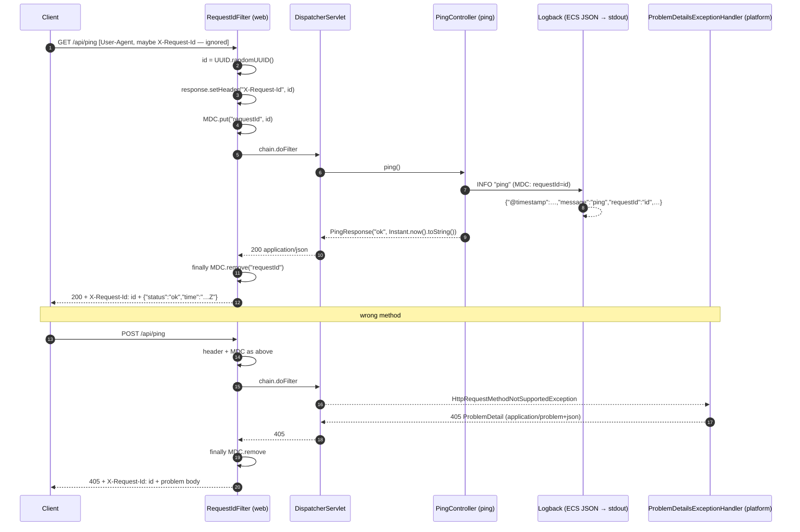

# Design — Slice 01 Ping endpoint

Reader: the Development Agent, with `SPEC.md` open beside this file. Everything
below is the smallest structure that reaches every acceptance criterion (AC-1
to AC-8) and every business rule (BR-1 to BR-8). Nothing here is speculative;
where the platform already does the job, the design says so and adds no code.

## 1. Components touched

| Component | Package / class | New or changed | Responsibility |
|---|---|---|---|
| Request-id filter | `dev.urlshort.web.RequestIdFilter` | **new** | Issues one id per request, sets the `X-Request-Id` response header *before* the chain runs, puts `requestId` into the SLF4J MDC, removes it in `finally`. |
| Ping controller | `dev.urlshort.ping.PingController` | **new** | `GET /api/ping` → `PingResponse("ok", <now as ISO-8601 UTC>)`; emits one INFO log event `ping`. |
| Ping response | `dev.urlshort.ping.PingResponse` | **new** | `record PingResponse(String status, String time)` — the exact two-field body (BR-6). |
| Problem-detail handling | `org.springframework.boot.webmvc.autoconfigure.ProblemDetailsExceptionHandler` (platform) | **unchanged** | Already enabled by `spring.mvc.problemdetails.enabled=true`; turns the wrong-method exception into an RFC 9457 body (AC-5, BR-7). **No project `@RestControllerAdvice` is added** by this slice (ADR-0002). |
| Structured logging | `logging.structured.format.console=ecs` (platform, shipped config) | **unchanged** | Renders every log event as one ECS JSON object per line; MDC entries become top-level members (AC-6). |
| Application class, properties, build | `UrlshortApplication`, `src/main/resources/application.properties`, `build.gradle.kts` | **unchanged** | — |
| Functional-suite properties | `src/functionalTest/resources/application.properties` | **one-line deletion, see §9 Territory** | Stop blanking the structured format so HTTP journeys run under the shipped logging configuration (AC-6 GIVEN). |

Mechanics the builder relies on, all platform-provided:

- A `jakarta.servlet.Filter` bean is registered for every URL by Spring Boot; `@Order(Ordered.HIGHEST_PRECEDENCE)` puts it first so the header and MDC exist for everything downstream, including the exception handler path.
- `OncePerRequestFilter` (Spring `org.springframework.web.filter`) runs once per request thread; its defaults skip ASYNC and ERROR dispatches, which this slice does not use.
- `MockMvc` built by `@AutoConfigureMockMvc` includes the context's `Filter` beans, so functional tests see the header and the MDC effect without a real socket.
- The id is `UUID.randomUUID().toString()`: 36 printable ASCII characters, no whitespace, unique per call (BR-2). The scheme is deliberately not part of the contract.
- `time` is `Instant.now().toString()`: ISO-8601 instant in UTC with the `Z` designator, seconds precision at minimum, fractional seconds when the clock has them (BR-5, A-3). Rendering it as a `String` keeps the contract independent of Jackson date settings. No `Clock` bean: nothing in the ACs needs a fixed clock, and the functional test compares against an interval.
- The controller logs exactly one INFO event, message `ping`, through SLF4J. The `requestId` reaches the line via MDC, not via the message (BR-8, A-5).

## 2. API contract

### `GET /api/ping`

Request: no parameters, no body, no significant headers. Any inbound `X-Request-Id` is **not read** (BR-1, AC-8).

Success response:

| Item | Value |
|---|---|
| Status | `200 OK` |
| `Content-Type` | `application/json` |
| `X-Request-Id` | server-issued, 1–64 printable ASCII chars, no whitespace, fresh per request (AC-3, AC-4) |
| Body | `{"status":"ok","time":"2026-10-02T22:11:59.123456Z"}` — exactly these two fields (AC-1, BR-6) |
| `status` | always the string `ok` (BR-4) |
| `time` | ISO-8601 instant, UTC, ends with `Z`, ≥ seconds precision, fractional seconds allowed, no numeric offset (AC-2, BR-5) |

No `Cache-Control` header is set (out of scope per SPEC).

### Error cases on `/api/ping`

| Trigger | Status | `Content-Type` | Body (RFC 9457 `ProblemDetail`) | Headers |
|---|---|---|---|---|
| Method other than GET/HEAD/OPTIONS, e.g. `POST /api/ping` (AC-5) | `405` | `application/problem+json` | `type` `about:blank`, `title` `Method Not Allowed`, `status` `405`, `detail` and `instance` framework-provided (`instance` is `/api/ping`). No stack trace, no exception class name (BR-7). | `X-Request-Id` present and non-empty; `Allow` listing the supported methods (framework-provided, not asserted) |

Why the header survives the error path: the filter sets `X-Request-Id` on the
`HttpServletResponse` *before* calling `chain.doFilter`. Spring MVC's
`ResponseEntityExceptionHandler` adds its own headers to the response and does
not reset the ones already there. The filter does not need to know an error
happened.

`HEAD` and `OPTIONS` on `/api/ping` keep framework defaults and are not
asserted (SPEC scope). Unknown paths produce a `404` problem detail from the
same platform handler; not part of this slice's tests.

OpenAPI: springdoc will list the endpoint automatically; the SPEC excludes
asserting it.

## 3. Data model & migration

**None.** Ping reads and writes no persistent state (SPEC scope). No table, no
Flyway migration (`V1__…` stays unused until the first persisting slice), no
rollback path needed. The H2 + Flyway baseline in `application.properties`
stays as shipped.

## 4. Sequence



The same diagram is kept as `docs/diagrams/ping-sequence.mmd`.

## 5. Logging & audit events

| Event | Logger | Level | `message` | Fields that must be present | Fields that must never appear |
|---|---|---|---|---|---|
| ping handled | `dev.urlshort.ping.PingController` | INFO | `ping` | `requestId` (from MDC, equals the `X-Request-Id` sent) | client IP / remote address, `User-Agent`, any value copied from an inbound header (AC-7, BR-1, SPEC non-functional) |

Expected shape under the shipped configuration (one line; envelope fields are
framework-provided and **not asserted**, only `requestId` is):

```json
{"@timestamp":"2026-10-02T22:11:59.123456Z","log":{"level":"INFO","logger":"dev.urlshort.ping.PingController"},"process":{"pid":4242,"thread":{"name":"http-nio-8080-exec-1"}},"service":{"name":"urlshort"},"message":"ping","requestId":"7c2f0c5e-6a3b-4a4e-9a0e-1f2d3c4b5a69","ecs":{"version":"8.11"}}
```

Boot's ECS formatter adds every MDC key-value pair as a top-level member, so
`requestId` sits beside `message`, not nested. `service.name` defaults to
`spring.application.name` (`urlshort`).

Audit events: **none.** Ping changes no state. The audit-record shape gets its
ADR with the first mutating slice.

Rules carried by this slice for every later slice (ADR-0003, ADR-0004): the
MDC key is `requestId`; the header is `X-Request-Id`; log lines never carry
client IP or user agent.

## 6. Threat model

Assets: integrity of the log stream (a support engineer trusts `requestId` to
find the right line); availability of the service; absence of client PII in
logs.

Entry points: `GET /api/ping`; any other method on `/api/ping` (framework
error path); inbound request headers (`X-Request-Id`, `User-Agent`, others).

| STRIDE | Threat | Mitigation in this slice | Residual / owner |
|---|---|---|---|
| Spoofing | Caller pretends to be another request by supplying `X-Request-Id` | Inbound id is never read; every id is server-issued (BR-1, AC-8) | None |
| Tampering | Log injection through a client-controlled value (newline or JSON in `X-Request-Id`, `User-Agent`) | No inbound header value is written to MDC or the message; the ECS encoder JSON-escapes everything it writes (AC-7, AC-8) | None |
| Repudiation | Nothing to repudiate: no state change | — | — |
| Information disclosure | Stack trace or class name in an error body | Platform `ProblemDetailsExceptionHandler`; body asserted free of stack trace (AC-5, BR-7) | Later slices adding a project advice keep the rule (ADR-0002) |
| Information disclosure | Client IP / `User-Agent` in logs (PII) | Not logged; asserted by canary (AC-7). Tomcat access log is off by default. Framework loggers stay at INFO under shipped config | A later slice that wants client analytics must hash per ADR-0004 |
| Information disclosure | Server clock exposed | By design: the endpoint's purpose | Accepted |
| Denial of service | Unauthenticated, unthrottled endpoint | Constant-time, allocation-light handler; no I/O | Accepted per SPEC (no rate limiting in scope) |
| Elevation of privilege | — | No privileges exist on this surface | — |

Dependencies: none added. The slice introduces no new library.

## 7. Test strategy hints

One functional test per AC, named after it, in
`src/functionalTest/java/dev/urlshort/ping/PingJourneyTest.java`:
`@SpringBootTest @AutoConfigureMockMvc @ExtendWith(OutputCaptureExtension.class)`
with a `CapturedOutput` parameter where log output is inspected
(`org.springframework.boot.test.system.*`). Unit tests sit in
`src/test/java/dev/urlshort/web/RequestIdFilterTest.java` and
`src/test/java/dev/urlshort/ping/PingControllerTest.java`.

| AC / BR | Layer | Test (suggested name) | What it asserts |
|---|---|---|---|
| AC-1, BR-4, BR-6 | functional | `AC1_pingAnswersOkAsJson` | 200; `Content-Type` `application/json`; `$.status == "ok"`; the object has exactly the keys `status`, `time` (e.g. `jsonPath("$.*", hasSize(2))` plus both keys exist) |
| AC-2, BR-5 | functional | `AC2_timeIsCurrentUtcInstant` | record `before = Instant.now().truncatedTo(SECONDS)` and `after = Instant.now()` around the call; `Instant.parse(time)` succeeds; `time.endsWith("Z")`; `!t.isBefore(before) && !t.isAfter(after)` |
| AC-3, BR-2, BR-3 | functional | `AC3_everyResponseCarriesRequestId` | header present, length ≤ 64, matches `^[\x21-\x7E]+$` |
| AC-4, BR-2 | functional | `AC4_requestIdsAreUniquePerRequest` | two GETs, headers differ |
| AC-5, BR-3, BR-7 | functional | `AC5_wrongMethodIsProblemDetailWithRequestId` | POST → 405; `Content-Type` compatible with `application/problem+json`; `$.status == 405`; body contains neither `Exception` nor a `\tat ` frame; `X-Request-Id` non-empty |
| AC-6, BR-8 | functional | `AC6_pingIsLoggedAsJsonWithRequestId` | take `R` from the response; collect captured lines containing `R`; at least one; parse **each** as a JSON object (the auto-configured `tools.jackson.databind.json.JsonMapper` bean, or JsonPath from the test starter) and assert top-level `requestId == R`. Assert only `requestId`; do not bind to the ECS envelope |
| AC-7, BR-1 | functional | `AC7_logEventCarriesNoClientAddressOrUserAgent` | send `User-Agent: canary-ua-<uuid>` and set a distinctive remote address with a request post-processor (`r -> { r.setRemoteAddr("203.0.113.77"); return r; }`); captured output contains neither string. MockMvc's default `127.0.0.1` is too weak a canary |
| AC-8, BR-1 | functional | `AC8_clientSuppliedRequestIdIsIgnored` | send `X-Request-Id: canary-rid-<uuid>`; response header ≠ canary; captured output does not contain the canary |
| BR-1, BR-2, BR-3 | unit | `RequestIdFilterTest` | with `MockHttpServletRequest/Response` and a chain lambda: header value equals `MDC.get("requestId")` *during* the chain; MDC is empty after; an inbound `X-Request-Id` does not influence the issued id; two invocations differ; MDC is cleared when the chain throws |
| BR-4, BR-5, BR-6 | unit | `PingControllerTest` | `new PingController().ping()` → `status == "ok"`, `Instant.parse(time)` succeeds, ends with `Z` |

**AC-6 mechanism — read this before writing the test.** AC-6 requires the
*shipped* logging configuration, but both test property files set
`logging.structured.format.console=` (blank), so a suite run as configured
emits plain text, and no MDC-presence check counts as proof (SPEC A-6).

- **Recommended:** delete the blanking line from
  `src/functionalTest/resources/application.properties` so the whole functional
  suite runs under the shipped ECS format. One-line deletion, deterministic,
  independent of test order; the unit suite keeps plain text. This file is
  outside the current territory — see §9.
- **Fallback if the territory is not widened:** a per-class override on the
  ping journey test, `@TestPropertySource(properties =
  "logging.structured.format.console=ecs")`. Uncertainty, stated plainly: Boot
  configures Logback before the ApplicationContext exists and the Logback
  configuration is applied once per JVM, so a format change requested by a
  *later* test context in the same JVM may not be re-applied. The builder's
  TDD loop proves which way it goes.
- **Rule either way:** the AC-6 test must **fail** when the captured line is
  not a JSON object. Never skip, never degrade to "MDC contained the key".
  If the fallback does not produce JSON, stop and route the territory
  question rather than weakening the test.

Coverage: the new code has no conditional branches (UUID, `setHeader`,
`MDC.put/remove`, one record, one `log.info`). 100 % line and branch is
reachable with the tests above; `UrlshortApplication.main` is already covered
by `UrlshortApplicationTests`. Expected `docs/qa/GAPS.md` row: "None for this
slice". Fixtures: none; canaries are fresh UUID strings per test.

`OutputCaptureExtension` works with Logback's console appender because the
appender writes to the current `System.out` at write time. Each test method
gets its own capture, so "output produced while handling that request" is the
whole capture of that method.

## 8. Reachability check (plan-review)

| AC | Reached by | Error AC explicit? | Threat model covers entry point? |
|---|---|---|---|
| AC-1 | `PingController` + `PingResponse` | — | GET /api/ping ✔ |
| AC-2 | `Instant.now().toString()` | — | ✔ |
| AC-3 | `RequestIdFilter` header | — | ✔ |
| AC-4 | `UUID.randomUUID()` | — | ✔ |
| AC-5 | filter order + platform `ProblemDetailsExceptionHandler` | yes, §2 error table | other methods ✔ |
| AC-6 | MDC + shipped ECS format + §7 mechanism | — | log stream ✔ |
| AC-7 | nothing logs IP/UA; canary test | — | inbound headers ✔ |
| AC-8 | filter never reads request headers | — | inbound `X-Request-Id` ✔ |

Every business rule maps to at least one test in §7. No AC needs a component
not listed in §1.

## 9. Territory (confirmed against `slice.yaml` and the mission SPEC)

| Path | In `slice.yaml` on disk | In mission SPEC / revised instance | Needed by this design |
|---|---|---|---|
| `src/{main,test,functionalTest}/java/dev/urlshort/ping/` | yes | yes | yes |
| `src/{main,test,functionalTest}/java/dev/urlshort/web/` | **no** | yes (lead widened it at decompose; adopted with `rig workflow revise`) | yes — `RequestIdFilter` and its unit test |
| `src/functionalTest/resources/application.properties` | no | no | **requested** — one-line deletion for the AC-6 mechanism (recommended option in §7) |

Two asks for the orchestration lead, neither blocking plan-lock:

1. Bring `slice.yaml` territory in line with the revised instance (add the
   `web/` paths) so `rig scope audit` agrees with this design.
2. Add `src/functionalTest/resources/application.properties` to the territory.
   If declined, the builder uses the §7 fallback under the stated rule.

Everything else this design touches is documentation in the main checkout.

## 10. Decisions recorded as ADRs

- ADR-0001 Spring Boot 4.1 on Java 21 with Gradle (stack baseline)
- ADR-0002 Errors are RFC 9457 problem details produced by the platform handler
- ADR-0003 Request id: server-issued `X-Request-Id`, MDC `requestId`, inbound ignored
- ADR-0004 Structured ECS JSON logs with no client PII

Not decided here (deferred to the slice that introduces them): H2 + Flyway
schema conventions, 301 vs 302 redirects, short-code generation, salted IP
hashing, audit-record shape.

## Status

- 2026-10-02 — design written against SPEC.md (8 AC, 8 BR). No question parked
  on `human@kernel`; two territory asks routed to the orchestration lead.
  Awaiting plan-lock.

## Self-check

Recorded before handoff to `plan_lock`. "Verified" means I read the SPEC
clause and the design section side by side; nothing here was executed.

| # | Item | Result | Where |
|---|---|---|---|
| 1 | Every AC reachable, component named | ✔ AC-1/2 `PingController`+`PingResponse`; AC-3/4/8 `RequestIdFilter`; AC-5 filter order + platform `ProblemDetailsExceptionHandler`; AC-6/7 MDC + shipped ECS format + controller log event | §8 |
| 2 | Every error AC is an explicit `ProblemDetail` | ✔ AC-5 (`405`, `application/problem+json`, `status` 405, no stack trace); produced by the platform handler, no project advice | §2 |
| 3 | Migration has a written rollback | n/a — no schema change, no migration; stated explicitly | §3 |
| 4 | Log/audit events PII-free | ✔ one event `ping` with `requestId` only; never IP, `User-Agent`, copied inbound headers; no audit events | §5 |
| 5 | Threat model covers every new entry point | ✔ `GET /api/ping`, other methods on `/api/ping`, inbound headers (`X-Request-Id`, `User-Agent`); STRIDE rows with mitigations and accepted residuals | §6 |
| 6 | Test strategy maps each AC to a suite | ✔ 8 functional tests (one per AC) + 2 unit tests (filter, controller); AC-6 mechanism named with recommended path, fallback and a fail-not-skip rule | §7 |
| 7 | No structure beyond the SPEC | ✔ no `Clock` bean, no `@RestControllerAdvice`, no service/repository layer, no access log, no new dependency | §1 |
| 8 | Territory respected | ✔ design stays inside `ping/` and `web/`; the one file outside (`functionalTest` properties) is **requested**, not taken; `slice.yaml` drift vs the revised instance reported | §9 |
| 9 | ADRs for cross-cutting choices | ✔ ADR-0001 stack, 0002 problem details, 0003 request id, 0004 structured logs / PII | §10, `docs/adr/` |

### plan-review (three lenses, proportionate to a dry-run slice)

**Strategy — 9/10.** The slice's product value is the proven pipeline; the
contract is deliberately tiny and the only wave has nothing else in it, so
there is no opportunity cost. Personas (operator, support engineer, factory
evaluator) are named in the SPEC and each has an AC that serves them. Risk:
process attention exceeding product attention; the design adds no mechanism
to feed that.

**Design (interaction) — n/a for UX, 8/10 as an API surface.** Information
architecture: one endpoint under `/api/`, consistent with the future API
root. States: success and wrong-method are specified and tested; unknown
path and unacceptable `Accept` fall to framework defaults (404 / 406 problem
details) and are not asserted — acceptable for this slice, noted here so a
later slice can pick them up. Journey matches how the operator works: curl,
read header, grep log by `requestId`. Accessibility and AI lenses do not
apply.

**Engineering feasibility — 8/10.** Every AC is observable and specific
enough to code against without guessing. Data model: none. Dependencies:
territory alignment (see Issues). Performance: none. Scope: three small
classes and about ten tests; realistic for one implement step.

**Issues found**

- Blocking: none.
- Important: (1) `slice.yaml` territory on disk omits `web/` although the
  revised instance includes it; `rig scope audit` may disagree with the
  design until the lead updates the manifest. (2) The recommended AC-6
  mechanism needs `src/functionalTest/resources/application.properties` in
  the territory; without it the builder takes the §7 fallback under the
  fail-not-skip rule. Both routed to the orchestration lead; neither blocks
  the plan-lock decision.
- Suggestions: assert `Content-Type` with "compatible with" matchers so a
  future charset parameter cannot break AC-1/AC-5; keep the `Allow` header
  and `detail` wording unasserted (framework-owned).

**Recommended action:** approve SPEC.md + design.md at plan-lock; lead
resolves the two territory items before or during implement. An executive
summary was not produced: disproportionate for a dry-run slice whose SPEC
intent is one sentence.
