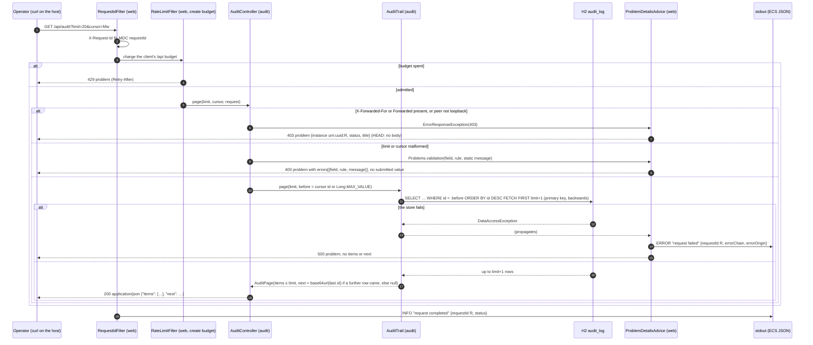

# Design — 01-audit-read

- Slice: `01-audit-read` (mission `02-brownfield`, moved from mission 01). Tier low; the plan-lock
  is delegated to the orchestration lead (D11). Workflow `urlshort-slice-delegated`, judges
  `review-agent` and `qa-agent`.
- SPEC: `7b753b7` (requirements PASS, RQ-01 to RQ-04 fixed).
- Impact analysis, committed before this design: [`impact-analysis.md`](impact-analysis.md) (`a686b2a`).
- Decision record: [ADR-0019](../../../../docs/adr/0019-audit-read-loopback-keyset.md).
- Probe: [`design-probe/`](design-probe/) (§12). Author: `design-agent@urlshort-factory`, 2026-10-03.

**In one paragraph.** `GET /api/audit` is a new `audit.AuditController`. Its first statement
refuses (`403` problem) any request in three cases:
- Boot's effective forwarded-header strategy is anything but `NONE`, so the peer address might
  not be the connection's;
- the request carries `X-Forwarded-For` or `Forwarded`;
- its peer address is not a loopback address.

The handler has no `produces` condition, so the guard and the validation always come first
(design review DR-01, DR-02). It then validates `limit` (1–100, default 50) and `cursor`
(`400` naming the field). `audit.AuditTrail` reads `limit + 1` rows newest first by `id` with a
keyset `WHERE id < :before`. The page is `{"items": […], "next": …}`, where `next` is the base64url
of the last row's `id` when more rows exist.

What the change does not need:
- no index and no migration: the primary key serves the backwards walk (P5);
- no new log event;
- no change to `link/`, `click/` or `web/`.

One line goes into the shipped configuration: `server.forward-headers-strategy=none`. Without it,
a detected cloud platform makes Tomcat rewrite the peer address from `X-Forwarded-For` and drop the
header, and a forged loopback header was admitted (P4b, first version). The controller does not rely
on that default alone. Any other effective strategy closes the endpoint, so an operator override
(`native`, `framework`) or a removed pin refuses every request rather than opening it (P6).

## 1. Components touched

| Component | Change | Specification |
|---|---|---|
| `audit.AuditController` | **new**, package-private `@RestController` | The constructor takes `AuditTrail`, Boot's `ServerProperties` (`org.springframework.boot.web.server.autoconfigure`) and Boot's `TomcatServerProperties` (`org.springframework.boot.tomcat.autoconfigure`). It keeps `peerIsConnection = server.getForwardHeadersStrategy() == ServerProperties.ForwardHeadersStrategy.NONE && !StringUtils.hasText(tomcat.getRemoteip().getRemoteIpHeader()) && !StringUtils.hasText(tomcat.getRemoteip().getProtocolHeader())`. That is the exact negation of Boot 4.1.1's condition for installing Tomcat's `RemoteIpValve` (design review DR-01; code review on `35590f0`, P7). `@GetMapping("/api/audit")`, **with no `produces` condition**, so nothing is decided before the guard (DR-02). The handler is `ResponseEntity<AuditPage> page(@RequestParam(name = "limit", required = false) @Nullable String limit, @RequestParam(name = "cursor", required = false) @Nullable String cursor, HttpServletRequest request)`. In this order: `if (!peerIsConnection \|\| !fromLoopback(request)) throw new ErrorResponseException(HttpStatus.FORBIDDEN);`; then `int size = limit(limit)`; then `long before = cursor == null ? Long.MAX_VALUE : position(cursor)`; then `return ResponseEntity.ok().contentType(MediaType.APPLICATION_JSON).body(trail.page(size, before))`. The preset content type makes a `200` `application/json` whatever the `Accept` (P6). The three helpers are package-private and static (below). OpenAPI annotations in §2 |
| `audit.AuditTrail` | **new**, package-private `@Component` | `AuditPage page(int limit, long before)`. `jdbc.sql(PAGE).param("before", before).param("fetch", limit + 1)` maps each row: `rs.getObject("occurred_at", OffsetDateTime.class).toInstant()`, the five strings, and `before_state` and `after_state` through `json.readTree(…)` (`null` when `before_state` is SQL `NULL`). If more than `limit` rows came back, it returns the first `limit` with `next = cursorOf(id of row limit)`; otherwise all rows with `next = null`. It needs the row `id`s next to the entries, mapped into a small private record and then projected. `PAGE` = `SELECT id, occurred_at, actor, action, entity, entity_id, request_id, before_state, after_state FROM audit_log WHERE id < :before ORDER BY id DESC FETCH FIRST :fetch ROWS ONLY` |
| `audit.AuditEntry`, `audit.AuditPage` | **new** records | `AuditEntry(Instant occurredAt, String actor, String action, String entity, String entityId, String requestId, @Nullable JsonNode before, JsonNode after)`; `AuditPage(List<AuditEntry> items, @Nullable String next)`. Components carry `@Schema` descriptions; `before` and `after` are `@Schema(type = "object")`, `before` nullable, so the document does not describe Jackson's `JsonNode` getters |
| `audit.package-info` | text | "the audit trail: the insert-only writer and the loopback-only read" |
| `audit.AuditLog` | **unchanged** | still the only writer |
| `application.properties` | **one setting** (first w1 holder) | after the rate-limit block: `# The audit read trusts only the connection address (ADR-0019); Tomcat must not rewrite it from X-Forwarded-For, which Boot otherwise enables on a detected cloud platform.` and `server.forward-headers-strategy=none` |
| `docs/api/openapi.json` | regenerated | one operation added (§2) |

**The helpers** (static, package-private, unit-tested):

```java
static boolean fromLoopback(HttpServletRequest request) {
	String peer = request.getRemoteAddr();
	if (request.getHeader("X-Forwarded-For") != null || request.getHeader("Forwarded") != null || peer == null || peer.isEmpty()) {
		return false;
	}
	try {
		return InetAddress.getByName(peer).isLoopbackAddress();   // a numeric literal from Tomcat: parsed, never resolved
	}
	catch (UnknownHostException ex) {
		return false;
	}
}

static int limit(@Nullable String value) {           // null → 50; not an int → 400 limit format; outside 1..100 → 400 limit range
	…
	throw Problems.validation("limit", "format", "must be a whole number");
	…
	throw Problems.validation("limit", "range", "must be from 1 to 100");
}

static long position(String cursor) {                 // base64url of a positive decimal long, else 400 cursor format
	try {
		long id = Long.parseLong(new String(Base64.getUrlDecoder().decode(cursor), StandardCharsets.US_ASCII));
		if (id > 0) {
			return id;
		}
	}
	catch (IllegalArgumentException ex) {             // not base64url, or not digits (NumberFormatException)
	}
	throw Problems.validation("cursor", "format", "must be a value returned as next");
}

static String cursorOf(long id) {                     // in AuditTrail; Base64.getUrlEncoder().withoutPadding()
	…
}
```

The messages are static, so no submitted value reaches a body (rule 6, AC-9: P2e). `limit` and
`cursor` are bound as `String` and parsed by hand. That puts each problem in its own `field` and
`rule`, and keeps the value out of framework conversion messages and logs. An empty `cursor=`
parses as `""`, decodes to no digits and answers `400` `cursor` `format`. Unknown query parameters
are ignored (rule 5).

## 2. API contract

`GET /api/audit` (and `HEAD`): anonymous, read-only, loopback only, under the create budget of the
rate limit.

| Request | Response |
|---|---|
| loopback peer, no forwarding header, strategy `NONE`, valid or absent `limit` and `cursor` | `200 application/json` **whatever the `Accept`**, exactly `{"items": [<row>…], "next": <string or null>}` (P6: `text/html`, `application/problem+json` and `*/*` all get `200 application/json`; no `406` on this endpoint) |
| any `X-Forwarded-For` or `Forwarded` header, a peer that is not loopback, or an effective forwarded-header strategy other than `NONE` (an override to `native` or `framework`, or the pin removed) | `403 application/problem+json` `{"instance": "urn:uuid:<R>", "status": 403, "title": "Forbidden"}` (`HEAD`: no body), whatever the `Accept` (P6) |
| `limit` not an integer / outside 1..100; `cursor` malformed | `400` problem with `errors: [{"field": "limit" or "cursor", "rule": "format" or "range", "message": <static>}]`, whatever the `Accept` (P6) |
| store failure | `500` problem, bare (inherited catch-all) |
| budget spent | `429` problem with `Retry-After` (inherited) |
| `POST`, `PUT`, `PATCH`, `DELETE` | `405` problem, `Allow: GET` (P2i) |
| `OPTIONS` | framework default, `Allow: GET,HEAD,OPTIONS` (P2k) |

Row: `{"occurredAt": "2026-10-03T17:29:41.033Z", "actor": "anonymous", "action": "link.retire",
"entity": "link", "entityId": "jHkOIMpK", "requestId": "140fc9de-…", "before": {"url": "…",
"state": "active"}, "after": {"url": "…", "state": "retired"}}`. `before` is `null` for a create.
Values are as stored (P2b).

**OpenAPI** (NFR-M3, AC-19), on the handler:
- `@Operation(summary = "Read the audit trail, newest first (loopback only)")`;
- `@Parameter`s:
  - `limit`: `@Schema(type = "integer", minimum = "1", maximum = "100", defaultValue = "50")`;
  - `cursor`: a string described as "the `next` of the previous page";
- `@ApiResponse` entries:
  - `200`: `AuditPage` schema with one `@ExampleObject`, a two-row page with a non-null `next`;
  - `400`, `403`, `500`: `application/problem+json` with `@Schema(implementation = ProblemDetail.class)`,
    as `StatsController` does.

`web.OpenApiConfig`'s customiser adds the `429`. The committed `docs/api/openapi.json` is
regenerated by the suite. W2-01, the problem schema's shape, stays with `03-dogfood-fix`.

## 3. Data model, queries and migration

**No migration.** The next Flyway number is not taken, and `02-click-retention` takes none either.

| Query | Served by |
|---|---|
| `SELECT … FROM audit_log WHERE id < :before ORDER BY id DESC FETCH FIRST :fetch ROWS ONLY` | the primary key, walked backwards: H2 plans `PRIMARY_KEY …: ID < ?` with `/* index sorted */` and reads `scanCount` = fetch + 1 at any depth on 1 000 000 rows (P5) |
| the existing `INSERT` (`AuditLog`) | unchanged |

**Why `id`.** It is the write sequence of rule 4: assigned on insert, strictly increasing, carried
by every shipped row. It is not commit order (`docs/review/01-audit-read/proof/commit-order.txt`),
and the SPEC accepts that.

**Upgrade (AC-18).** Nothing to migrate; the pre-existing rows are read as they are.

**Rollback.** `git revert` of the merge commit.

## 4. Sequence

Source: [`docs/diagrams/audit-read-sequence.mmd`](../../../../docs/diagrams/audit-read-sequence.mmd).



## 5. Logging and audit events

No new event (rule 7).
- Each request writes the existing INFO `request completed` with `requestId` and `status`.
- A `500` writes the existing ERROR `request failed` (class names and one code frame).
- `400`, `403` and `405` write nothing else. Their problems come from `ErrorResponseException`s,
  which the advice handles without logging, and Spring's `PageNotFound` category is at ERROR.

Never logged: the peer address, a forwarding-header value, the `User-Agent`, the `cursor`, a URL
or any `before`/`after` content. `limit` and `cursor` are parsed by hand, so no conversion
exception carries them. A read writes no audit row (A-11).

## 6. Threat model (STRIDE-lite)

| Threat | Mitigation | Residual |
|---|---|---|
| **Information disclosure:** a remote client reads link targets and request ids | peer address must be loopback and no forwarding header present (P1, P2f–h); forwarded-header handling pinned off (P4b shows the hole it closes), and **enforced**: any setting that makes Tomcat rewrite the peer closes the endpoint. That is any other effective strategy, or either `server.tomcat.remoteip` header setting, so no setting opens it (A-6; DR-01; P6 `native`, `framework`, unset, unset + `kubernetes`; P7 `remote-ip-header`, `protocol-header`: every request `403`). The check runs before anything else in the handler. **Ceiling:** the guard mirrors Boot 4.1.1's valve condition, so a Boot upgrade that adds a trigger must be added here | a headerless local relay looks like a local Operator (rule 2 trust boundary, documented in `docs/DESIGN.md` §3) |
| **Spoofing:** a forged `X-Forwarded-For: 127.0.0.1` | forwarding headers only ever refuse | — |
| Information disclosure: content in error bodies or logs | static messages, no `detail`, no logging of content or `cursor`; the `403` says nothing about the trail; `HEAD` has no body | — |
| **Tampering:** a read changes the trail | `AuditTrail` holds one `SELECT`; `AuditLog` remains the only writer (`INSERT`); no update or delete path exists | — |
| **Denial of service:** deep pages or large pages | `limit` ≤ 100; a page reads `limit + 1` index rows at any depth (P5); the `/api` budget of 60 per minute applies | — |
| Elevation | none: anonymous by NFR-S6, read-only | — |
| Repudiation | reads are not audited by decision (A-11); each request has its `request completed` line | — |

## 7. Test strategy

Most journeys run on **their own in-memory database**
(`spring.datasource.url=jdbc:h2:mem:urlshort-audit-read;…`), so AC-1's empty trail is real and the
row counts are exact. Rows are created through the API, or seeded with `JdbcClient` for volume, as
the SPEC's preamble allows. Peers are set per request with MockMvc:
`.with(r -> { r.setRemoteAddr("::1"); return r; })`.

| AC / rule | Test (class: mechanism) | Asserts |
|---|---|---|
| AC-1 | `AuditReadJourneyTest` (own DB): `DELETE FROM audit_log` in that database, then `GET /api/audit` | `200`, `application/json`, body exactly `{"items":[],"next":null}` |
| AC-2, AC-3, AC-4, rule 3, rule 4 | same: creates and a retire through the API, recording `X-Request-Id` and the instants around them | field-by-field row content, `before` `null` on create, newest first |
| AC-5 | same: several creates and retires; read every page | count and content equal to `SELECT * FROM audit_log` |
| AC-6, AC-7, rule 5 | same: 45 and 150 rows seeded; follow `next` | pages of 20/20/5; 50 by default, 100 at the maximum; `next` `null` only on the last |
| AC-8 | same: 30 rows, read `limit=10`, create five more, follow `next` | each of the 30 exactly once, none of the five; a fresh read starts with the five |
| AC-9 | same, `@ParameterizedTest` over the four queries | `400`, one `errors` element with the `field` and `rule`, the submitted value absent |
| AC-10, rule 1 | same: read all pages twice; `POST`, `PUT`, `PATCH`, `DELETE` | `405` problems; rows, count and links unchanged |
| AC-11 | same: peers `192.0.2.10` and `10.0.0.7`, `GET` and `HEAD` | `403`, no row content, code, URL, request id or address in the body |
| AC-12 | same: peers `127.0.0.1`, `127.0.0.2`, `::1`, `::ffff:127.0.0.1` | `200` |
| AC-13, AC-14, rule 2 | `AuditAccessSettingsJourneyTest`: own DB, with `urlshort.rate-limit.trusted-proxies=127.0.0.1,192.0.2.10`, raised budgets, a non-default `urlshort.public-base-url` (every operator setting at a non-default value); plus the four header cases of AC-13 on the default context | every case `403`, no trail content |
| forwarded-header strategy, rule 2, AC-14 (DR-01) | `AuditForwardedHeadersJourneyTest`: **(a)** two MockMvc contexts with `server.forward-headers-strategy=native` and `=framework` (operator overrides of the pin): a plain loopback `GET`, `X-Forwarded-For: 127.0.0.2` and `Forwarded: for=127.0.0.2`. **(b)** `RANDOM_PORT` with `spring.main.cloud-platform=kubernetes` and the shipped pin, a real Tomcat on `127.0.0.1`: a plain `GET` and `X-Forwarded-For: 127.0.0.2`. **(c)** read `application.properties` from the classpath for `server.forward-headers-strategy=none`, like `RateLimitDefaultsTest` | (a) every request `403`, no trail content (P6). (b) `200` for plain; `403` forged (it was `200` without the pin, P4b). (c) the pin is present. Unit: `AuditController` built with a `ServerProperties` whose strategy is `null`, `NATIVE` or `FRAMEWORK` refuses a loopback request; with `NONE` it admits it |
| `server.tomcat.remoteip` settings, rule 2 (code review on `35590f0`) | `AuditForwardedHeadersJourneyTest` **(d)**: two `RANDOM_PORT` contexts (MockMvc never runs the valve), each with the shipped pin plus `server.tomcat.remoteip.remote-ip-header=x-forwarded-for` or `server.tomcat.remoteip.protocol-header=x-forwarded-proto`. On a real Tomcat on `127.0.0.1`: a plain `GET` and `X-Forwarded-For: 127.0.0.2` | every request `403`, no trail content (P7; the candidate answered `200` with trail content to the forged one). Unit: `AuditController` built with `NONE` plus a `TomcatServerProperties` whose remote-ip header, or protocol header, has text refuses a loopback request; with both empty or `null` it admits it. That covers each `hasText` branch |
| strict `Accept` (DR-02) | `AuditReadJourneyTest`: `Accept: text/html` and `Accept: application/problem+json` on a refused request, `limit=0` and a valid request | `403` and `400` problems; the valid request `200 application/json` (P6) |
| AC-15, AC-16, rule 7 | `AuditReadJourneyTest` with `OutputCaptureExtension`: the `200`, `400`, `403` and `405` cases; a canary URL in a link's query and a canary `User-Agent` on a refused request | every line in each window carries the request's `requestId`; no canary, cursor value, `before`/`after` content, `192.0.2.10` or `198.51.100.9` |
| AC-18 | `AuditUpgradeJourneyTest`: a temporary file database at **V2** (`Flyway…target("2")`, the `f6dd29e` schema) with active and retired links, clicks and audit rows in the shipped shapes; start the candidate (`SpringApplicationBuilder`, port 0) and use a real HTTP client on `127.0.0.1` | `302` with the same `Location`, `410`, statistics unchanged, `GET /api/audit` returns every pre-existing row with its content. **By effect (proof item 7):** the real `f6dd29e` jar writes the directory, then the candidate jar starts on it |
| AC-19 | `AuditReadJourneyTest`: `/v3/api-docs` | `/api/audit` get with `limit` and `cursor`; `200` schema and example; `400`, `403`, `500` as problem JSON; every earlier operation unchanged (`OpenApiDocumentTest` compares the committed file) |
| AC-20, rule 5 | `AuditReadJourneyTest`: 30 committed rows; a second connection from the `DataSource` with `autoCommit(false)` inserts one row and holds it; read `limit=10`, commit, follow `next`; then a fresh traversal | the first traversal: the 30 once each and the held row at most once; the fresh one: 31, the held row in its `id` position. **Induction mechanism:** the held JDBC transaction (P3) |
| AC-21, rule 6 | `AuditReadFailureJourneyTest`: own DB, `@MockitoSpyBean AuditTrail`, `doThrow(new DataAccessResourceFailureException(CANARY))`; a well-formed canary `cursor`; then `reset` | `500` problem without `items`/`next`, class name, SQL, cursor or content; the log window carries `requestId` and none of those; then `200`. **Induction mechanism:** the spy |
| AC-17 | the shipped functional suite, unchanged | impact analysis, *Test impact* |
| helpers | unit `AuditControllerTest` | `limit`: `null` → 50, `"1"`, `"100"`, `"0"`/`"101"` → range, `"ten"`/`""` → format; `cursor`: `"Mw"` → 3, `"***"`, `"MA"` (0), `"eDE"` (`x1`), `""` → format; `fromLoopback`: the twelve addresses of P1, an empty peer, `"1::2::3"` (unparsable: refused, no lookup), each forwarding header |

Coverage target: 100 % line and branch on merged data (NFR-M1). Every branch above has a test. No
exclusion is expected.

## 8. Reachability check

| Mechanism | Reached by |
|---|---|
| `fromLoopback` | every `GET`/`HEAD` on `/api/audit`, first |
| `limit`, `position` | admitted requests only |
| `AuditTrail.page` | admitted, valid requests only |
| the pinned strategy | Boot's Tomcat customiser at startup (P4) |

## 9. Territory

| Path | Use |
|---|---|
| `src/main/java/dev/urlshort/audit/` | `AuditController`, `AuditTrail`, `AuditEntry`, `AuditPage`, `package-info`; `AuditLog` untouched |
| `src/test/java/dev/urlshort/audit/` | `AuditControllerTest` |
| `src/functionalTest/java/dev/urlshort/audit/` | `AuditReadJourneyTest`, `AuditAccessSettingsJourneyTest`, `AuditForwardedHeadersJourneyTest`, `AuditUpgradeJourneyTest`, `AuditReadFailureJourneyTest` |
| `src/main/resources/application.properties` | one setting (first w1 holder) |
| `docs/api/openapi.json` | regenerated (only w1 holder) |
| `src/main/resources/db/migration/` | **not used**: no migration, no Flyway number |

**Grant request for the lead at plan-lock.** One line of `README.md`: `GET /api/audit` in the
endpoint list, marked loopback only. Proof item 13 accepts `docs/DESIGN.md` as the operator
documentation, and §3's Audit read row is that (mine). The README line only keeps the README
honest (brownfield §5).

Mine, done in this design step: `docs/DESIGN.md`, `docs/diagrams/container.mmd`,
`docs/diagrams/audit-read-sequence.mmd`, ADR-0019.

## 10. Decisions recorded as ADRs

ADR-0019: where the check sits, the rule, the forwarded-header pin, write-sequence order, the
keyset and cursor, the bounded guarantee, no index. No amendment to ADR-0015: the rate limiter is
unchanged, and the pin keeps its stated premise.

## 11. Trade-offs

| Chosen | Over | Because |
|---|---|---|
| a check in the handler | a filter, Tomcat's valve | one endpoint; provable with MockMvc (AC-11 to AC-14) |
| refuse on any forwarding header | believe a trusted proxy | rule 2: headers only refuse |
| pin `server.forward-headers-strategy=none`, **and close the endpoint under any other effective strategy** | leave Boot's platform default; rely on the pin alone | P4b admits a forged header on a detected platform. The reviewer's controls show an override of the pin did too, and so did either `server.tomcat.remoteip` header setting (code review). Enforcing in the controller the negation of Boot's whole valve condition makes "no known setting opens it" true by construction (DR-01, P6, P7) |
| no `produces`; `ResponseEntity` with `application/json` preset | `produces = APPLICATION_JSON_VALUE` | the mapping condition answered `406` before the guard (DR-02). The preset type answers `200 application/json` to any `Accept`, after the guard and validation (P6) |
| keyset on `id` | offset; `occurred_at` | stable while written (AC-8); the clock can step (A-10) |
| base64url of the `id` | a plain number; a signed token | opaque by contract at one line; nothing to protect |
| strings parsed by hand | `@RequestParam Integer` | per-field `rule` (`format` vs `range`), and no value in a framework message |
| no index | `ix_audit_log_id_desc` | the primary key serves the backwards walk (P5) |

## 12. Design probe (what was verified by effect)

`AuditProbe.java` runs the endpoint as §1 specifies it, inside the shipped application on a real
Tomcat bound to `127.0.0.1`, on the functional classpath. No product file was touched.

| Row | Setup | Result | Proves |
|---|---|---|---|
| P1 | `InetAddress.getByName(…).isLoopbackAddress()` over 12 literals | `127.0.0.1`, `127.0.0.2`, `127.255.255.254`, `::1`, `0:0:0:0:0:0:0:1`, `::ffff:127.0.0.1` → true; `192.0.2.10`, `10.0.0.7`, `::ffff:192.0.2.10`, `fe80::1`, `0.0.0.0`, `::` → false; `::ffff:a.b.c.d` parses to IPv4 | rule 2's address set |
| P2a | empty trail | `200 application/json` `{"items":[],"next":null}` | AC-1, null inclusion |
| P2b–d | three creates, one retire; `limit=2`, then `cursor=next` | retire first, `before` `null` on creates, `after` as stored with the canary URL; pages 2 + 2, `next` `Mw` then `null` | AC-2 to AC-6 |
| P2e | `limit=0`, `101`, `ten`; `cursor=***`, `MA`, `eDE` | `400` with one `errors` element and the right `field`/`rule`, no submitted value | AC-9 |
| P2f–h | `X-Forwarded-For`, `Forwarded`, `HEAD` with `X-Forwarded-For`, from `127.0.0.1` | `403` problem `{instance, status, title}`; `HEAD` no body | AC-11, AC-13 |
| P2i–k | `POST`, `HEAD`, `OPTIONS` | `405` `Allow: GET`; `200` no body; `200` `Allow: GET,HEAD,OPTIONS` | AC-10, rule 1 |
| P3 | 30 rows; one insert held open during page 1, committed before page 2 | first traversal 30 rows, all distinct, held row absent; fresh traversal 31, held first | AC-20, rule 5 |
| P4 | `X-Forwarded-For: 198.51.100.9` from `127.0.0.1`: default; `spring.main.cloud-platform=kubernetes`; kubernetes + `none` | default and pinned: the app sees `127.0.0.1` and the header; kubernetes alone: `198.51.100.9` and **no header** | the pin |
| P4b | `GET /api/audit` with `X-Forwarded-For: 127.0.0.2` in the same three configurations | first version (no strategy check): `403`; **`200`**; `403`. Revised controller: `403` in all three | the hole the pin closes; after DR-01 the controller closes it even without the pin |
| P6 (DR-01, DR-02) | the revised controller under strategy `none`, `native` and `framework` (operator overrides), unset, unset + `kubernetes`, with a plain loopback request and forged `X-Forwarded-For: 127.0.0.2`, `Forwarded: for=127.0.0.2` and `X-Forwarded-For: 192.0.2.10`; then `Accept: text/html`, `application/problem+json` and `*/*` against a refused request, `limit=0` and a valid request | `none`: plain `200`, every forged one `403`. **`native`, `framework`, unset, unset + `kubernetes`: every request `403`.** With any `Accept`: `403` and `400` problems, valid `200 application/json` | no forwarded-header strategy opens the endpoint; guard and validation precede content negotiation; no `406`. **Incomplete:** it did not cover the `server.tomcat.remoteip` settings (P7) |
| P7 (code review on `35590f0`) | `RemoteIpProbe.java` (`remote-ip-output.txt`), real Tomcat on `127.0.0.1`. Three guards side by side: the strategy alone (the candidate); the strategy plus both `remoteip` headers (§1); and "no `org.apache.tomcat.remoteAddr` attribute". Each runs under the pin, pin + `remote-ip-header=x-forwarded-for`, pin + `protocol-header=x-forwarded-proto`, pin + `remote-ip-header=X-Real-IP`, `native` and `framework`, with plain, forged `X-Forwarded-For: 127.0.0.2`, forged `X-Real-IP: 127.0.0.2` and `X-Forwarded-For: 198.51.100.9` | each `remoteip` setting puts a `RemoteIpValve` on the engine. The strategy-only guard then admits the forged `X-Forwarded-For` (header setting or protocol setting) and the forged `X-Real-IP` (when that is the configured header). **The §1 guard answers `403` to every request under all five rewriting settings, and under the pin it answers plain `200` and forged `X-Forwarded-For` `403`.** The attribute guard misses `framework` (no valve, so no attribute) | the §1 predicate is the one that closes every known rewrite; the attribute check cannot replace the strategy check |
| P5 | 1 000 000 rows: first page, `id < 500000`, `id < 52` (`EXPLAIN ANALYZE`) | `PRIMARY_KEY` backwards, `index sorted`, `scanCount` 51, 52, 52 | page cost, no index |

Not run by the probe: an IPv6 peer on a real socket (Tomcat is bound to `127.0.0.1`; P1 and MockMvc
cover the classification); PostgreSQL; the dev's class, of which this is a twin.

## 13. Build plan

1. `test(01-audit-read): audit read journeys and parsing` (red).
2. `feat(01-audit-read): loopback-only audit read with keyset pages`: the controller, the trail and
   the records. The shipped-file line `server.forward-headers-strategy=none` is in the same commit
   as its test.
3. `docs(01-audit-read): regenerate the API document`.
4. Run `scripts/gw check`, commit the coverage reports, and hand off naming the SHA. This slice
   merges first in w1. `02-click-retention` rebases onto the merge for `application.properties`.

ADR-0019 is on `main` with this design, before any dependent code (NFR-M2).

## Status

- 2026-10-03 — design written on SPEC `7b753b7`, impact analysis first (`a686b2a`); handed to
  `design_review`.
- 2026-10-03 — design review **FAIL** on `b55c549` (`docs/review/01-audit-read/design-review.md`,
  review commit `97e434a`): DR-01 HIGH, DR-02 MEDIUM. Both fixed; see *Review response*. Rework
  packet `qitem-20261003175700-cbb50861`.
- 2026-10-03 20:07Z — code review on `35590f0` found that the `server.tomcat.remoteip` settings
  reopen the read (HIGH). This is a gap in DR-01's fix. §1, §6, §7 and §12 (P7) and ADR-0019 are
  corrected for the builder; see *Review response*.

## Review response

| Id | Severity | Response |
|---|---|---|
| DR-01 | HIGH | **Fixed: no setting can open the endpoint, by construction.**<br>**The cause.** The pinned `server.forward-headers-strategy=none` was only an overridable default, and the reviewer's controls admitted forged loopback headers under `native` and `framework`. No recorded decision allowed that, as I confirmed at 17:52Z.<br>**The fix.** `AuditController` takes Boot's `ServerProperties` and admits a request only when `getForwardHeadersStrategy()` is `NONE` (§1). Any other value closes the endpoint for every request: `NATIVE`, `FRAMEWORK`, or `null`, which is the unset case where Boot applies its cloud-platform default. The pin keeps the shipped endpoint working, and an override now refuses instead of opening.<br>**Proof by effect.** Probe P6 on a real Tomcat: `native` and `framework` overrides, unset, and unset + `kubernetes` answer `403` to a plain loopback request and to forged `X-Forwarded-For: 127.0.0.2` or `Forwarded: for=127.0.0.2`; `none` admits plain loopback only. P4b now answers `403` in all three configurations.<br>**Updated with it.** The threat row, without the old "voids the rule" residual. The test mapping (§7: MockMvc override contexts, the real-Tomcat platform case, the shipped-file check, a unit for each strategy). ADR-0019. The `docs/DESIGN.md` Audit read row. The impact analysis's blast radius. The local-relay trust boundary (SPEC rule 2) is unchanged and remains the documented residual. |
| Code review on `35590f0` (review-agent, 20:07Z) | HIGH | **Design gap, fixed in the design; the builder implements it.**<br>**The cause.** My DR-01 fix covered the forwarded-header strategy, but that is only one of Boot 4.1.1's three triggers for Tomcat's `RemoteIpValve`. `TomcatWebServerFactoryCustomizer.customizeRemoteIpValve` (read in its bytecode) also installs it when `server.tomcat.remoteip.remote-ip-header` or `…protocol-header` has text. The reviewer's controls (`docs/review/01-audit-read/proof/code-controls-35590f0.txt`) returned trail content to a forged `X-Forwarded-For: 127.0.0.2` under either setting.<br>**The fix (§1).** The guard is the negation of Boot's whole condition: strategy `NONE` **and** neither `remoteip` header has text, read from `TomcatServerProperties`, the object Boot's customizer reads. It is one more constructor parameter and two `hasText` terms, and both settings now close the read like `native`.<br>**Proof by effect.** P7 on a real Tomcat. A guard keyed on the valve's request attribute was rejected: it misses `framework`, and it depends on a Tomcat-internal attribute.<br>**Updated with it.** The §6 threat row, which now names the ceiling: a future Boot trigger must be added. The §7 tests: real-Tomcat contexts for both settings, and unit branches. ADR-0019. The `docs/DESIGN.md` Audit read row. |
| DR-02 | MEDIUM | **Fixed.** The `produces = application/json` condition chose `406` before the guard. The mapping now has no condition, and the handler returns `ResponseEntity.ok().contentType(MediaType.APPLICATION_JSON)`.<br>**Measured** (P6), with `Accept: text/html`, `application/problem+json` and `*/*`: a refused request answers `403` and a bad `limit` `400`, both problems, before anything else; a valid read answers `200 application/json`.<br>A first attempt without a preset type answered `200` labelled `application/problem+json` to a problem-only `Accept`, which is why the type is preset. The endpoint now answers no `406`. Strict-`Accept` cases are in §7. |

## Self-check

- Every AC (1 to 21) and every rule (1 to 9) has a mechanism and a named test (§7). AC-20 and
  AC-21 name their induction mechanisms (the held JDBC transaction; a spy on `AuditTrail`).
- Every mechanism claim was run (§12): the address set, the problem shapes, `HEAD`/`OPTIONS`/`405`,
  the held-write traversal, the forwarded-header hole and its pin, the page cost.
- The requirements review's continuations are honoured:
  - the impact analysis was committed first;
  - peer-address handling was measured, including the platform default nobody had looked at;
  - the bounded paging was demonstrated;
  - the test mechanisms are named.
- Scope stays narrow: no filter, count, setting, write-side change, actuator endpoint or W2-01
  fix.
- Ordered custody: one line of `application.properties`, and `openapi.json`; no Flyway number.
- **Not verified:**
  - the shipped functional suite against a candidate (AC-17, QA);
  - real IPv6 sockets;
  - whether springdoc renders `JsonNode` cleanly with the `@Schema(type = "object")` override.
    AC-19 and `OpenApiDocumentTest` check that on the candidate.

## Plan review (author's lenses; the skill was not invoked separately)

- **Engineering.**
  - The probe turned an assumed "loopback check" into a measured one, and found the
    forwarded-header default. The fix is one line of configuration and one discriminating test.
  - The primary key made the expected index unnecessary, which also frees the wave's migration
    ordering.
- **Strategy.** FR-17 and NFR-S6 exactly; access beyond loopback stays a human decision for later.
- **Operator experience.**
  - An empty trail is `200` with an empty page.
  - A bad parameter names its field.
  - A refusal says only "Forbidden".
  - `next` makes paging copy-and-paste.
  - The trust boundary is written where the Operator reads the setting list.
