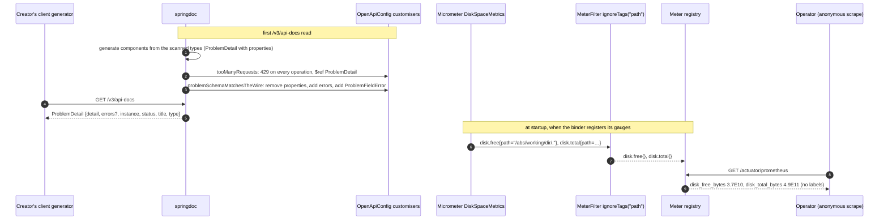

# Design — 03-dogfood-fix

- Slice: `03-dogfood-fix` (mission `02-brownfield`, wave w2), tier low, plan-lock delegated to the
  orchestration lead. Workflow `urlshort-slice-delegated`, judges `review-agent` and `qa-agent`.
- SPEC: `8b63e5b` (requirements PASS; RQ-01 fixed). Defects: W2-01 (MEDIUM) and W2-03 (LOW) from
  QA's dogfood pass (`docs/qa/01-greenfield-core/dogfood.md`, `305dce5`).
- Impact analysis, committed before this design: [`impact-analysis.md`](impact-analysis.md) (`e8969b5`).
- Decision records: amendments to [ADR-0010](../../../../docs/adr/0010-committed-openapi-document.md)
  (the documented problem schema) and [ADR-0016](../../../../docs/adr/0016-metrics-and-health-exposure.md)
  (no `path` tag). ADR-0002 is not amended: the wire it governs does not change.
- Probes: [`design-probe/`](design-probe/) (§12). Author: `design-agent@urlshort-factory`, 2026-10-03.

**In one paragraph.** Two small fixes, each with its regression test committed first.
- **W2-01:** one more `OpenApiCustomizer` in `web.OpenApiConfig` rewrites the generated
  `ProblemDetail` component. It removes `properties`, a member the service never sends, and adds
  an optional `errors` array whose items are a new `ProblemFieldError` component: `field`, `rule`
  and `message`, all required strings. Every operation already references that one component, so
  every problem response is corrected at once, the audit read's included (rule 3).
- **W2-03:** a new `web.MetricsConfig` declares Micrometer's own `MeterFilter.ignoreTags("path")`.
  The disk gauges keep their values and lose the working-directory path on `/actuator/prometheus`
  and `/actuator/metrics`.
- **Unchanged:** no response changes (AC-4), and no producer of problems changes (`Problems`,
  `ProblemDetailsAdvice` and `RateLimitFilter` are untouched). Both probes show the shipped
  defects, the fixed behaviour, and the regression assertions failing first.

## 1. Components touched

| Component | Change | Specification |
|---|---|---|
| `web.OpenApiConfig` | one bean added | `@Bean OpenApiCustomizer problemSchemaMatchesTheWire()`, the code below. The existing `openApi()` and `tooManyRequests()` are unchanged. The class Javadoc gains one sentence: the problem schema is corrected to the bodies the service sends (ADR-0010 amendment) |
| `web.MetricsConfig` | **new**, package-private `@Configuration(proxyBeanMethods = false)` | `@Bean MeterFilter withoutPathTag() { return MeterFilter.ignoreTags("path"); }`. Javadoc: Micrometer's disk gauges tag the absolute data path, which is an installation detail on an anonymous surface (ADR-0016 amendment); the filter drops that tag key from every meter, and today only `disk.free` and `disk.total` carry it |
| `docs/api/openapi.json` | regenerated | only `components.schemas.ProblemDetail` changes, and `components.schemas.ProblemFieldError` is added (§2; probe D1) |
| `web.Problems`, `web.ProblemDetailsAdvice`, `web.RateLimitFilter`, every controller, `application.properties` | **unchanged** | — |

The customiser, verbatim from the probes (`DogfoodProbe.FixConfig`, `DogfoodFixProbeConfig`):

```java
@Bean
OpenApiCustomizer problemSchemaMatchesTheWire() {
	return openApi -> {
		Schema<?> problem = openApi.getComponents().getSchemas().get("ProblemDetail");
		problem.getProperties().remove("properties");
		problem.addProperty("errors", new ArraySchema().items(new Schema<>().$ref("#/components/schemas/ProblemFieldError"))
				.description("Present on 400 validation and 422 idempotency-mismatch problems only"));
		openApi.getComponents().addSchemas("ProblemFieldError", new ObjectSchema()
				.addProperty("field", new StringSchema()).addProperty("rule", new StringSchema())
				.addProperty("message", new StringSchema()).required(List.of("field", "rule", "message")));
	};
}
```

- `required(…)` on the raw `Schema` returned by `addProperty` compiles with an unchecked warning
  (probe compile). The build's `-Werror` is set on `javadoc` only, so it does not fail. The builder
  may build the `ObjectSchema` in a local variable to avoid the warning; the document is the same.
- `ProblemDetail` is always present when customisers run: three controllers reference
  `ProblemDetail.class`, and the shipped `tooManyRequests` customiser references it on every
  operation. If it ever were absent, the `NullPointerException` would fail every document read,
  and `OpenApiDocumentTest` would fail at once. That is the wanted failure, so no null check is
  added.
- **Why a customiser and not annotations.** springdoc generates `ProblemDetail` from Spring's
  `org.springframework.http.ProblemDetail` class, not a project type. Its `getProperties()` getter
  becomes the `properties` member, while Boot's `ProblemDetailJacksonMixin` flattens it on the wire
  (probe D0 shows both). There is no project class to annotate, so annotations on `Problems` would
  change nothing in the document. A project `@Schema` type would instead require editing every
  `@ApiResponse(schema = @Schema(implementation = ProblemDetail.class))` in three controllers, which
  is outside the territory, and the audit read's after its merge. The customiser corrects the one
  component that all of them reference.

## 2. API contract

**The wire is unchanged (AC-4).** Every status, content type, body member and value is as shipped
(rule 2). Neither fix touches a request path, so this holds by construction. Probe D2 checked only
the shape over AC-2's five pre-merge requests: status, content type, member names, the `errors`
count and item member names. Design review's control compared the full JSON values with only
`instance` removed, and found them equal for all five, `title` and `errors` `field`/`rule`/`message`
included. It also caught a changed `title` that the shape check misses
(`docs/review/03-dogfood-fix/proof/design-controls.txt`, DR-01). QA's AC-4 check is the full-value
one (§7).

**The document's problem schema** (live `/v3/api-docs`, key-sorted as committed), from probe D1:

```json
"ProblemDetail": {
  "type": "object",
  "properties": {
    "detail":   {"type": "string"},
    "errors":   {"type": "array", "description": "Present on 400 validation and 422 idempotency-mismatch problems only",
                 "items": {"$ref": "#/components/schemas/ProblemFieldError"}},
    "instance": {"type": "string", "format": "uri"},
    "status":   {"type": "integer", "format": "int32"},
    "title":    {"type": "string"},
    "type":     {"type": "string", "format": "uri"}
  }
},
"ProblemFieldError": {
  "type": "object",
  "properties": {"field": {"type": "string"}, "message": {"type": "string"}, "rule": {"type": "string"}},
  "required": ["field", "message", "rule"]
}
```

- `ProblemDetail` has no `required` list, before and after, so `errors` is optional (A-3).
- `detail` and `type` stay documented although the service omits them: `detail` is cleared and
  `type` is `about:blank` (ADR-0002 amendment). A member that is documented and optional, but
  absent, is valid. AC-1 keeps them "as before".
- Every path, operation, response, header and example is unchanged, and so is every other schema
  (D1). The only schema name added is `ProblemFieldError`.

**Metrics.** `disk_free_bytes` and `disk_total_bytes` render without labels. `/actuator/metrics/disk.free`
and `disk.total` show `availableTags: []`. The values are unchanged (D3).
- A selector on the old tag stops matching. `/actuator/metrics/disk.free?tag=path:<old value>`
  answers `200` before and `404` after; unfiltered it stays `200` (design review's control, DR-02).
- A Prometheus query with `path="…"` likewise matches nothing. Consumers must drop the `path`
  selector. The unfiltered gauge is the same single series.

## 3. Data model, migration and queries

None. No schema change (NFR-X2 not triggered), no query, no Flyway number.

## 4. Sequence



It is inline only: neither flow adds a component or a request path. `docs/DESIGN.md` §1 and the
diagrams are unchanged.

## 5. Logging and audit events

None added or changed. No request path is touched, and the customiser and the filter run at
document build and meter registration and log nothing.

## 6. Threat model (STRIDE-lite)

| Threat | Before | After | Residual |
|---|---|---|---|
| **Information disclosure:** the anonymous scrape and metrics endpoint | the absolute working directory (user name, project path) in `disk_*{path=…}` and `availableTags` (D0) | no `path` tag on any meter (D3, T5) | the values (free and total bytes) remain, by A-4. ADR-0017 publishes on loopback only. Metrics exposure as a whole is unchanged (out of scope, ADR-0016) |
| **Information disclosure:** the API document | describes a member that does not exist | describes the members that exist | the document reveals nothing new: `errors` is already on every `400`/`422` |
| Spoofing, tampering, repudiation, elevation | — | — | no change to authentication (none), inputs, writes or the audit trail |
| **Denial of service** | — | — | none: the customiser runs once per document build (springdoc caches it), and the filter once per meter registration |

**Known ceiling.** If a second disk path is ever configured (`management.metrics.system.diskspace.paths`),
its gauges would share the name and the empty tag set with the first. The fix would then be a
non-path tag per path (for example `volume=data`), set in the same class. Only Boot's default `.`
is configured today.

## 7. Test strategy

Each regression test is committed and seen failing on the unfixed code before its fix (rule 1;
AC-5, AC-6). The assertions below are the ones the probe ran (`DogfoodRegressionProbeTest`, T2 to
T5): on the shipped code they fail with these messages, and with the fixes they pass. No JSON
Schema validator is added (rule 5; `build.gradle.kts` has none). "Validates against the schema"
is the check `assertConformsToProblemSchema` below.

**`OpenApiDocumentTest`, additions only:**

| AC | Test | Asserts |
|---|---|---|
| AC-1 | `AC1_problemSchemaDocumentsErrorsAndNoProperties()` on the `document` field the class already fetches | `ProblemDetail.properties` names are exactly `detail, errors, instance, status, title, type`, with `.as("ProblemDetail documents the errors member the service sends and no properties member")`. On the shipped code it fails with "elements not found: [errors] and elements not expected: [properties]" (T2). Also: `errors` absent from any `required` list; `errors.type = array`; its `items.$ref` resolves to a component whose properties and `required` are exactly `field, message, rule`, each `type: string`; `status` integer, `title` and `detail` string, `type` and `instance` `format: uri` |
| AC-2 | `AC2_problemBodiesConformToTheDocumentedSchema()`: (a) a create with `{"url":"ftp://x/"}` (`400`); (b) a create with key `K` (a fresh UUID per run, because the database is shared), then retire that link, then a create with `K` and another URL (`422`); (c) `GET /api/links/nosuch12` (`404`); (d) `GET /<retired code>` (`410`); (e) `GET /api/audit?limit=0` (`400`, the merged `01-audit-read`; MockMvc's peer is loopback and sends no forwarding header) | each through `assertConformsToProblemSchema(document, response, status, withErrors)`: status; content type `application/problem+json`; every body member is a documented property of `ProblemDetail`, and its JSON type matches the documented `type` (`string`/`integer`/`array`); `errors` present exactly for (a), (b) and (e), with one element whose members are exactly `field, message, rule`, all strings |
| AC-2 (`429`) | `@Nested @TestPropertySource(properties = "urlshort.rate-limit.create-per-minute=1") class OverTheCreateBudget`, test `AC2_theTooManyRequestsProblemConformsToo()`: two creates from the peer `10.88.0.2` (`with(request -> { request.setRemoteAddr(…); return request; })`, as `RateLimitJourneyTest`) | the first is `201`; the second is `429` and passes `assertConformsToProblemSchema(…, 429, false)` |

- **Why the `429` needs a nested class.** The functional overlay sets both budgets to 1,000,000 a
  minute, so the shared context cannot refuse a create. The nested class gets its own context with
  a budget of one. It inherits `@SpringBootTest` and `@AutoConfigureMockMvc`, and the outer
  `@BeforeEach` fetches the document in it (T4: the `429` conformed, against the fixed document).
- The nested class adds lines and changes none, so AC-9's "only add assertions" holds in effect.
  The plan-lock may still read it otherwise; the alternative is a new test class, which the
  territory does not name.
- `NFRM3_committedDocumentEqualsTheLiveOne` is unchanged and proves AC-3's "committed equals live"
  once `docs/api/openapi.json` is regenerated.

**`HealthMetricsJourneyTest`, additions only:**

| AC | Test | Asserts |
|---|---|---|
| AC-6 (metrics endpoint) | `AC6_diskGaugesCarryNoInstallationPath()`: `GET /actuator/metrics/disk.free` and `disk.total` | for each: `200`; the `availableTags` names do not contain `path`, `.as("%s carries no path tag")`. On the shipped code it fails with "Expecting ["path"] not to contain ["path"]" (T2). The body does not contain `Path.of("").toAbsolutePath().toString()`, the suite's working directory, which the shipped tag embeds. The first measurement's value is positive |
| AC-6 (scrape) | `@Nested @AutoConfigureMetrics class AnonymousScrape`, test `AC6_theScrapeCarriesNoInstallationPath()`: `GET /actuator/prometheus` | `200`; a `disk_free_bytes` and a `disk_total_bytes` sample are present; the body contains no `path="` and not the working directory, `.as("the scrape carries no path label")`. On the shipped code it fails showing `disk_free_bytes{path="…/url-shortener/."}` (T5) |

- **Why the scrape needs a nested class.** `/actuator/prometheus` answers `404` in the plain
  `@SpringBootTest` context (T1). Boot's test support turns metrics export off unless
  `@AutoConfigureMetrics` is present, as on `RateLimitJourneyTest`. The import is
  `org.springframework.boot.micrometer.metrics.test.autoconfigure.AutoConfigureMetrics`.
- Each nested class is one more cached context, about two seconds each.

**New unit test `MetricsConfigTest`** (`src/test/java/dev/urlshort/web/`):
- register `new MetricsConfig().withoutPathTag()` on a `SimpleMeterRegistry`;
- register a gauge `disk.free` with tags `path=/x` and `other=kept`;
- assert the registry's meter has exactly the tag `other=kept`, and the gauge's value is still read.

It pins that only the `path` key is dropped.

**Recorded checks (QA, not tests):**

| AC | Check |
|---|---|
| AC-3 | key-sorted diff of the candidate's `docs/api/openapi.json` against the merged `main`'s: only `components.schemas.ProblemDetail` and the added `ProblemFieldError`. Probe D1 is the same comparison on the live documents |
| AC-4 | AC-2's six requests against the merged `main`'s jar and the candidate's. Compare status, content type and the **full normalised body**: every member and every value, `title` and each `errors` item's `field`, `rule` and `message` included. Exclude only `instance` and the `X-Request-Id` header. A shape-only comparison like probe D2 does not meet AC-4 (DR-01). By construction no request-path code changes |
| AC-5, AC-6 test first | the test commit checked out without the fix: `scripts/gw functionalTest --tests '*OpenApiDocumentTest*' --tests '*HealthMetricsJourneyTest*'`, failing run captured to `proof/` |
| AC-7 | QA closes `GAPS.md` QA-OPR-02 with this slice's evidence, and no row lists W2-01 as open |
| AC-8 | `docs/DESIGN.md` updated in this design step (Errors, API document, Metrics rows). The builder records the `README.md` check in `PROGRESS.md`. At design time, lines 12, 17 and 38 mention metrics generically and none describes a problem member or a tag (impact analysis) |
| AC-9 | both suites of the merged `main` pass on the candidate; `git diff` on the two shipped test files shows added lines only |

| Rule | Covered by |
|---|---|
| 1 test first | AC-5, AC-6 commit order (§13) |
| 2 wire is the truth | AC-2 (bodies against the schema), AC-4 |
| 3 one schema | AC-2 case (e) and the `429`: an operation outside `LinkController` |
| 4 no installation details | AC-6, both surfaces |
| 5 smallest fix | territory (§9); `Problems` and properties untouched |

Coverage: the new main code is one lambda with no branch and one bean method. Every functional
context runs both, and `MetricsConfigTest` runs the bean. 100 % line and branch on merged data.

## 8. Reachability check

| Mechanism | Reached by |
|---|---|
| `problemSchemaMatchesTheWire` | every document build: `OpenApiDocumentTest`'s `@BeforeEach`, `/v3/api-docs`, Swagger UI |
| `withoutPathTag` | every meter registration; the disk gauges at startup |

## 9. Territory

This narrows the SPEC's list for the lead to adopt with `rig workflow revise` at plan-lock.

| Path | Use |
|---|---|
| `src/main/java/dev/urlshort/web/OpenApiConfig.java` | the customiser bean |
| `src/main/java/dev/urlshort/web/MetricsConfig.java` | **new**, the filter bean (the SPEC's second W2-03 option) |
| `src/test/java/dev/urlshort/web/MetricsConfigTest.java` | **new** unit test |
| `src/functionalTest/java/dev/urlshort/web/OpenApiDocumentTest.java` | additions only (§7) |
| `src/functionalTest/java/dev/urlshort/web/HealthMetricsJourneyTest.java` | additions only (§7) |
| `docs/api/openapi.json` | regenerated, ordered against mission 03's `01-analytics-v2` at plan-lock |
| `README.md` | checked; no change expected |

**Dropped from the SPEC's list:**
- `web/Problems.java`: the schema is not described there (§1);
- `application.properties`: no property drops only the tag. The configuration metadata of
  `spring-boot-micrometer-metrics` 4.1.1 lists, under `management.metrics.*`, only adding tags
  (`tags`), switching meters off (`enable`), choosing disk paths (`system.diskspace.paths`),
  distributions, observations and web URI limits. Micrometer tags each disk path with its absolute
  form: D0 shows `…/url-shortener/.` for the default `.`.

**Mine, done in this design step:** the ADR-0010 and ADR-0016 amendments and `docs/DESIGN.md`.

## 10. Decisions recorded as ADRs

- **ADR-0010 amendment.** The document's `ProblemDetail` component is corrected by one customiser
  to the bodies ADR-0002 defines: no `properties`, an optional `errors` of `ProblemFieldError`. It
  also corrects the ADR's regeneration command to the one the test has used since
  `01-create-redirect`'s revision: run the test, then `cp build/openapi/openapi.json
  docs/api/openapi.json`. Nothing reads `OPENAPI_EXPORT` (`grep` over `src`, `scripts` and
  `build.gradle.kts`).
- **ADR-0016 amendment.** `MeterFilter.ignoreTags("path")` in `web.MetricsConfig`. No meter carries
  a filesystem path, and the disk gauges stay. A second disk path would need its own non-path tag
  (§6).

## 11. Trade-offs

| Chosen | Over | Because |
|---|---|---|
| one `OpenApiCustomizer` on the component | a project problem type with `@Schema`, referenced from every `@ApiResponse` | one place; no controller edits; the audit read's responses corrected without touching `audit/` |
| `errors` items as a named component `ProblemFieldError` | an inline item schema | a generated client gets a named type; AC-3 permits "any schema it adds for an `errors` item" |
| `MeterFilter.ignoreTags("path")`, every meter | a `map` filter scoped to `disk.*` | Micrometer's own one-liner, no branch. Only the disk gauges carry `path` (D0: 2 samples). ADR-0016 already bars a request path from tags, and a filesystem path is an installation detail (rule 4), so no meter here may carry a `path` worth keeping |
| drop the tag | `management.metrics.enable.disk=false` | A-4: the Operator keeps free space for a file database |
| nested classes for the `429` and the scrape | a new test class, or `@AutoConfigureMetrics` on the whole shipped class | additions only; the shipped contexts unchanged |

## 12. Design probe (what was verified by effect)

Two probes, with no product, test or build file changed.
- `DogfoodProbe.java` (`output.txt`, via `dogfood-probe.gradle`) starts the real application on a
  random port twice, as shipped and with `FixConfig`, the two beans of §1.
- `DogfoodRegressionProbeTest.java` (`test-output.txt`, via `design-test-probe.gradle`) is a JUnit
  class compiled under `build/design-probe/` and run like the functional suite: `@SpringBootTest`,
  MockMvc and the `functional` profile.

| Row | Setup | Result | Proves |
|---|---|---|---|
| D0 | shipped service | `ProblemDetail` has `properties` (object, `additionalProperties`) and no `errors`. The wire: `400`/`422` `[errors, instance, status, title]` with items `[field, message, rule]`, and `404`/`410`/`429` `[instance, status, title]`. The scrape: 2 samples with `path="/Users/…/url-shortener/."`; `disk.free` lists the `path` tag | both defects, reproduced |
| D1 | fixed service | the §2 schema. Paths unchanged: true; other schemas unchanged: true; schema names added: `[ProblemFieldError]` | AC-1, AC-3 |
| D2 | AC-2's five pre-merge requests, shipped and fixed | every member and item member documented. "Wire unchanged (status, content type, members, error items): true" compares **shape only**: member names, the `errors` count and item member names, not values | AC-2; the shape part of AC-4. Value equality: design review's control (DR-01) |
| D3 | fixed service | `disk_free_bytes 3.7E10`, `disk_total_bytes 4.9E11`, no labels; 0 samples with a `path` label; `availableTags: []` | AC-6 |
| T1 | plain functional context | `/actuator/prometheus` → `404` | the scrape needs `@AutoConfigureMetrics` (§7) |
| T2 | §7's assertions, shipped | AC-1 fails: "elements not found: [errors] and elements not expected: [properties]". AC-6 fails: `[disk.free carries no path tag] … not to contain ["path"]` | AC-5, AC-6 test first |
| T3 | the same, `@Import` of the fixes | AC-1, AC-6 (metrics endpoint) and AC-2's `400`/`422`/`404`/`410` pass | the fixes satisfy the assertions |
| T4 | nested `@TestPropertySource(create-per-minute=1)` | `201`, then a `429` that conforms; the outer `@BeforeEach` fetched the fixed document in that context | the `429` mechanism |
| T5 | nested `@AutoConfigureMetrics`, shipped and fixed | shipped: fails with `disk_free_bytes{path=…}`; fixed: `disk_free_bytes`, `disk_total_bytes`, no label; the context holds the filter, registry `prometheusMeterRegistry` | AC-6 on the scrape |

**Probe artefacts, not product facts.**
- In its first run the "shipped" context passed AC-1. A static nested `@TestConfiguration` of a
  `@SpringBootTest` class is added to that class's context automatically, so the fix config is now
  a top-level class.
- In a later run the fixed-scrape context reused the shipped-scrape one. The `@Import` inherited by
  a doubly nested class did not reach the context cache key. A unique `@TestPropertySource` on
  that class fixed it; run alone it had the filter and a clean scrape.
- Neither applies to the builder's tests, whose fixes live in `src/main`.

## 13. Build plan

1. After both w1 merges, the lead creates the worktree from the merged `main` at plan-lock. Re-read
   the impact analysis against it. Confirm that `GET /api/audit?limit=0` answers `400` with one
   `errors` element, and that `docs/api/openapi.json` carries the audit operation.
2. `test(03-dogfood-fix): the API document's problem schema describes the bodies the service sends`
   (§7 `OpenApiDocumentTest` additions). Run `scripts/gw functionalTest --tests '*OpenApiDocumentTest*'`.
   It is red with the AC-1 message; capture to `proof/` (AC-5).
3. `fix(03-dogfood-fix): document the errors member and drop properties from the problem schema`:
   the customiser. Then `scripts/gw functionalTest --tests '*OpenApiDocumentTest*'`, and
   `cp build/openapi/openapi.json docs/api/openapi.json`. Green.
4. `test(03-dogfood-fix): no installation path on the disk gauges` (§7 `HealthMetricsJourneyTest`
   additions). Red with the AC-6 messages; capture to `proof/`.
5. `fix(03-dogfood-fix): drop the path tag from every meter`: `MetricsConfig` and `MetricsConfigTest`.
   Green.
6. The `README.md` check goes into `PROGRESS.md`. Then `scripts/gw check`, the coverage reports,
   and a handoff naming the SHA.

## Status

- 2026-10-03: design written on SPEC `8b63e5b`; impact analysis first (`e8969b5`); handed to
  `design_review`.
- 2026-10-03 19:37Z: design review by review-agent passed with no blocker; two MEDIUMs were
  corrected in passing (*Review response*).

## Self-check

- Every AC (1 to 9) and rule (1 to 5) has a mechanism and a named test or recorded check (§7).
- Every mechanism claim was run. On a real server: the schema, the wire's shape before and after
  (values were compared by design review's control, DR-01), and the scrape (D0–D3). In the suite's set-up: the failing-first messages, the nested `429` and the
  nested scrape (T1–T5).
- The two places the shipped test classes cannot observe were found by running them, not assumed:
  the `429` under the overlay's budgets, and the `404` scrape. Both are additions.
- Scope: two beans, one regenerated document, two test files with additions, one new unit test.
  `Problems`, `application.properties`, `RateLimitFilter`, `click/`, `link/`, `audit/` and the
  schema are untouched.
- **Not verified:**
  - the merged `main`, including the audit read's `400`, re-checked at plan-lock;
  - the document after `01-analytics-v2` regenerates it, which is ordered at plan-lock;
  - the jar-level captures (QA's proof items);
  - `MetricsConfigTest` itself: its shape is specified in §7 but was not run. The filter it pins
    was run (D3, T3, T5).

## Plan review (author's lenses; the skill was not invoked separately)

- **Engineering.** Each fix is one bean in the place that owns the surface. The probes show the
  assertions red first and green after, so the builder's test-first evidence is predictable.
- **Strategy.** It closes the one real defect the dogfood pass found, and an existing gaps row,
  without touching the wire.
- **Creator and Operator experience.** A generated client gets a typed `errors` list and no dead
  `properties` field. The anonymous scrape no longer shows where the service is installed.

## Review response (design review, review-agent, 19:37Z)

The evidence is `docs/review/03-dogfood-fix/proof/design-controls.txt`. The reviewer requested no
product change.

| Finding | Severity | Response |
|---|---|---|
| DR-01: D2 is cited as proving AC-4, but `DogfoodProbe.wire` compares names and counts, not `title` or the `errors` values | MEDIUM | **Fixed.** D2 is now described as a shape check (§2, §12). The AC-4 check in §7 now requires QA to compare the full normalised body: every member and value, each `errors` item's `field`, `rule` and `message` included, excluding only `instance` and `X-Request-Id`. The reviewer's control made that comparison on all five pre-merge cases and found them equal. Its negative control showed a changed `title` is caught by the full comparison and missed by the shape check. The same correction is in the impact analysis |
| DR-02: the impact analysis says a query filtered on `path` still matches, but `/actuator/metrics/disk.free?tag=path:<old value>` answers `200` before and `404` after | MEDIUM | **Fixed.** The claim was wrong. The impact analysis's *Compatibility* section, §2 *Metrics* and the ADR-0016 amendment's consequences now say: a selector on the old tag (an Actuator `tag=path:…` filter, or a PromQL `path="…"` matcher) stops matching, and consumers must drop it. The unfiltered gauge is the same single series and stays `200` |
