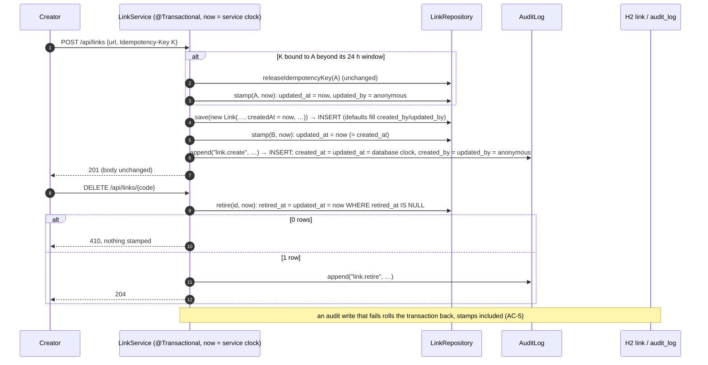

# Design — 04-audit-columns

- Slice: `04-audit-columns` (mission `02-brownfield`, wave w2), tier low, plan-lock delegated to the
  orchestration lead (D11). Workflow `urlshort-slice-delegated-b`, judges `review2-agent` and
  `qa2-agent`.
- SPEC: `e28cfea` (requirements PASS; RQ-01 fixed). The human's audit-column decision is
  `qitem-20261003175330-fb054f2f`.
- Impact analysis, committed before this design: [`impact-analysis.md`](impact-analysis.md) (`aecb0d9`).
- Decision record: the `04-audit-columns` amendment to
  [ADR-0020](../../../../docs/adr/0020-audit-columns-expand-migration.md).
- Probe: [`design-probe/`](design-probe/) (§12). Author: `design-agent@urlshort-factory`, 2026-10-03.

**In one paragraph.** One expand migration, V4 (after `02-click-retention`'s V3), gives `link` and
`audit_log` the policy's audit columns.
- **`link`** keeps its shipped `created_at` (rule 1) and gains `updated_at`, `created_by` and
  `updated_by`. `updated_at` is stamped **by the application on the service clock** at exactly the
  three link writes (rule 2):
  - the retire's existing conditional `UPDATE` sets it with the retirement instant;
  - a new targeted `LinkRepository.stamp(id, at)` runs after the create's insert and after a key
    release, inside the same transaction, with the create's `now`.
- **`audit_log`** gains `created_at`/`updated_at` from the database clock and
  `created_by`/`updated_by` defaulting to `'anonymous'`, its actor. `AuditLog` is unchanged, and
  rows stay append-only.
- **Backfill:** links get `COALESCE(retired_at, created_at)`; audit rows get
  `LEAST(occurred_at, upgrade time)` and their own actor.
- **Kept as they are, so every shipped test passes unchanged (AC-9):** the `Link` record, every
  response, `AuditLog`, and the shipped repository signatures.

## 1. Components touched

| Component | Change | Specification |
|---|---|---|
| `src/main/resources/db/migration/V4__add_link_audit_columns.sql` | **new**, verbatim [`design-probe/migration/V4__add_link_audit_columns.sql`](design-probe/migration/V4__add_link_audit_columns.sql) | DDL, backfill and the rollback header of §3. V4 is the next Flyway number after V3; the builder confirms it after rebasing onto both w1 merges (A-7) |
| `link.LinkRepository` | one SQL text, one method | `retire`: `@Query("UPDATE link SET retired_at = :at, updated_at = :at, updated_by = 'anonymous' WHERE id = :id AND retired_at IS NULL")`, same signature `int retire(Long id, Instant at)`. New: `@Modifying @Query("UPDATE link SET updated_at = :at, updated_by = 'anonymous' WHERE id = :id") int stamp(Long id, Instant at);` with Javadoc saying it is a link write's update stamp (rule 2), on the service clock. `releaseIdempotencyKey(Long id)` is unchanged |
| `link.LinkService` | two calls in `create` | after `links.releaseIdempotencyKey(bound.id())`: `links.stamp(bound.id(), now);`. After `Link link = links.save(…)`: `links.stamp(link.id(), now);`. Both are in the existing `@Transactional` method with its single `now`, so `A.updated_at` equals `B.created_at` (AC-4) and `C.updated_at` equals `C.created_at` (AC-2). `retire` is unchanged; its statement now stamps |
| `link.Link`, `LinkResponse`, `LinkSnapshot`, `audit.AuditLog`, `audit.AuditTrail` | **unchanged** | the record maps none of the new columns, and the audit read names its columns, so nothing new can reach a response (AC-8) |

**Why the create stamps with a second statement.** The alternative is a seventh `Link` component.
That changes the record's canonical constructor, which `LinkServiceTest` and `LinkTest` call with
six arguments (AC-9 forbids changing them). It also puts `updatedAt` on the object that
`LinkResponse` is built from. A targeted `UPDATE` by primary key, in the create's own transaction, is
the codebase's existing pattern (ADR-0005: targeted `@Modifying` updates) and costs one keyed write.

## 2. API contract

Unchanged (rule 7, AC-8): every status, header and body of `POST /api/links`, `GET`/`DELETE
/api/links/{code}`, `GET /{code}`, the statistics and `GET /api/audit`. `createdAt` (the reused
`link.created_at`) and the audit row's `actor` are exposed exactly as before. `docs/api/openapi.json`
is not regenerated.

## 3. Data model, migration and queries

V4 (verbatim in `design-probe/migration/`):

```sql
ALTER TABLE link ADD COLUMN updated_at TIMESTAMP WITH TIME ZONE DEFAULT CURRENT_TIMESTAMP NOT NULL;
ALTER TABLE link ADD COLUMN created_by VARCHAR(64) DEFAULT 'anonymous' NOT NULL;
ALTER TABLE link ADD COLUMN updated_by VARCHAR(64) DEFAULT 'anonymous' NOT NULL;
UPDATE link SET updated_at = COALESCE(retired_at, created_at);

ALTER TABLE audit_log ADD COLUMN created_at TIMESTAMP WITH TIME ZONE DEFAULT CURRENT_TIMESTAMP NOT NULL;
ALTER TABLE audit_log ADD COLUMN updated_at TIMESTAMP WITH TIME ZONE DEFAULT CURRENT_TIMESTAMP NOT NULL;
ALTER TABLE audit_log ADD COLUMN created_by VARCHAR(64) DEFAULT 'anonymous' NOT NULL;
ALTER TABLE audit_log ADD COLUMN updated_by VARCHAR(64) DEFAULT 'anonymous' NOT NULL;
UPDATE audit_log SET created_at = LEAST(occurred_at, CURRENT_TIMESTAMP), updated_at = LEAST(occurred_at, CURRENT_TIMESTAMP),
    created_by = actor, updated_by = actor;
```

- **`link.updated_at`'s default** only fills a row inserted without it: the v1-shaped inserts of
  `ClickSchemaTest` and `ObservabilityJourneyTest` (AC-9, K3). The application always stamps it on
  the service clock (rule 1).
- **`VARCHAR(64)`** is `audit_log.actor`'s width, so `created_by = actor` always fits. `link` uses the
  same width for one convention across the two tables.
- **`audit_log`'s row times** are the database clock (ADR-0020). `occurred_at` stays the event's
  service-clock time (rule 1).
- **Backfill:** as SPEC rule 6 (K2). The `LEAST` keeps an audit row whose event time is ahead of the
  database clock from claiming a row time later than the upgrade.
- **Rollback**, written in the header, run in K4: drop `link.updated_by`, `created_by`, `updated_at`;
  drop `audit_log.updated_by`, `created_by`, `updated_at`, `created_at`; delete V4's
  `flyway_schema_history` row. That gives the exact V3 schema and constraints, and V4 re-applies with
  every link backfilled.
- **Cost:** 6.2 s wall for 100 000 links and 150 000 audit rows (K5), inside Flyway before
  readiness.

| Query | Served by |
|---|---|
| `UPDATE link SET retired_at = :at, updated_at = :at, updated_by = 'anonymous' WHERE id = :id AND retired_at IS NULL` | primary key; 0 rows on a second retire (K3b) |
| `UPDATE link SET updated_at = :at, updated_by = 'anonymous' WHERE id = :id` (`stamp`) | primary key |
| every other statement | unchanged |

## 4. Sequence



## 5. Logging and audit events

No new log event. No new audit action: the audit trail still records `link.create` and
`link.retire`. A key release writes no audit row, as shipped. Audit rows are written once and
never updated (NFR-A2), so `updated_at = created_at` and `updated_by = created_by` for life (AC-6).

## 6. Threat model (STRIDE-lite)

| Threat | Mitigation | Residual |
|---|---|---|
| **Tampering:** stamps that misstate a link's history | three writes stamp, in the write's own transaction, with the write's own instant; refused, replayed and rolled-back requests stamp nothing (AC-5) | a key release before this slice left no time (rule 6): backfilled to the latest known write |
| **Information disclosure:** new columns in a response | the `Link` record does not map them; the audit read selects named columns; AC-8 | — |
| Information disclosure: client values in the columns | the actor columns hold constants (`anonymous`, or the row's actor); the time columns hold times (AC-10) | — |
| **Repudiation:** the audit trail altered | no update or delete path added; the new audit columns are filled by defaults at insert, then never written (AC-6) | — |
| **Denial of service:** upgrade time | 6.2 s for 100 000 links and 150 000 audit rows (K5) | — |

## 7. Test strategy

New tests sit in `link/` and `audit/`, in the unit and functional suites. Clicks and requests made
while the suite clock is shifted come from a dedicated peer (mission 01 NOTES §2 12:40Z). Rows are
read with `JdbcClient`.

| AC / rule | Test (class: mechanism) | Asserts |
|---|---|---|
| AC-1 | unit `LinkAuditColumnsTest` (its own Flyway database, `ClickSchemaTest`'s pattern): `INFORMATION_SCHEMA.COLUMNS` and `TABLE_CONSTRAINTS` for both tables after all migrations, compared with the same reading at V3 (`target("3")`) | the new columns' types, nullability and defaults; every V3 column and constraint unchanged |
| AC-2, rule 1, rule 3 | functional `LinkAuditColumnsJourneyTest`: the clock frozen at `t`; create `C` | `C`: `created_at = updated_at = t`, actors `anonymous`; its `link.create` row: `created_at = updated_at`, actors = `actor` |
| AC-3, rule 2 | same: create at `t0`, clock to `t1` (dedicated peer), retire | `updated_at = t1 = retired_at`, `created_at = t0`; the `link.retire` row stamped as in AC-2 |
| AC-4, rule 2 | same: create `A` with key `K` at `t0`; clock past 24 h to `t1`; create with `K` and a new URL | `A.updated_at = t1 = B.created_at`; `A`'s `created_at`, `url` and retirement unchanged; `B` as AC-2 |
| AC-5, rule 2 | same: record every link's stamps; then replay `K`, a `422` mismatch, `GET /api/links/C`, `GET /C`, retire `C`, a second retire (`410`); plus a separate class `LinkAuditColumnsFailureJourneyTest` (`@MockitoSpyBean AuditLog`, `doThrow` on `append("link.retire", …)`, as `AuditJourneyTest.AC24`) on a fresh link `D` | after each request the stamps are unchanged, except `C`'s after its first retire; `D` stays active with its stamps, and no audit row for its retire |
| AC-6, NFR-A2 | `LinkAuditColumnsJourneyTest`: every `audit_log` row; the shipped `AuditJourneyTest.AC25` unchanged | `updated_at = created_at`, `updated_by = created_by` for every row; AC25 still passes |
| AC-7 | functional `LinkUpgradeJourneyTest`: a temporary file database at **V3** (`target("3")`) with an active link, a retired link, a link whose key was released, and their audit rows in the shipped shapes; start the candidate (`SpringApplicationBuilder`, port 0) | V4 applied; shipped columns unchanged; links `updated_at = COALESCE(retired_at, created_at)` with `anonymous`; audit rows `created_at = updated_at ≤` the upgrade, actors equal `actor`. **By effect (proof item 6):** the real `f6dd29e` jar writes a directory (create, retire, a key release over a shifted 24 h is not possible on the real clock, so its row comes from H2's Shell while stopped), then the candidate starts on it |
| AC-11, NFR-X2 | unit `LinkAuditColumnsTest`: migrate to latest; **read the rollback lines from V4's header on the classpath** and run them; compare schema and values with the V3 reading; migrate again | equal to V3; values unchanged; V4 re-applies (K4). The test runs the written rollback, so the header cannot drift from what is proven |
| AC-8, rule 7 | `LinkAuditColumnsJourneyTest`: create, read, redirect, statistics, and `GET /api/audit` (merged `01-audit-read`) after a retire | each body's field set equals the shipped one; `GET /api/links/<code>` shows `createdAt` and no update time; each audit row has exactly the eight fields; `OpenApiDocumentTest` unchanged |
| AC-9 | the unit and functional suites of the merged `main`, unchanged | — |
| AC-10 | `LinkAuditColumnsJourneyTest`: create and retire with a `User-Agent` canary, `X-Forwarded-For: 192.0.2.10` and an `Idempotency-Key` canary | no audit column of either table contains a canary, the address, a request id or a URL; actor columns hold only `anonymous` |
| units | `LinkServiceTest` unchanged. One new unit test `LinkServiceStampTest`, so the existing class stays as shipped: `create` stamps the new link and a released one with the same `now`; `retire` passes `now` | — |

100 % line and branch on merged data. The new code is two `stamp` calls and two SQL strings.

## 8. Reachability check

| Mechanism | Reached by |
|---|---|
| `stamp` after insert | every create that inserts |
| `stamp` after release | a create with a key bound beyond its window |
| retire's stamp | every successful retire |
| audit defaults | every `AuditLog.append` |
| `link.updated_at` default | v1-shaped inserts only (tests) |

## 9. Territory

| Path | Use |
|---|---|
| `src/main/java/dev/urlshort/link/` | `LinkRepository`, `LinkService` |
| `src/test/java/dev/urlshort/link/` | `LinkAuditColumnsTest`, `LinkServiceStampTest` |
| `src/functionalTest/java/dev/urlshort/link/` | `LinkAuditColumnsJourneyTest`, `LinkAuditColumnsFailureJourneyTest`, `LinkUpgradeJourneyTest` |
| `src/main/resources/db/migration/` | `V4__add_link_audit_columns.sql` |
| `audit/` | **no change** (defaults fill its columns) |

Mine, done in this design step: the ADR-0020 amendment, `docs/DESIGN.md`, `docs/diagrams/erd.mmd`.

## 10. Decisions recorded as ADRs

ADR-0020 amendment (`04-audit-columns`) records how `link` departs from the click pattern:
- the reused `created_at`;
- `updated_at` on the service clock, stamped by the three writes;
- `VARCHAR(64)` actors;
- the audit rows' `LEAST(occurred_at, upgrade)` backfill and `created_by = actor`.

## 11. Trade-offs

| Chosen | Over | Because |
|---|---|---|
| `stamp(id, at)` after insert and release | a seventh `Link` component | shipped tests unchanged (AC-9); no new column on the object responses are built from (AC-8) |
| service clock for `link.updated_at` | a database default | one clock per link row (rule 1, A-2) |
| database clock and defaults for `audit_log` | stamping in `AuditLog` | `AuditLog` and its tests unchanged; ADR-0020's pattern; append-only rows |
| `LEAST(occurred_at, CURRENT_TIMESTAMP)` | `occurred_at` alone | no row claims a write after the upgrade (rule 6) |

## 12. Design probe (what was verified by effect)

`LinkMigrationProbe.java` (`output.txt`), Flyway on H2 2.4.240 file databases with the shipped V1–V2,
`02-click-retention`'s designed V3 and this V4. No product file was touched.

| Row | Setup | Result | Proves |
|---|---|---|---|
| K1 | V1–V4 on an empty database | the columns, `NOT NULL`, defaults `CURRENT_TIMESTAMP` / `'anonymous'`, `VARCHAR(64)` | AC-1 |
| K2 | a V3 directory: an active link, a retired one, a released one, audit rows (one dated a day ahead), then V4 | shipped columns, values and constraints unchanged; links `updated_at = COALESCE(retired_at, created_at)`, `anonymous`; audit rows equal stamps `≤` the upgrade (the future one capped), actors = `actor` | AC-7, rule 6 |
| K3 | v1-shaped `link` insert and the unchanged `AuditLog` insert, on the connection that kept the database open | filled; audit `created_at = updated_at`, actors `anonymous` = `actor` | AC-9, AC-2 |
| K3b | the designed release + `stamp`, and the retire statement twice | `updated_at` = the given instant; retire changes 1 row, then 0 | rule 2, AC-3 to AC-5 |
| K4 | the header's rollback, then V4 again | exact V3 schema and constraints; re-applied, 4 of 4 backfilled | AC-11 |
| K5 | 100 000 links (half retired), 150 000 audit rows | 6.2 s wall; all backfilled | upgrade cost |

## 13. Build plan

1. After both w1 merges: create the worktree from the merged `main` (the lead does this at
   plan-lock). Re-read the impact analysis against it, including `AuditTrail`'s named `SELECT`.
2. `test(04-audit-columns): audit columns on link and audit_log`: the tests of §7. Red.
3. `feat(04-audit-columns): V4 expand migration and link update stamps`: V4 verbatim,
   `LinkRepository`, `LinkService`. Green.
4. Run `scripts/gw check`, commit the coverage reports, and hand off naming the SHA.

## Status

- 2026-10-03 — design written on SPEC `e28cfea`; impact analysis first (`aecb0d9`); handed to
  `design_review`.

## Self-check

- Every AC (1 to 11) and rule (1 to 7) has a mechanism and a named test. AC-11 runs the rollback
  text read from the migration itself.
- Every mechanism claim was run (K1–K5), including the H2 connection-retirement case for defaults
  (K3, on the connection kept open after Flyway's closed).
- AC-9 is met by construction: the signatures and the record the shipped tests pin are kept, and
  the defaults fill v1-shaped inserts.
- Scope: `link` and `audit_log` only; no exposure; `audit/` main code unchanged.
- **Not verified:**
  - the merged `main`, re-checked at plan-lock;
  - the shipped suites against a candidate (QA);
  - PostgreSQL's `LEAST` and `ALTER … DEFAULT … NOT NULL`. Both are standard and in PostgreSQL, but
    were not run here.

## Plan review (author's lenses; the skill was not invoked separately)

- **Engineering.** The smallest change that keeps every shipped test as it is: one migration, one
  SQL text, one method, two calls.
- **Strategy.** It finishes the human's audit-column decision across every table, in the same
  pattern as `click`.
- **Operator experience.** A link row now tells when it last changed: a retire or a key release.
  Every audit row says when it was written, separately from the event it records.
