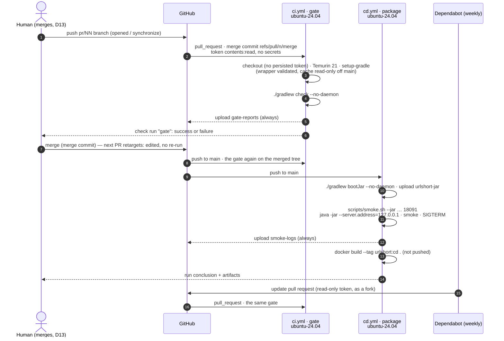

# Design — 05-ci-cd

- Slice: `05-ci-cd` (mission `02-brownfield`, wave w2). Tier low; the plan-lock is delegated to the
  orchestration lead (D11). Workflow `urlshort-slice-delegated-b`: builder `dev2-agent`, judges
  `qa2-agent` and `review2-agent`.
- SPEC: `9ac54aa` (requirements PASS, RQ-01 fixed in passing; review `aa0143f`).
- Impact analysis, committed before this design: [`impact-analysis.md`](impact-analysis.md).
- Probe: [`design-probe/`](design-probe/) (§12). The three files of §1 are in
  [`design-probe/draft/.github/`](design-probe/draft/.github/), linted there. GitHub reads
  workflows and Dependabot's configuration only from the repository root's `.github/`, so neither
  the drafts nor the lint control (`design-probe/lint-control/`) can ever run.
  Author: `design2-agent@urlshort-factory`, 2026-10-03.

**In one paragraph.** Three files under `.github/`, and nothing else changes.
- `ci.yml` has one job, `gate`. It runs `./gradlew check --no-daemon` on a GitHub-hosted
  `ubuntu-24.04` runner with Temurin 21. It runs on every pull request with no filter, on every push
  to `main`, and on demand, and uploads the reports even when the gate fails.
- `cd.yml` has one job, `package`. On `main` and on demand, it builds the jar, smokes it on
  `127.0.0.1` through the **shipped `scripts/smoke.sh --jar` mode** (which starts, smokes and
  gracefully stops the jar itself), and builds the image without pushing it. It uploads the jar and
  the smoke logs.
- `dependabot.yml` proposes weekly updates for the actions and the Gradle build.

Every workflow has a read-only token, actions pinned to commits, a timeout, a concurrency group, no
expression in any shell line and no secret.

Two choices go beyond the guide's table, each for a measured reason:
- `setup-gradle` uses the MIT-licensed `basic` cache provider. Its default provider is proprietary
  and only a "Free Preview" for private repositories, and this repository is private (D13).
- The workflows name `shell: bash`. Only an explicitly named `bash` runs with `pipefail`, and the
  smoke step pipes into `tee`.

## 1. Components touched

| File | Change | Specification |
|---|---|---|
| `.github/workflows/ci.yml` | **new** | exactly the text below |
| `.github/workflows/cd.yml` | **new** | exactly the text below |
| `.github/dependabot.yml` | **new** | exactly the text below |

No other file changes. `scripts/smoke.sh` already has the mode `cd.yml` needs (`--jar`), so the
plan-lock needs no grant request (SPEC rule 5).

The builder copies the three files from `design-probe/draft/.github/` to `.github/` byte for byte.
**The pins below were resolved on 2026-10-03.** The builder re-runs `git ls-remote --tags` for each
action and attaches that capture (AC-9). If a tag has moved since, the capture wins, and the
builder records the new SHA beside the old one in `PROOF.md`.

| Action | Tag | Commit | From the `ls-remote` line |
|---|---|---|---|
| `actions/checkout` | `v7.0.1` | `3d3c42e5aac5ba805825da76410c181273ba90b1` | `refs/tags/v7.0.1` (lightweight) |
| `actions/setup-java` | `v6.0.1` | `de7274f081f381c8f8158605e0321c36c376e2e6` | `refs/tags/v6.0.1` (lightweight) |
| `gradle/actions/setup-gradle` | `v6.4.0` | `3f5f9adaf7d9fecd50b5935e54106014257a94e6` | `refs/tags/v6.4.0^{}` (annotated: the tag object is `b9bee63e…`, the commit is its peeled entry) |
| `actions/upload-artifact` | `v7.0.1` | `043fb46d1a93c77aae656e7c1c64a875d1fc6a0a` | `refs/tags/v7.0.1` (lightweight) |

All four run on Node 24, which GitHub-hosted runners provide.

### `.github/workflows/ci.yml`

```yaml
# The quality gate on a clean runner: the same `check` task the seats run through scripts/gw
# (docs/guidance/ci-cd.md §2). Its check run, `gate`, is what the human merges on (D13, D14).
name: ci

on:
  # No branch, path or type filter: stacked pull requests are based on other pull requests'
  # branches, and each one must show a gate (D13).
  pull_request:
  push:
    branches: [main]
  workflow_dispatch:

permissions:
  contents: read

concurrency:
  group: ${{ github.workflow }}-${{ github.ref }}
  cancel-in-progress: true

defaults:
  run:
    # Named explicitly so that GitHub runs `bash --noprofile --norc -eo pipefail`; the implicit
    # default is `bash -e` without pipefail.
    shell: bash

jobs:
  gate:
    runs-on: ubuntu-24.04
    timeout-minutes: 20
    steps:
      - uses: actions/checkout@3d3c42e5aac5ba805825da76410c181273ba90b1 # v7.0.1
        with:
          persist-credentials: false
      - uses: actions/setup-java@de7274f081f381c8f8158605e0321c36c376e2e6 # v6.0.1
        with:
          distribution: temurin
          java-version: '21'
      - uses: gradle/actions/setup-gradle@3f5f9adaf7d9fecd50b5935e54106014257a94e6 # v6.4.0
        with:
          # The MIT-licensed cache. The default provider is proprietary and only a preview for
          # private repositories.
          cache-provider: basic
      - run: ./gradlew check --no-daemon
      - if: always()
        uses: actions/upload-artifact@043fb46d1a93c77aae656e7c1c64a875d1fc6a0a # v7.0.1
        with:
          name: gate-reports
          path: |
            build/reports/
            build/test-results/
            build/docs/javadoc/
            build/openapi/
          retention-days: 30
```

Line by line, what the file must not lose:
- **`gate`** is the job id with no `name:`, so the check run is named `gate` (AC-2), and that is
  what the human reads and could later make a required check.
- **`pull_request:` with no value** means every pull request, whatever its base (AC-1, rule 2).
  `pull_request_target` is absent.
- **`persist-credentials: false`**: the job never pushes or fetches again, so the token is not left
  in `.git/config` for the build, the tests or the jar to read (§6).
- **No `cache:` on `setup-java`.** Caching is `setup-gradle`'s alone, as the guide says. Two caches of
  the same directory would race.
- **`setup-gradle`'s defaults are kept, on purpose:**
  - wrapper validation (`validate-wrappers: true`);
  - a cache written only on the default branch (`cache-read-only` is true elsewhere);
  - no build scan, no dependency-graph submission (both need extra configuration and the second
    needs `contents: write`);
  - a job summary (`add-job-summary: always`).
- **`./gradlew check --no-daemon`** is the whole gate: unit and functional suites, the three JaCoCo
  reports, merged 100 % line and branch verification, and the Javadoc doclint gate
  (`build.gradle.kts`). There is no `-x`, no `continue-on-error`, no pipe and no `||` (AC-2,
  rule 1).
- **The upload runs `if: always()`** (AC-3, rule 6) and keeps:
  - the HTML and XML test reports, and the JaCoCo reports of both suites and the merged one
    (`build/reports/`);
  - the JUnit XML (`build/test-results/`);
  - the generated Javadoc (`build/docs/javadoc/`);
  - the live API document (`build/openapi/`). `OpenApiDocumentTest`'s failure message says
    "regenerate with `cp build/openapi/openapi.json docs/api/openapi.json`", so the file it names
    must be downloadable.

  A doclint error is printed in the job log, not in a report. GitHub keeps job logs for the
  repository's log retention, 90 days by default. `if-no-files-found` stays `warn`: a run that fails
  before compiling has nothing to upload, and that must not add a second error.

### `.github/workflows/cd.yml`

```yaml
# The artefact that would ship, built from the exact commit: the jar is proven to answer the
# public journey on loopback, and the image is built. Nothing is pushed, published or deployed
# (D14, D2; docs/guidance/ci-cd.md §2).
name: cd

on:
  push:
    branches: [main]
  workflow_dispatch:

permissions:
  contents: read

concurrency:
  group: ${{ github.workflow }}-${{ github.ref }}
  cancel-in-progress: true

defaults:
  run:
    # Named explicitly so that GitHub runs `bash --noprofile --norc -eo pipefail`: the smoke step's
    # `tee` must not hide the smoke's exit code.
    shell: bash

jobs:
  package:
    runs-on: ubuntu-24.04
    timeout-minutes: 20
    steps:
      - uses: actions/checkout@3d3c42e5aac5ba805825da76410c181273ba90b1 # v7.0.1
        with:
          persist-credentials: false
      - uses: actions/setup-java@de7274f081f381c8f8158605e0321c36c376e2e6 # v6.0.1
        with:
          distribution: temurin
          java-version: '21'
      - uses: gradle/actions/setup-gradle@3f5f9adaf7d9fecd50b5935e54106014257a94e6 # v6.4.0
        with:
          # The MIT-licensed cache. The default provider is proprietary and only a preview for
          # private repositories.
          cache-provider: basic
      - run: ./gradlew bootJar --no-daemon
      - uses: actions/upload-artifact@043fb46d1a93c77aae656e7c1c64a875d1fc6a0a # v7.0.1
        with:
          name: urlshort-jar
          path: build/libs/urlshort.jar
          if-no-files-found: error
          retention-days: 30
      # The shipped --jar mode starts the jar with --server.address=127.0.0.1 on a throwaway
      # database, runs the installed smoke, checks the environment overrides and stops the jar
      # with SIGTERM, requiring a graceful shutdown (scripts/smoke.sh, jar_mode).
      - name: Smoke the jar on 127.0.0.1
        env:
          URLSHORT_JAVA_HOME: ${{ env.JAVA_HOME }}
        run: |
          mkdir -p build/smoke
          scripts/smoke.sh --jar build/libs/urlshort.jar 18091 build/smoke/jar.log 2>&1 | tee build/smoke/smoke.log
      - if: always()
        uses: actions/upload-artifact@043fb46d1a93c77aae656e7c1c64a875d1fc6a0a # v7.0.1
        with:
          name: smoke-logs
          path: build/smoke/
          retention-days: 30
      # Built on the runner and discarded: no login, no tag for a registry, no push.
      - run: docker build --tag urlshort:cd .
```

Line by line:
- **Triggers**: `push` to `main` and `workflow_dispatch`, nothing else (AC-4, A-1). A dispatch can
  build any branch on demand.
- **The jar goes up right after `bootJar`**, before the smoke. A red smoke still leaves the exact jar
  to reproduce it with, and no `if: always()` is needed for that. On a green run it is the jar that
  passed (AC-5). `if-no-files-found: error`: a successful `bootJar` that wrote no jar is a fault.
- **The smoke is the shipped `--jar` mode, called as shipped** (AC-5, rules 4 and 5, A-2), from
  `smoke.sh:319–354`. It:
  - starts `java -jar` with `--server.port=18091 --server.address=127.0.0.1`, a database in its own
    `mktemp -d` directory, and four environment overrides;
  - waits for readiness and runs the full installed smoke (health, ping, the public journey,
    metrics, Prometheus, OpenAPI);
  - checks that the overrides took effect;
  - sends `SIGTERM` and fails unless the jar logs `Graceful shutdown complete`.

  So "start on loopback, smoke, stop" is one call to a reviewed script, and the workflow carries
  no start or stop logic of its own.
- **`URLSHORT_JAVA_HOME: ${{ env.JAVA_HOME }}`** makes the smoke run the JDK that `setup-java`
  installed (`smoke.sh:28–31`), whatever else is on the runner's `PATH`. This is an expression in
  `env:`, not in `run:`, and it is the runner's own value, not event text (AC-8).
- **The jar's own log** (`build/smoke/jar.log`, third argument) and **the smoke's output**
  (`build/smoke/smoke.log`, through `tee`) are uploaded together as `smoke-logs`, `if: always()`
  (AC-5, rule 6). `tee` keeps the output visible in the job log too. `pipefail` (from
  `defaults.run.shell: bash`) makes the step fail when `smoke.sh` fails. The smoke's last line on
  success is `SMOKE JAR OK (…)`; on failure it is `SMOKE FAIL: …`, and the exit code is 1.
- **`docker build --tag urlshort:cd .`** builds the shipped `Dockerfile` (AC-5). The tag is local.
  There is no `docker login`, no registry name and no `push`, and the image disappears with the
  runner (AC-6). It runs after the smoke, so a red smoke skips it. That run is red already, and
  the image would prove nothing more.

### `.github/dependabot.yml`

```yaml
# Weekly update proposals for the pinned actions and the Gradle build. Each one is a pull request
# that the gate checks like any other change (D14; docs/guidance/ci-cd.md §3.2).
version: 2
updates:
  - package-ecosystem: github-actions
    directory: /
    schedule:
      interval: weekly
  - package-ecosystem: gradle
    directory: /
    schedule:
      interval: weekly
```

What it does and does not cover (stated, not discovered later):
- **`github-actions`** proposes a new commit SHA, with its version comment, for each `uses:`.
- **`gradle`** reads `build.gradle.kts`. It proposes the plugin versions (Spring Boot, the
  dependency-management plugin) and the directly declared dependency
  `springdoc-openapi-starter-webmvc-ui`. Versions managed by the Boot BOM move with the Boot
  plugin.
- **Not verified, and not expected:** that it proposes the three `extra["…version"]` BOM overrides
  (`build.gradle.kts:26–28`) or the wrapper's `distributionUrl`. Those stay manual: the comment
  above the overrides says when to drop them.
- The `docker` ecosystem is out of scope (A-4).

## 2. Workflow contract (in place of an API contract)

This slice adds no HTTP endpoint. Its contract with the human and the release seat:

| What | Value | Where it is seen |
|---|---|---|
| Check run on a pull request and on `main` | `gate` (workflow `ci`) | the pull request's checks; the commit's status on `main` |
| `gate` triggers | `pull_request` (`opened`, `synchronize`, `reopened`: GitHub's default types), `push` to `main`, `workflow_dispatch` | — |
| `package` triggers | `push` to `main`, `workflow_dispatch` | Actions tab, workflow `cd` |
| Artifacts | `gate-reports`: `build/reports/`, `build/test-results/`, `build/docs/javadoc/`, `build/openapi/`, always. `urlshort-jar`: `build/libs/urlshort.jar`, after `bootJar`. `smoke-logs`: `build/smoke/smoke.log` and `build/smoke/jar.log`, always. Each 30 days | run page, Artifacts |
| Token | `contents: read` for every job, nothing else | — |
| Published | nothing | — |
| Supersession | a newer run on the same workflow and ref cancels the older one | the older run shows *cancelled* |

**Cancellation on `main`** (AC-10). When the human merges several pull requests in quick
succession, only the newest `main` commit finishes `cd`, so only it has artifacts. To get the
artifacts of an older commit, dispatch `cd` on that commit's ref. The `gate` of a cancelled `main`
push is likewise superseded by the newer commit's, which contains it.

## 3. Data model and migration

None: no table, no column, no Flyway number. The CD smoke writes to an H2 file in its own temporary
directory on the runner, discarded with the runner.

## 4. Sequence



Source: `docs/diagrams/ci-cd-sequence.mmd`.

## 5. Logging and audit events

- **No product log, metric or audit event changes.** No `src/` file changes.
- **What the runs record.**
  - The job logs: Gradle's console with the test failures and doclint errors, and the smoke's
    lines.
  - The `setup-gradle` job summary: tasks and outcome.
  - The artifacts of §2.
- **What they contain.** Test names and their captured output, made of synthetic data and
  structured logs that already follow ADR-0004 (no client address, `User-Agent`, target URL or
  idempotency key). The jar's log is from loopback traffic to example URLs on a throwaway database.
- **What they never contain.** No secret exists to print: no repository secret is referenced
  (AC-6). The token is not persisted (`persist-credentials: false`) and not passed to any step.
- **Who can read them.** The repository is private (D13), so runs and artifacts are visible only to
  its collaborators.

## 6. Threat model (STRIDE-lite)

**Assets.**
- The repository's contents and history.
- The job token (`GITHUB_TOKEN`).
- The trust the human places in a green `gate` before merging.
- The runner while a job executes.
- The artifacts.

**Entry points.**
- Pull-request content, which a job executes: the build script, the tests, `smoke.sh`, the
  `Dockerfile`.
- Event text: titles, branch names.
- Third-party actions and the Gradle wrapper.
- The Gradle cache.
- Dependabot's pull requests.
- The registries the build pulls from: Maven Central, Gradle, Docker Hub.

| Threat | Mitigation | Residual |
|---|---|---|
| **Tampering, supply chain:** a moved action tag runs new code | every `uses:` is a 40-hex commit with its tag comment, checked against the builder's `ls-remote` capture (AC-9); updates arrive as Dependabot pull requests through the gate | a malicious commit at the pinned SHA itself (the pin is to a reviewed release, not an audit) |
| **Tampering:** a pull request swaps `gradle-wrapper.jar` | `setup-gradle` validates every wrapper jar against Gradle's published checksums by default; the build stops on a mismatch | the distribution zip has no `distributionSha256Sum` in `gradle-wrapper.properties` (out of territory); `validateDistributionUrl=true` and HTTPS to `services.gradle.org` remain. If AC-13's first `gate` fails in the `setup-gradle` step on wrapper validation, the committed `gradle-wrapper.jar` is not an official release jar. That is a finding outside this territory, not a flaky gate |
| **Tampering:** a pull request poisons the dependency cache `main` reads | `setup-gradle` writes the cache only on the default branch; GitHub scopes caches by branch, so `main` never restores a cache a pull request wrote | — |
| **Elevation:** a job uses the token to write | `permissions: contents: read` at the top, no job-level grant (AC-7); `persist-credentials: false`; no `pull_request_target` | the read token can still read the private repository's contents during the job, as any checkout does |
| **Elevation / injection:** event text in a shell | no `run:` block contains a `${{ }}` expression at all; the only expressions are `github.workflow`/`github.ref` in `concurrency` and `env.JAVA_HOME` in a step's `env:` (AC-8) | — |
| **Information disclosure:** secrets in logs or artifacts | no repository secret is referenced (AC-6); the token is not persisted or passed on; the artifacts hold test output and loopback logs that already follow ADR-0004 | collaborators of the private repository can read the artifacts for 30 days, as intended |
| **Information disclosure:** build data leaves for a third party | the `basic` cache provider stores only in GitHub's Actions cache; no build scan or dependency graph is published (both off by default) | the proprietary provider (not used) would send cache metadata to Gradle's service |
| **Spoofing:** a merge on a check that never ran green | the check run is posted by GitHub Actions for the head commit; the gate cannot be skipped from inside (no filter, no `continue-on-error`) | without branch protection (the human's setting, out of scope) a human can still merge on red or before the run finishes |
| **Denial of service:** a run hangs or floods | `timeout-minutes: 20` on both jobs; a newer run on the same ref cancels the older (AC-10) | the private repository's included minutes (impact analysis); Docker Hub's anonymous pull limit on a shared runner address can fail `package`, unmitigated because authenticating needs a secret (AC-6) |
| **Exposure:** the CD jar listens beyond loopback | `smoke.sh` passes `--server.address=127.0.0.1`; `scripts/http` refuses any non-loopback URL (rule 4) | — |
| **Repudiation:** which commit was checked | each check run names its commit; logs kept for the repository's log retention (90 days by default), artifacts 30 days | — |

## 7. Test strategy

There are no unit or functional tests to add: no `src/` change, and the suites run unchanged
(NFR-M1 is held by the gate itself). The proof is the files read against the ACs, the same commands
run locally, and later the GitHub runs.

| AC / rule | Check | Where |
|---|---|---|
| AC-1, rule 2 | `on:` has `pull_request` with no `branches`, `branches-ignore`, `paths`, `paths-ignore` or `types`; `push.branches: [main]`; `workflow_dispatch`; no `pull_request_target` anywhere | `ci.yml` |
| AC-2, rule 1 | job id `gate` without `name:`; `actions/checkout`; `setup-java` `temurin` `'21'`; the run line is exactly `./gradlew check --no-daemon`; no `-x`, `continue-on-error`, `|| true`, `scripts/gw` | `ci.yml` |
| AC-3, rule 6 | the upload step after the gate has `if: always()`, the four paths and `retention-days: 30` | `ci.yml` |
| AC-4 | `on:` is `push.branches: [main]` and `workflow_dispatch`, nothing else | `cd.yml` |
| AC-5, rules 4, 5 | `./gradlew bootJar`; `scripts/smoke.sh --jar build/libs/urlshort.jar 18091 …` (the shipped mode; the `127.0.0.1` binding and the stop are in `smoke.sh:326` and `:350`); `docker build` of `.`; uploads `urlshort-jar` and `smoke-logs` (`if: always()`), both 30 days; `git diff <base> <candidate> -- scripts/` empty | `cd.yml`, `scripts/smoke.sh` |
| AC-6, rule 3 | no `docker login`, `docker push`, `--push`, `gh release`, `npm publish`, `git push`, `git tag`, deploy step or `environment:`; no `packages`, `contents: write`, `deployments` or `id-token` grant; no `secrets.` | `ci.yml`, `cd.yml` |
| AC-7 | top-level `permissions: contents: read`; no job-level `permissions:` | `ci.yml`, `cd.yml` |
| AC-8 | no `${{` inside any `run:` value (the files have none at all) | `ci.yml`, `cd.yml` |
| AC-9 | each `uses:` matches `@[0-9a-f]{40} # v…`, and the builder's `ls-remote` capture shows that tag at that SHA (or its `^{}` line) | §1 table, `proof/` |
| AC-10 | `timeout-minutes` on `gate` and `package`; `concurrency.group: ${{ github.workflow }}-${{ github.ref }}`, `cancel-in-progress: true` in both | `ci.yml`, `cd.yml` |
| AC-11 | `version: 2`; the two `updates` entries with `directory: /` and `interval: weekly` | `dependabot.yml` |
| AC-12 | the local equivalents below on the candidate SHA | `proof/` |
| AC-13, rule 7 | pending: the human's push, then run URLs in `PROOF.md` | `PROOF.md` |

**Each workflow step beside the command a seat runs for AC-12.** The QA judge (`qa2-agent`) has no
network. It runs every row except the image build and the lint image's first pull. The builder runs
those two on a networked seat and attaches the logs.

| Workflow step | Local equivalent on the candidate worktree |
|---|---|
| `ci.yml`: checkout, setup-java, setup-gradle | a clean worktree at the candidate SHA; `scripts/gw` pins JDK 21 and the repo-local Gradle home |
| `ci.yml`: `./gradlew check --no-daemon` | `scripts/gw --offline check` (the same task; `--log` keeps the output) |
| `ci.yml`: upload `gate-reports` | the reports under `build/reports/jacoco/` are copied to `docs/qa/coverage/05-ci-cd/{unit,functional}/` |
| `cd.yml`: `./gradlew bootJar --no-daemon` | `scripts/gw --offline bootJar` |
| `cd.yml`: smoke step | `scripts/smoke.sh --jar build/libs/urlshort.jar 18091 <log>`, the same command (the JDK comes from `URLSHORT_JAVA_HOME`, Homebrew's `openjdk@21` by default) |
| `cd.yml`: `docker build --tag urlshort:cd .` | the same command, builder only (pulls the base images) |
| lint (AC-12) | `actionlint` is not installed on this machine (checked with `which`, 2026-10-03). Its image runs instead: `docker run --rm -v <worktree>:/repo --workdir /repo rhysd/actionlint:1.7.12 -verbose` (the builder pulls it on a networked seat; once pulled it runs offline). `dependabot.yml` is not a workflow, so it is parsed as YAML: `node design-probe/parse-yaml.mjs <npm root -g>/@openrig/cli/node_modules/yaml <files>`, which needs no network (the `yaml` package ships with the OpenRig CLI). That parser reads YAML 1.2. A YAML 1.1 parser such as Ruby's Psych reads the key `on` as boolean `true`, so with one of those, read the triggers from the text |
| `git diff --stat <base> <candidate>` | lists only `.github/dependabot.yml`, `.github/workflows/ci.yml`, `.github/workflows/cd.yml` |

## 8. Reachability check

| Mechanism | Reached by |
|---|---|
| `gate` | every pull request carrying `ci.yml` (opened, pushed, reopened), every push to `main`, a dispatch |
| reports upload | every `gate` run that reaches it, `if: always()` |
| `package` | every push to `main`, a dispatch |
| `urlshort-jar` upload | every `package` run whose `bootJar` passed |
| smoke, `smoke-logs` upload | every `package` run whose `bootJar` passed; the upload also after a failed smoke |
| image build | every `package` run whose smoke passed |
| Dependabot | weekly, per ecosystem |

## 9. Territory

| Path | Use |
|---|---|
| `.github/workflows/ci.yml`, `.github/workflows/cd.yml`, `.github/dependabot.yml` | new (the builder's, from `design-probe/draft/.github/`) |
| `src/`, `scripts/`, `build.gradle.kts`, `Dockerfile`, `compose.yaml`, `docs/api/` | **not touched** (`slice.yaml`) |

No grant request: `scripts/smoke.sh --jar` already does what `cd.yml` needs.

Mine, done in this design step: `docs/DESIGN.md` (§3 CI/CD row, §4 facts, §6, §8),
`docs/diagrams/ci-cd-sequence.mmd`.

## 10. Decisions recorded as ADRs

**None, by decision.** The SPEC (NFR-M2) asks the design to say which. The cross-cutting decision
is the human's D14, recorded in `PLAN.md` §10 and adopted as `docs/guidance/ci-cd.md`. That guide
already is the policy every future workflow follows, and an ADR would restate it. This design's
own choices are each local to these three files, and each reverses in one line:
- the runner label;
- the `basic` cache provider;
- `persist-credentials: false`;
- `shell: bash`;
- the timeouts;
- the smoke mode.

The ones a later workflow must keep are written as the CI/CD row of `docs/DESIGN.md` §3, which is
where this project keeps its cross-slice contracts. If a second set of workflows ever appears, that
row is promoted to an ADR then.

## 11. Trade-offs

| Chosen | Over | Because |
|---|---|---|
| `runs-on: ubuntu-24.04` | `ubuntu-latest` | a moving label changes the gate's userland and Docker version without a commit. A pinned image changes only by a reviewed one-line edit. When GitHub retires the image, jobs fail to start, which is visible, not silent. Dependabot does not update runner labels, so the move is manual |
| `setup-gradle` with `cache-provider: basic` | the default (`enhanced`) provider; `setup-java`'s `cache: gradle` | the default is proprietary under Gradle's terms of use, and a "Free Preview" for private repositories, with "usage-based pricing for large-scale commercial organizations" planned. `basic` is MIT-licensed and free for all repositories. Keeping `setup-gradle`, as the guide names, keeps its wrapper validation and its read-only cache off `main`, which `setup-java`'s cache lacks |
| the shipped `smoke.sh --jar` mode | start the jar in the workflow, then `smoke.sh http://127.0.0.1:<port>`, then kill it (the guide's example) | the start, readiness wait, loopback binding, throwaway database and graceful stop already exist and were reviewed (mission 01, AC-26). Rewriting them as inline shell is what rule 5 forbids. It also checks the environment overrides and the graceful stop at no extra cost |
| `defaults.run.shell: bash` | GitHub's implicit shell | only an explicitly named `bash` runs with `pipefail`. Without it, `smoke.sh … \| tee …` would report `tee`'s exit code and turn a failed smoke green |
| upload the jar before the smoke | upload after everything passed | a red smoke still leaves the jar to reproduce with. A green run's jar is the one that passed |
| default `pull_request` types | adding `edited` (base retarget) | `edited` also fires on every title or body edit. Under D13's in-order merge-commit stack, the retargeted tree equals the checked tree, and the push to `main` re-checks after each merge (impact analysis) |
| `timeout-minutes: 20` for both jobs | the 360-minute default; a tight value | bounds a hang: one recorded local run failed only after 29 minutes (`BUILD FAILED in 29m 43s`, found in the repository's logs). The probe's work after its downloads was about 60 s for `check` (compile, both suites, three coverage reports, Javadoc), 6 s for `bootJar` and 6 s for the smoke. A cold runner adds setup and downloads of Gradle, the dependencies and the two base images. 20 minutes leaves several times that for a slower 2-vCPU runner |
| `persist-credentials: false` | checkout's default | nothing after checkout talks to the repository, so the token has no reason to stay on disk |
| one job per workflow | a matrix; split `build`/`test` jobs | one gate, one artefact proof; the check-run name is the human's interface |

## 12. Design probe (what was verified by effect)

`design-probe/ci-probe.sh` runs `ci.yml`'s and `cd.yml`'s shell steps, in order, on a clean
checkout of `main` at `8b63e5b`. It runs inside `eclipse-temurin:21-jdk` (Ubuntu userland,
OpenJDK 21) as uid 1001 with an empty Gradle home, so every dependency was downloaded as on a fresh
runner. Output: [`design-probe/output-linux.txt`](design-probe/output-linux.txt).

| Row | Setup | Result | Proves |
|---|---|---|---|
| L1 | `./gradlew check --no-daemon` on Linux, non-root, `./gradlew` (not `scripts/gw`) | exit 0, `BUILD SUCCESSFUL`: 320 tests, 0 failed, errored or skipped; merged coverage 443/443 lines and 162/162 branches; Javadoc built. 915 s wall time, about 14 minutes of it downloads over this machine's slow link, about 60 s of build work | the gate passes on a runner-like machine; no macOS dependency in the suites; the four upload paths exist after it |
| L2 | `./gradlew bootJar --no-daemon`, then `scripts/smoke.sh --jar build/libs/urlshort.jar 18091 build/smoke/jar.log \| tee build/smoke/smoke.log`, no `URLSHORT_JAVA_HOME` (so `java` from `PATH`) | `bootJar` 6 s; `SMOKE OK against http://127.0.0.1:18091`, the overrides held (forwarded client admitted 10 times, then `429`), `SMOKE JAR OK`, exit 0 in 6 s; `Graceful shutdown complete` | the shipped `--jar` mode works on Linux userland with a non-Homebrew JDK, on `127.0.0.1`; both `smoke-logs` files are written |
| L3 | `docker build` of the shipped `Dockerfile`, from the probe's clean checkout (host Docker 28.4.0, legacy builder; GitHub's runners use BuildKit, which takes the same plain command) | `Successfully built`, 15 of 15 steps ([`docker-build.txt`](design-probe/docker-build.txt)). The build context was 589 kB: `.dockerignore` keeps `.git`, `build` and `docs` out. Steps 1–5 (base image, Gradle distribution) came from the host's layer cache; the in-container `bootJar` with its dependency downloads took 1 min 8 s | the image still builds from a clean checkout of `main`; no checkout credential could enter the build context |
| L4 | `actionlint` 1.7.12 (Docker image `rhysd/actionlint:1.7.12`, with shellcheck 0.11.0 inside, so every `run:` block is shellchecked) over `design-probe/draft/.github/workflows/{ci,cd}.yml`; the three files parsed as YAML 1.2 by `design-probe/parse-yaml.mjs` | `Found 0 errors in 2 files` ([`lint-drafts.txt`](design-probe/lint-drafts.txt)); all three parsed ([`parse-drafts.txt`](design-probe/parse-drafts.txt)) | the files of §1 are valid as written |
| L4b | **negative control:** the same lint over [`lint-control/…/control.yml`](design-probe/lint-control/.github/workflows/control.yml), which puts `${{ github.event.pull_request.title }}` in a `run:` block and leaves a variable unquoted | two findings: "potentially untrusted … pass it through an environment variable" and shellcheck SC2086 ([`lint-control.txt`](design-probe/lint-control.txt)) | the lint discriminates; a clean L4 means something |
| D1 | `git ls-remote --tags` for the four actions | the §1 table | the pins exist; `gradle/actions` `v6.4.0` is annotated, so its commit is the `^{}` line |

Documentation read on 2026-10-03 (quoted, because the design rests on it):
- **Shell.** "For unspecified shell on non-Windows platforms … `bash -e {0}`"; when "`shell: bash` is
  explicitly specified … `bash --noprofile --norc -eo pipefail {0}`" (GitHub, workflow syntax).
  `defaults.run.shell` applies to every `run` step in the workflow.
- **`pull_request`.** "By default, a workflow only runs when a `pull_request` event's activity type
  is `opened`, `synchronize`, or `reopened`." `GITHUB_SHA` is the "Last merge commit on the
  `GITHUB_REF` branch", and `GITHUB_REF` is `refs/pull/PULL_REQUEST_NUMBER/merge`. "Workflows will
  not run on `pull_request` activity if the pull request has a merge conflict." "Workflows
  triggered by Dependabot pull requests are treated as though they are from a forked repository."
- **`edited`.** "The title or body of a pull request was edited, or the base branch of a pull
  request was changed" (webhook events).
- **Re-runs.** "The workflow will also use the same `GITHUB_SHA` (commit SHA) and `GITHUB_REF` (git
  ref) of the original event that triggered the workflow run."
- **`setup-gradle` `v6.4.0` `action.yml`.**
  - `cache-provider` defaults to `enhanced` ("the full-featured commercial caching service").
  - `cache-read-only` defaults to
    `${{ github.event.repository != null && github.ref_name != github.event.repository.default_branch }}`.
  - `validate-wrappers` defaults to `true`.
  - `dependency-graph` defaults to `disabled`, `build-scan-publish` to `false`, and
    `add-job-summary` to `always`.
  - It runs on `node24`.

  `DISTRIBUTION.md`: the enhanced provider is "Proprietary", under "Gradle Technologies Terms of
  Use", in "Free Preview" for private repositories. `cache-provider: basic` "Switches to the
  MIT-licensed open-source implementation", "free forever".
- **`actions/checkout` `v7.0.1`.** `persist-credentials` defaults to `true` ("configure the token …
  with the local git config"); `node24`.
- **`actions/upload-artifact` `v7.0.1`.** `if-no-files-found` defaults to `warn`; `retention-days`
  (0 = the repository default); new `archive` (default `true`, zipped); `node24`.
- **`actions/setup-java` `v6.0.1`.** Sets `JAVA_HOME` and `JAVA_HOME_21_<arch>`; `cache` has no
  default; `node24`.

**Not run by the probe:**
- a GitHub-hosted runner itself: x86_64, GitHub's `ubuntu-24.04` image, 2–4 vCPU for a private
  repository. The probe ran aarch64 with the Temurin image's Ubuntu userland on 4 CPUs. That is
  AC-13's first run;
- `pipefail` under GitHub's runner;
- the `URLSHORT_JAVA_HOME: ${{ env.JAVA_HOME }}` path: L2 used the `PATH` fallback. If that value is
  ever empty or wrong, `java_bin()` finds no executable `$home/bin/java` and falls back to `java`
  on `PATH` (`smoke.sh:28–31`), which is the path L2 exercised;
- `setup-gradle`'s cache and wrapper validation in action;
- a Dependabot run.

The documentation above is the evidence for those.

## 13. Build plan

1. Copy `design-probe/draft/.github/` to `.github/` in `.worktrees/05-ci-cd`. Re-capture
   `git ls-remote --tags` for the four actions into `proof/` (AC-9). Commit
   `chore(05-ci-cd): gate, package and dependency updates on GitHub Actions`. Build infrastructure is
   `chore` in the AGENTS.md list.
2. On a networked seat: lint with
   `docker run --rm -v <worktree>:/repo --workdir /repo rhysd/actionlint:1.7.12 -verbose`, parse
   `dependabot.yml` with `design-probe/parse-yaml.mjs`, run `docker build --tag urlshort:cd .`, and
   capture all three into `proof/`.
3. Run `scripts/gw --offline check` and `scripts/gw --offline bootJar`, then the `--jar` smoke.
   Commit the coverage reports (unchanged product), name the SHA, and hand off. `PROOF.md` names
   AC-13 as pending.

No ADR precedes the code (§10). `docs/DESIGN.md` carries the CI/CD row from this design onward.

## Status

- 2026-10-03: design written on SPEC `9ac54aa`, impact analysis first; handed to `design_review`.

## Self-check

- **Every AC reaches a mechanism:**
  - AC-1 to AC-3: `ci.yml`.
  - AC-4, AC-5: `cd.yml` plus the shipped `--jar` mode.
  - AC-6 to AC-10: both workflow files.
  - AC-11: `dependabot.yml`.
  - AC-12: the local-equivalent table.
  - AC-13: pending by contract.

  Every rule (1 to 7) is named in §7.
- **Every claim about the files was run or quoted.** The gate and the smoke ran on Linux (L1, L2).
  The image build ran (L3). The three files were linted as written (L4). The pins come from
  `ls-remote` (D1). The GitHub and action behaviours are quoted from their documentation (§12).
- **Threat model.** Every entry point has a row: pull-request content, event text, actions, the
  wrapper, the cache, Dependabot and registries (§6). The two unmitigated residuals are named:
  Docker Hub's anonymous limit, and merging without branch protection.
- **No structure beyond the SPEC.** One job per workflow; no matrix, reusable workflow, composite
  action, deploy job, environment, secret or new script.
- **Territory.** `.github/` only. No grant needed (§9).
- **ADR.** None, stated with its reason (§10).
- **Brownfield.** The impact analysis was committed first and cites observed behaviour.
- **Not verified:** a real GitHub run (AC-13, the human's push); the GitHub-hosted image itself
  (§12).

## Plan review (author's lenses; the skill was not invoked separately for this small slice)

- **Engineering.**
  - The probe moves "the suites pass on a runner" from an assumption, in the SPEC's own
    self-check, to a measurement before the first push.
  - Reading the action defaults found the proprietary cache provider, and reading GitHub's shell
    rules found the `tee`/`pipefail` trap. Each is one line in the files.
- **Strategy.** D14 exactly. No deploy, no publishing, and no branch protection: the human's
  settings stay the human's.
- **The human's experience.**
  - One check named `gate` on every pull request of the stack, from the one carrying this merge
    onward.
  - Red runs keep their reports for 30 days.
  - The retarget case and its escape (close and reopen) are written where the human reads the CI
    contract (`docs/DESIGN.md` §3).
